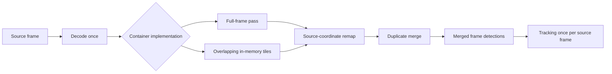
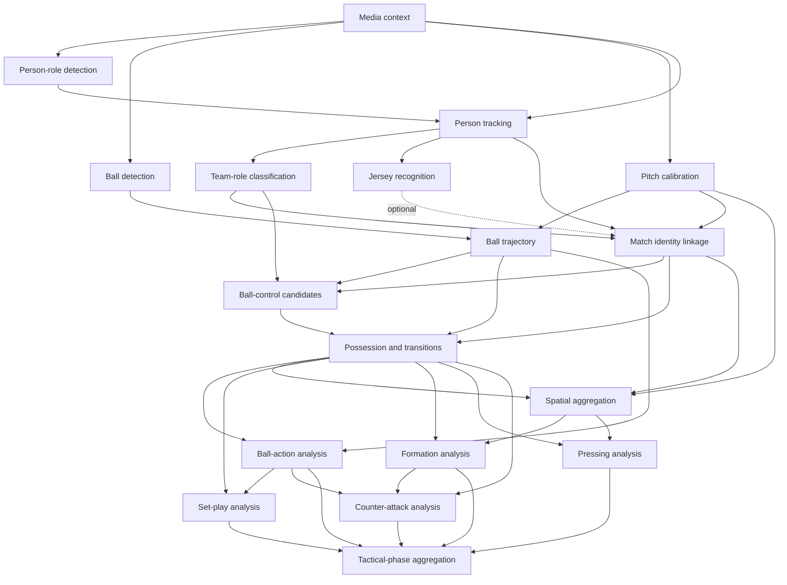

# Analyst Capability Catalog

This document is the canonical architecture inventory for the first SocAlytics
Analyst Containers (ACs). It defines capability intent, dependencies,
implementation direction, runtime needs, and validation evidence. Executable
contracts remain owned by
[Analysts, Models, and Hardware](analysts-models-and-hardware.md), workflow
readiness by [Job Processing](job-processing.md), and attempt behavior by
[Analyst Runtime and Recovery](analyst-runtime-and-recovery.md).

All selections and thresholds in this catalog are **Provisional** until the
license, quality, runtime, and cost gates below pass. This is an architecture
catalog, not a machine-readable capability declaration.

## Catalog Rules

SocAlytics supports fixed tactical-camera and edited broadcast footage from the
first supported release. Acceptance evidence must cover both profiles
separately; fixed-camera success alone is insufficient.

An Analyst has exactly one tier, while execution scope is declared independently:

- **Low-level** ACs produce foundational facts. They are usually segment-scoped,
  but may be match-scoped when foundational continuity crosses segments.
- **High-level** ACs produce soccer concepts and are match-scoped.

The implementation family does not determine the tier. Permitted families are
deterministic geometry or rules, statistical aggregation, classical machine
learning, deep vision models, and temporal models. No first-shot AC uses an LLM
or VLM. Coach and Specialist Agents own narrative interpretation of accepted
facts and concepts.

Every named framework, transitive dependency, pretrained weight, and dataset
requires an independent license and provenance audit. Production resolves
immutable OCI image, model, Analyst-profile, and policy digests. Training code,
inference graph, weights, thresholds, and policy versions remain independently
traceable. Floating package, image, model, or profile names are forbidden.

Each capability declaration is carried in the versioned
`analyst-manifest.json` embedded in its digest-pinned GHCR image. Registration
imports that metadata into the control-plane cache keyed by image digest. Model
weights are bundled in the first implementation while retaining an independent
model digest. An approved Analyst profile binds one capability version to one
OCI image digest and one model digest plus compatible runtime, hardware, and
resource requirements. Analysis-run creation resolves that binding once for
every recording, segment, and retry in the match.

## Container-Owned Preprocessing And Spatial Tiling

Spatial frame tiling is model-specific preprocessing inside a detector AC. It
is distinct from temporal media segmentation and is not a separate capability,
workflow node, or durable Segment Service output. The Scheduler pins the
approved Analyst profile in the analysis-run snapshot, and the Analyst Manager
admits work only when it can execute the profile's image and model on the host.
The AC alone owns and performs preprocessing and postprocessing; neither the
Scheduler nor the Manager selects or overrides those internal transformations.

The versioned Analyst profile records:

- profile ID, version, digest, and provenance
- capability ID and version
- immutable OCI image and model digests
- compatible runtime, accelerator, compiler, and driver constraints
- resource, retry, lease, stale-timeout, and execution-timeout requirements
- video policy and declared input and output schema versions

Source pixel handling, model input dimensions and layout, quantization,
normalization, resizing, padding, tiling, batching, coordinate transforms, and
duplicate merging are implementation details of the digest-pinned container.
They may be documented and measured for validation, but are not independently
selected job parameters.

Tiles are created in memory after decoding the source frame once and are not
persisted by default. The detector emits only merged detections in source-frame
coordinates. Trackers never consume independent tile detections.

SAHI is the preferred reusable starting point for slicing and postprocessing,
subject to exact license and transitive-dependency audit. Thin inference adapters
may be required for ONNX Runtime, HailoRT, and Coral Edge TPU. Hailo and Coral
profiles require fixed-shape compiled artifacts. Coral profiles additionally
require fully 8-bit-quantized TensorFlow Lite artifacts and matching Edge TPU
compiler and runtime versions.

## Low-Level Capabilities

<!-- markdownlint-disable MD013 -->

| Capability | Scope | Dependencies | Video policy | Outputs | Baseline and challenger | Analyst profile constraints | Primary validation |
| --- | --- | --- | --- | --- | --- | --- | --- |
| `media-context-classification` | Segment | None | Required | Shot boundaries and types; live, replay, graphics, quality, and usable intervals | OpenCV plus content/adaptive cut detection and permissively trained MobileNetV3 or ResNet-18 with temporal voting | CPU baseline; optional CUDA; full frame | Shot-boundary/type and replay F1 by input profile |
| `person-role-detection` | Segment | Media context optional | Required | Player, goalkeeper, referee, and relevant staff boxes with confidence | SocAlytics-fine-tuned RT-DETRv2-S; YOLOX-S/M challenger | ONNX Runtime CPU/CUDA; optional TensorRT; compare full-frame, tiled, and hybrid profiles | Per-role AP, small-object AP, tile-boundary recall, duplicate rate, throughput |
| `ball-detection` | Segment | Media context optional | Required | Ball boxes or points with confidence and visibility evidence | Separately fine-tuned RT-DETRv2-S; YOLOX-S challenger | ONNX Runtime CPU/CUDA; optional TensorRT; SAHI-style tiled or hybrid inference | Ball AP and small-object AP, tile-boundary recall, false merges, latency |
| `person-tracking` | Segment | Person detections required; media context conditional | Optional | Shot-local tracklets and foot-point trajectories | BoT-SORT with camera-motion compensation; ByteTrack challenger | CPU/CUDA; consumes merged source-frame detections and resets at hard cuts | HOTA, DetA, AssA, ID switches, runtime |
| `pitch-calibration` | Segment | Media context optional | Required | Camera parameters or homographies, pitch transforms, landmark evidence, confidence, uncalibrated intervals | SocAlytics-trained torchvision DeepLabV3-ResNet50 line segmentation plus OpenCV RANSAC and temporal drift checks | CPU/CUDA; versioned full-frame preprocessing | Calibration completeness, JaC, reprojection error |
| `ball-trajectory` | Segment | Ball detections; media context; calibration optional | Upstream results only; source video forbidden | Visible observations, bounded interpolations, velocity, acceleration, pitch coordinates, uncertainty | Kalman filtering and smoothing plus bounded spline interpolation | CPU; deterministic cut and out-of-play resets | Trajectory error, interpolation precision, coverage, runtime |
| `team-role-classification` | Segment | Person tracklets | Optional for declared crops | Home, away, goalkeeper, and referee assignments with color evidence | Lab/HSV jersey features, robust clustering, temporal consensus; permissively trained ResNet-18 challenger | CPU baseline; optional CUDA for challenger | Per-role F1, temporal stability, kit-clash subset |
| `jersey-number-recognition` (optional capability) | Segment | Person tracklets | Optional for declared crops | Number candidates with crop and frame evidence; never authoritative identity | Permissively licensed OCR stack after dependency and weight audit, crop rectification, temporal voting | CPU/CUDA as audited | Character/number accuracy, coverage, false confident reads |
| `match-identity-linkage` | Match | Tracklets; teams; calibration and media context; jersey evidence optional | Upstream results only; source video forbidden | Stable anonymous match-entity IDs and cross-segment linkage confidence | Team and role gates, pitch continuity, temporal constraints, OSNet-class appearance embeddings trained and evaluated on approved data | CPU/CUDA; match-scoped foundational continuity | Rank-1/mAP, false merges, identity switches across cuts and replays |
| `ball-control-candidates` | Segment | Tracklets or match identities; ball trajectory; teams; calibration optional | Forbidden | Contact and control candidate intervals with player, team, evidence, and uncertainty | Deterministic proximity, relative velocity, direction change, occlusion, and temporal hysteresis | CPU; deterministic policy profile | Candidate interval F1 and timing error |

Named player identity is never inferred from track IDs alone. Jersey and roster
evidence remains optional and confidence-bearing; anonymous match identities
must still support team-level analysis.

## High-Level Capabilities

| Capability | Scope | Dependencies | Video policy | Outputs | Baseline and challenger | Runtime | Primary validation |
| --- | --- | --- | --- | --- | --- | --- | --- |
| `possession-and-transitions` | Match | Control candidates; ball trajectory; teams and match identities | Forbidden | Possession, contested, and unknown spans; recoveries, losses, turnovers | Deterministic temporal state machine with confidence propagation and optional HMM smoothing; compact temporal classifier challenger | CPU | Interval F1 and transition timing by profile |
| `ball-action-analysis` | Match | Possession; control candidates; ball trajectory; identities and teams | Optional: authorized lineage clips only | Passes, carries, headers, crosses, shots, outs, tackles, blocks, restart candidates | Versioned trajectory/control rules; permissive temporal convolution or transformer challenger | CPU baseline; optional CUDA challenger | Event mAP or precision/recall at temporal tolerances |
| `spatial-aggregation` | Match | Calibrated tracks; identities and teams; possession optional | Forbidden | Occupancy grids, heatmaps, average positions, widths, depths, compactness, territory | NumPy/SciPy histograms, KDE, and computational geometry | CPU | Coordinate coverage, reproducibility, aggregation checks |
| `set-play-analysis` | Match | Ball actions; possession; ball trajectory; calibration | Forbidden | Kick-offs, corners, throw-ins, goal kicks, free kicks, penalties | Calibrated location, stationarity, out-of-play, possession, and action state machine; temporal classifier challenger | CPU | Event precision/recall and timing |
| `formation-analysis` | Match | Spatial aggregation; identities and teams; possession | Forbidden | Stable attacking and defending shape windows, line and role assignments, uncertainty | Possession-conditioned positions, constrained clustering and line fitting, orientation and temporal smoothing; graph/temporal model challenger | CPU baseline; optional CUDA challenger | Window accuracy and temporal stability |
| `pressing-analysis` | Match | Possession; calibrated tracks; teams; spatial aggregation | Forbidden | Pressing phases, zones, intensity, participants, success or recovery outcome | Pressure distance, time-to-ball, compactness, velocity, and temporal rules | CPU | Event agreement, participant precision/recall, outcome accuracy |
| `counter-attack-analysis` | Match | Possession transitions; ball actions; calibrated progression; team shape | Forbidden | Event windows, team, origin, progression speed, numerical context, outcome, evidence, confidence | Versioned temporal pattern rules; gradient-boosted or temporal neural challenger | CPU baseline; optional CUDA challenger | Event precision/recall or mAP and outcome accuracy |
| `tactical-phase-aggregation` | Match | Accepted high-level concepts | Forbidden | Versioned phase timelines and numeric tactical summaries without prose | Deterministic and statistical aggregation | CPU | Reproducibility, completeness, schema conformance |

<!-- markdownlint-enable MD013 -->

There is no `evidence-clips` AC. Every concept carries evidence time ranges and
segment identifiers. The API and MCP `get_video_clip()` operation resolve those
references to short-lived, team-authorized match media access.

Video access is capability-specific, not a general high-level entitlement. In
the initial catalog, only `ball-action-analysis` may request authorized lineage
clips for evidence review; every other high-level capability consumes accepted
upstream results without source-video access.

## Representative Dependency Graph

The Scheduler and Job Registry own this durable dependency graph and readiness.
NATS transports only ready jobs and lifecycle events. Match-scoped foundational
continuity, including identity linkage, completes before dependent high-level
nodes become ready.

## Implementation Waves

1. **Wave 0 - evidence and contracts:** audit licenses, SBOMs, dataset rights,
   and weights; establish the fixed and broadcast corpus, annotations, model
   cards, metrics harness, and immutable versioning rules.
2. **Wave 1 - dual-profile visual foundation:** implement media context, person
   and ball detection, person tracking, pitch calibration, and ball trajectory.
   Both fixed and broadcast acceptance subsets must pass.
3. **Wave 2 - match-consistent foundation:** implement team and role
   classification, optional jersey OCR, match identity linkage, and ball-control
   candidates. Preserve anonymous analysis when named identity is unavailable.
4. **Wave 3 - core concepts:** implement possession and transitions, ball
   actions, spatial aggregation, and set plays, including API/MCP readiness for
   turnovers, heatmaps, and evidence clips.
5. **Wave 4 - tactical concepts:** implement formations, pressing,
   counter-attacks, and tactical phase aggregation. Introduce learned temporal
   challengers only where rules fail measured gates.

## Validation And Promotion Gates

Evaluation is capability- and profile-specific, never one aggregate score. The
golden corpus must cover fixed and broadcast footage; wide and close views;
live play, replay, and graphics; calibrated and uncalibrated intervals; camera
cuts and motion; lighting and weather; kit clashes; and occlusion.

Detector evaluation compares full-frame, tiled, and hybrid profiles for each
source resolution and accelerator artifact. It records per-class and
small-object AP, tile-boundary recall, post-merge duplicate and false-merge
rates, decoded frames, tile count, accelerator utilization, latency, peak
memory, artifact size, and cost per match. Tiling is promoted only when its
quality gain justifies its latency, memory, duplicate risk, and cost.

A baseline must:

- beat its declared trivial or rules-only comparator where applicable
- pass quality thresholds separately on fixed and broadcast subsets
- meet CPU fallback and declared accelerator throughput budgets
- produce deterministic or tolerance-bounded idempotent results
- preserve complete OCI, model, policy, runtime, compiler, and upstream
   lineage, with preprocessing implementation traced through the OCI image

A challenger replaces a baseline only through same-corpus A/B evidence. Exact
thresholds remain Provisional until measured on the SocAlytics-owned corpus.

---

Related architecture: [Index](README.md) |
[Analysts, Models, and Hardware](analysts-models-and-hardware.md) |
[Job Processing](job-processing.md) |
[Analyst Runtime and Recovery](analyst-runtime-and-recovery.md) |
[Match Data Pipeline](match-data-pipeline.md) |
[Intelligence and Agents](intelligence-and-agents.md)
