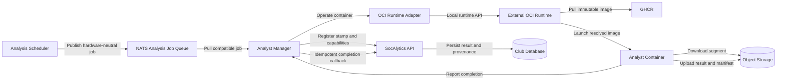
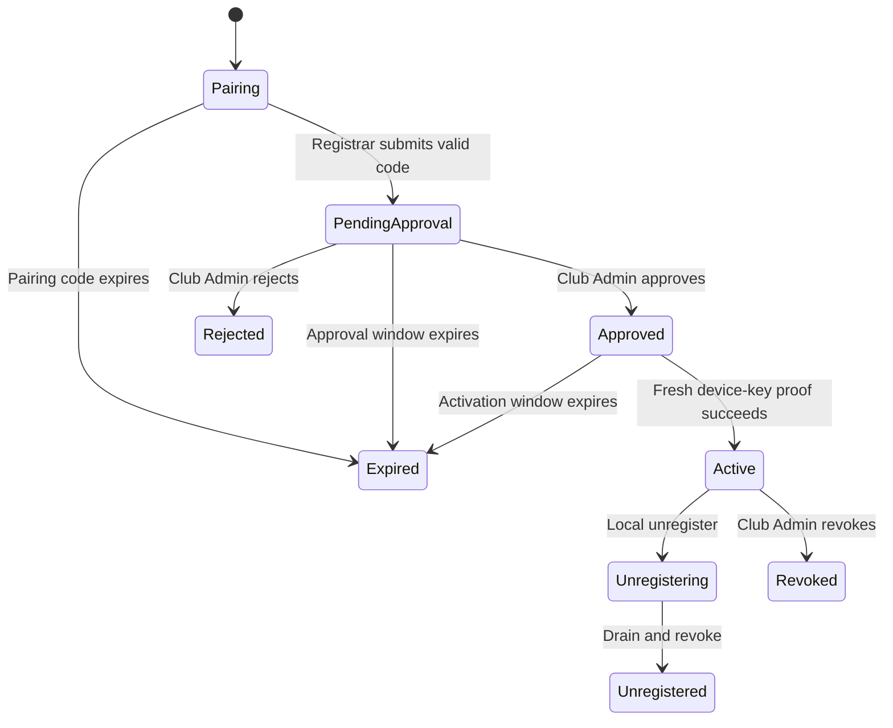

# Analyst Execution Architecture (Provisional)

## Analyst Manager

The Analyst Manager is cross-platform operator software installed on hardware
that participates in a SocAlytics deployment stamp. It is distinct from the
web and coach client applications. Its role resembles the participation model
of the SETI project: an installed client contributes available compute capacity
to a distributed workload. Here, that capacity analyzes match recording video
segments rather than searching radio data for extraterrestrial signals.

Each Analyst Manager connects and registers with exactly one deployment stamp,
advertises its available hardware and runtime capabilities, and consumes
compatible jobs only from that stamp's NATS JetStream work
queue. The platform never addresses an Analyst Manager directly to assign work.

Analyst Managers pull work and ask a built-in OCI Runtime Adapter assembly to
launch the appropriate Analyst container through the configured external
runtime. Runtime-specific assemblies implement one transport-neutral interface
and are selected through configuration and dependency injection. Arbitrary
third-party plugin loading is unsupported.

They match ready jobs to validated host hardware and the pinned Analyst
profile's runtime requirements using control-plane metadata cached by immutable
image digest. They do not substitute an image or model, classify Analyst tiers,
evaluate workflow dependencies, decide when high-level work is ready, or
perform model preprocessing. The Analysis Scheduler and durable Job Registry
own readiness; the pinned Analyst Container owns preprocessing, including
spatial tiling and source-coordinate merging where implemented.

For runtime operations and attempt fencing, see
[Analyst Runtime and Recovery](analyst-runtime-and-recovery.md).

---

## Desktop Application Profile

The Analyst Manager uses one cross-platform implementation for Windows, macOS,
and Linux. It supports opt-in per-user autostart and launches minimized to the
system tray where the desktop provides one. Coordination and active Analysts
continue without an open window. The tray provides actions to open status,
pause or resume dequeue, and exit safely.

The status window shows:

- registered stamp, club, connectivity, operating state, and
  uptime
- active Analyst count and the configured maximum concurrency
- host CPU and memory utilization and available accelerator utilization where
  the runtime can report it
- each active job attempt and the time of its last successful heartbeat
- the approximate stamp-local queue depth for this Manager's
  capabilities, together with the observation time

Queue depth is operational guidance, not a transactional guarantee. The AM
obtains it through the registered stamp API and does not infer permission to
pull work from the displayed value.

The Analyst Manager is a per-user desktop application: it runs in the context
of the signed-in user on Windows, macOS, and Linux, without an
operating-system service and without administrator rights. A .NET 10 Generic
Host worker without UI dependencies runs in-process with an Avalonia tray
application. This keeps runtime coordination, credentials, queue consumption,
hardware inspection, and OCI adapters in C# without embedding a browser
runtime alongside Analyst workloads. The tray menu offers status, pause, pause
for a chosen time with automatic resume, resume, safe exit, register,
unregister, and start at sign-in; where the desktop has no tray host (for
example Linux without StatusNotifierItem support), a status window offers the
same controls. One owner-only local socket per user provides single-instance
hand-off and an optional scripting client; the Manager verifies that every
peer belongs to the same user and never listens on the network. Autostart is
opt-in and per user: the Windows `Run` key of the current user,
`SMAppService` (or a per-user launch agent) on macOS, and an XDG autostart
entry on Linux.

The 2026-10 spike confirmed the Avalonia tray, headless UI tests, and the
local socket. Signed installers, updates, runtime footprint while Analysts
execute, accessibility, and long-term maintenance remain open promotion items,
with Electron with React and Tauri with React as the evaluated alternatives if
a required platform capability fails.

---

## Registration And Stamp Binding

An unregistered Analyst Manager cannot discover, dequeue, or execute jobs.
First-run registration targets one SocAlytics deployment stamp and requires two
explicit authorization actions:

- a user with the club-level `Registrar` role initiates the registration
- a user with the `Club Admin` role approves or rejects it

Club Admin inherits the Registrar capability. An administrator who initiates a
request may approve that same request, but initiation and approval remain
separate authorized operations and separate immutable audit events.

### Browser Pairing And Approval

Before pairing, the AM generates an asymmetric device key in a supported
operating-system-protected keystore. Activation is refused when no supported
protected store is available; an exportable key-file fallback is not supported.
Hardware-backed storage may be used but is not required.

Supported keystores are per-user and non-exportable: on Windows a CNG key in
the Microsoft Platform Crypto Provider (TPM) when available, otherwise in the
software key storage provider; on macOS a Secure Enclave key when available,
otherwise a Keychain key, reached through a small native bridge because .NET
has no Secure Enclave API; on Linux a key in a PKCS#11 token, with tpm2-pkcs11
as the production module, generated without the extractable attribute because
non-exportability comes from the TPM. The AM reports the kind of protection at
registration; the platform records and shows it as claimed by the AM and never
bases authorization on it, and it refuses software-backed keys unless the stamp
explicitly allows them (by default only for development and test). Hardware key
attestation is a later decision.
Production approval of any store remains governed by `GOV-CRED-002` in
[Security and Data Governance](security-and-data-governance.md#credential-class-entries).

The untrusted AM requests a short-lived, single-use pairing code bound to its
public key, target stamp, nonce, expiry, and reported device metadata. It shows
the platform verification URL, the pairing code, and a short device fingerprint
derived from its public key, and may also show a QR code. The user completes
normal local or external OpenID Connect authentication in the system browser;
human credentials and tokens never pass through the AM.

The authenticated user selects the target club and submits the pairing code
together with the device fingerprint read from the AM. The platform verifies
the Registrar capability and the fingerprint against the paired key, and
creates a key-bound pending request; a wrong fingerprint is refused like an
invalid code, which defeats phished pairing codes (RFC 8628, section 5.4). The
Club Admin decision view shows the fingerprint, the time and network origin of
the pairing request, and a warning to approve only Managers the approver can
physically identify. The human-facing code expires after approximately ten minutes. Once
consumed, the pending request remains available for Club Admin action for 24
hours. Codes and polling handles are high-entropy, rate-limited, narrowly
scoped, and do not reveal request existence through distinguishable failures.

Approval moves the request to `Approved`; it does not issue operational access.
The waiting AM must sign a fresh platform challenge with the paired private key.
Only successful proof activates the registration, assigns its stable Manager
identity, and permits machine-token issuance. Rejected or expired requests
cannot be activated, and retrying creates a new request and audit trail.

### Machine Authentication

Pairing, token issuance, and API calls use authenticated TLS; cleartext
transport is unsupported.

An active AM uses OAuth 2.0 client credentials with `private_key_jwt` client
authentication to obtain short-lived, DPoP-bound API access tokens. Token
issuance validates the registered key, assertion audience, expiry, and unique
identifier. Each API call validates the DPoP proof, request binding, replay
identifier, token audience and scopes, stamp binding, and authoritative active
registration state. AM tokens cannot authorize human or administrative APIs.

The DPoP proof key is the registered device key, so every token request and
API call proves possession of the non-exportable key. Access tokens are opaque
references stored only as hashes and validated against the authoritative
registration on every call, so revocation takes effect without a platform
token-signing key. The AM treats its registration as inactive only after a
refusal that follows its own valid key proof; transport failures never clear
its protected registration.

The registration identity remains valid across restart and routine credential
rotation until local unregister or administrator revocation. The private key
never leaves the protected keystore. Routine rotation preserves the Manager
identity only after proving possession of both the registered old key and the
replacement key. A lost key cannot be recovered, escrowed, or rebound by an
administrator; the old registration is revoked and the host registers anew.

The AM stores its Manager identity, endpoint, stamp binding, key reference,
and last operating intent in a local file readable only by the user's account
and signed with the device key, and restores them across restart and
autostart; any change, or a copy to another account or machine, fails
verification and the AM fails closed. It obtains short-lived, stamp- and
subject-scoped NATS credentials through the authenticated API rather than
storing a durable broker secret.

Every capability advertisement, queue query, dequeue, heartbeat, object-storage
grant, and completion callback is validated against the registered stamp.
Neither local configuration nor a job payload can override the binding.

Rebinding never edits an existing registration in place. It requires
unregistering or revoking the old registration and then completing fresh
pairing and approval against the new stamp.

A local user can unregister from the tray application. The AM pauses dequeue,
drains active Analysts, asks the platform to revoke the registration, removes
stamp credentials and cached stamp data, and returns to `Unregistered`. A club
administrator can revoke an AM from the stamp at any time. Administrative
revocation is an immediate security action rather than a drain: the platform
blocks API authorization and credential renewal, revokes current broker access,
fences active attempts, rejects later heartbeats and callbacks, and instructs
the AM to stop and clean up its containers. Enforcement does not depend on the
AM receiving that instruction. Once the AM observes revocation, it clears stamp
credentials and cached stamp data and enters `Revoked`. After local stamp state
is cleared, it returns to `Unregistered` and can begin fresh registration.

The AM observes revocation through periodic registration-status checks and
through authorization failures from any platform operation, including queue
status, heartbeat, and completion calls. Revocation does not depend on a
runtime-engine notification.

Registration records and security audit events identify the Manager, stamp,
public-key thumbprint, state, initiating user, approving or rejecting
administrator, timestamps, expiry, device metadata, reason, and correlation
identifier. Tokens, assertions, DPoP proofs, private keys, pairing secrets, and
broker credentials are never written to application or audit logs.

Credential destruction, cached stamp-data purge, audit-event minimization, and
retention follow
[Security and Data Governance](security-and-data-governance.md). These
requirements do not weaken immediate server-side revocation or attempt fencing.

The registration lifecycle above is authoritative for machine access. `Active`
means the Manager registration may obtain credentials; it does not mean the
local process is currently accepting work. `Running`, `Paused`,
`RuntimeUnavailable`, and `Draining` are local operating states beneath an
active registration. Changing operating state does not create, activate,
revoke, or rebind a registration.

While `RuntimeUnavailable`, the Manager remains connected only for registration
status, diagnostics, and revocation. It advertises no unavailable capability
and dequeues no work until runtime preflight succeeds again.

```mermaid
stateDiagram-v2
    state "Runtime unavailable" as RuntimeUnavailable
    [*] --> Unregistered
    Unregistered --> RuntimeUnavailable: Register; runtime preflight pending
    RuntimeUnavailable --> Running: Preflight passes; restore running
    RuntimeUnavailable --> Paused: Preflight passes; restore paused
    Running --> RuntimeUnavailable: Runtime or profile becomes unavailable
    Paused --> RuntimeUnavailable: Runtime or profile becomes unavailable
    Running --> Paused: Pause dequeue
    Paused --> Running: Resume dequeue
    Running --> Draining: Local unregister or safe exit
    Paused --> Draining: Local unregister or safe exit
    Draining --> Unregistered: Unregister after active attempts finish
    Draining --> [*]: Safe exit after active attempts finish
    Running --> Revoked: Club administrator revokes registration
    Paused --> Revoked: Club administrator revokes registration
    RuntimeUnavailable --> Revoked: Club administrator revokes registration
    Draining --> Revoked: Club administrator revokes registration
    Revoked --> Unregistered: Clear local stamp state
```

Autostart restores the last Running or Paused state. A deliberately paused AM
does not resume dequeue after reboot. Safe exit is distinct from pause because
an exited process cannot renew leases. When work is active, the UI offers cancel
or drain-and-exit. A safe exit preserves the stamp registration and the last
operating state for the next start. Forced process or host termination is
handled by lease expiry and retry.

Drain uses a configurable timeout so a hung Analyst cannot block exit or local
unregister indefinitely. When the timeout expires, the UI follows policy to
cancel the operation or stop and clean up the remaining AM-owned containers.

---

## Capacity And Pause Controls

The user configures a persisted, host-local maximum number of concurrent
Analysts. It is a positive integer bounded by platform policy and the host's
advertised capability. The effective limit is the lowest applicable bound. The
AM pulls only while its active Analyst count is below that limit.

Increasing the limit allows additional pulls. Decreasing it never terminates an
active Analyst; new pulls remain suppressed until the active count falls below
the new limit.

Pause keeps the AM registered, connected, visible to the platform, and updating
its status. It stops new dequeues immediately while active Analysts continue,
including heartbeats, result uploads, and completion callbacks. A pause may be
set for a chosen time, after which the AM resumes automatically. Resume
restores pulling subject to the effective concurrency limit and capability
matching.

If runtime access is lost, the AM stops dequeue and reports degraded status. It
retries failed heartbeat submissions with bounded backoff while the attempt
lease remains valid, but it cannot assume renewal. The platform may fence and
retry an attempt after lease expiry. On recovery, the AM reconciles existing
containers and their fencing state before it resumes dequeue.

Production-approved effective concurrency, queue and utilization thresholds,
drain timeout, runtime/profile compatibility, degraded-state alerts, and
recovery evidence are profile values governed by
[Production Deployment and Operations](production-operations.md). No default
in this topic implies production approval; unresolved values block readiness
without changing pause, drain, lease, or reconciliation semantics.

---

Related architecture: [Index](README.md) | [Job Processing](job-processing.md) |
[Platform Implementation Profile](platform-implementation.md) |
[Analyst Runtime and Recovery](analyst-runtime-and-recovery.md) |
[Tenancy and Technology](tenancy-and-technology.md) |
[Production Deployment and Operations](production-operations.md)
