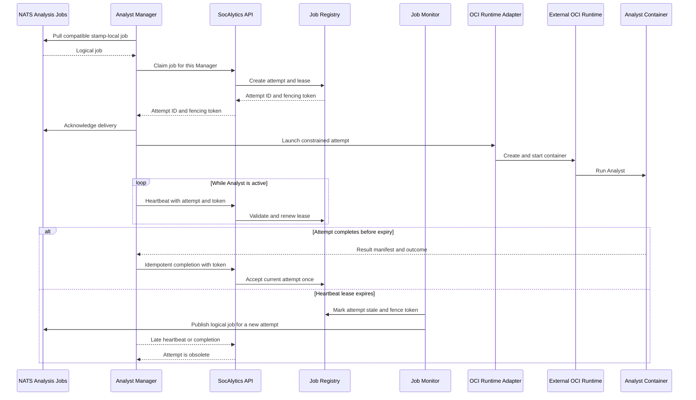

# Analyst Runtime and Recovery (Provisional)

This document defines the external OCI runtime boundary and durable execution
attempt behavior. The installed host lifecycle is defined by the
[Analyst Manager architecture](analyst-manager.md).

## OCI Container Runtime Boundary

The Analyst Manager application remains cross-platform, but the first supported
host for Analyst-container execution is Windows. Linux and macOS execution
profiles are future provisional work. OCI images remain the portable packaging
contract; the container engine is an external host dependency rather than part
of the AM installation.

The AM operates containers through an internal, transport-neutral OCI Runtime
Adapter. The adapter must:

- probe runtime identity, version, endpoint health, operating system,
  architecture, backend, and device capabilities
- authenticate to the OCI registry and pull an image by immutable digest
- create, start, inspect, stop, and remove an Analyst container
- apply constrained mounts, environment, devices, network, and resource limits
- collect exit status and bounded logs
- label, reconcile, and clean up AM-owned resources left after a crash

Hardware-neutral jobs and platform APIs contain no Docker- or Podman-specific
fields. The AM advertises only execution capabilities that the active runtime
profile has validated on the host, not capabilities inferred from the runtime
product name.

Runtime endpoints are configured or discovered by a supported profile. A
Docker Desktop profile on Windows may use
`npipe://./pipe/docker_engine`; another profile may use a different named pipe,
Unix socket, or authenticated local endpoint. Local access is the default and
unauthenticated remote TCP runtime APIs are unsupported.

### Built-In Runtime Adapter Profiles

- **Docker Desktop for Windows:** the first shipped adapter and profile, using its
  Engine API and Linux-container backend. CPU is the mandatory baseline and
  CUDA through WSL2 is the first accelerated path to test.
- **Podman for Windows:** a future separate built-in adapter assembly to ship
  only after validation through its compatible API and Podman Machine. Podman
  is not bundled with the AM.
- **Future profiles:** Linux, macOS, and containerd support remain outside the
  first-release execution scope.

Support is defined by a tested compatibility matrix containing the AM version,
runtime product and version, backend or VM mode, Windows version, architecture,
and accelerator configuration. Detecting a runtime does not by itself make the
profile supported.

Adapter assemblies are versioned and shipped with the Analyst Manager. They
share one runtime-neutral interface; installable plugins and arbitrary external
adapter loading are unsupported.

Users or IT install, configure, license, update, and start the runtime and its
VM or backend. The AM installer does not install, upgrade, remove, or reconfigure
Docker, Podman, or their virtual machines. The AM validates compatibility and
uses least-privilege local access. An upgrade outside the compatibility matrix
moves the AM to `Runtime unavailable` until the profile is validated again.

### Runtime Preflight And Status

After stamp registration and before entering `Running`, the AM verifies:

- the runtime endpoint is reachable, local, and authorized
- the runtime and profile versions are supported
- the Linux-container backend or VM is available
- OCI registry authentication and image-platform compatibility
- configured CPU, memory, disk, and concurrency limits are feasible
- every advertised accelerator passes a functional device probe

A failed preflight leaves the AM registered in `Runtime unavailable`. It stays
connected for status and revocation but cannot advertise the failed capability
or dequeue work. The tray window shows the failed check and remediation guidance
without silently selecting an unvalidated profile. It also shows the active
profile and version, endpoint and backend health, runtime disk use, validated
accelerators, and resource-reconciliation state.

The runtime endpoint is a privileged host-control boundary. Only the AM process
account receives access. Analyst containers never receive that endpoint, AM
credentials, or host-wide control APIs. Analyst launches default to:

- immutable image digests with the configured signature and provenance checks
- a non-root container user and read-only root filesystem where supported
- explicit writable scratch and result mounts scoped to one job
- short-lived stamp-local object-storage credentials
- no privileged mode, host PID namespace, host network, or runtime socket mount
- allowlisted devices, dropped capabilities, CPU and memory limits, and bounded
  logs

### Registration And Runtime Credentials

The durable AM registration is not a durable bearer secret. The AM proves its
protected device key to obtain short-lived, DPoP-bound API tokens. Through that
authenticated API session it obtains expiring NATS credentials restricted to
the registered stamp and the subjects required to pull and acknowledge work.
API and NATS connections use authenticated TLS. It never stores a
registration-lifetime broker credential.

Administrative revocation immediately blocks API authorization and credential
renewal, revokes the current NATS identity where supported, and fences every
active attempt owned by the Manager. The platform rejects later heartbeat and
completion calls and reschedules work through normal lease recovery. It also
instructs the connected AM to stop and remove its active containers, but
correctness and access control do not depend on delivery of that instruction.

Outstanding object-storage grants are invalidated when the storage mechanism
supports revocation. Unavoidable presigned grants use short lifetimes and narrow
job scope; attempt fencing prevents their results from becoming accepted after
Manager revocation.

Runtime secrets, logs, grants, cached data, images, and result artifacts follow
the classification, vulnerability, retention, and deletion requirements in
[Security and Data Governance](security-and-data-governance.md).

The AM labels every managed container and volume with its Manager, job,
and execution-attempt identities. Startup reconciliation inspects only those
AM-owned resources. It adopts or terminates them according to the durable lease
and fencing state and removes stale resources without touching unrelated user
containers.

---

## Execution Attempts, Heartbeats, And Recovery

Low-level and high-level Analyst Containers use this same runtime path. Both
tiers use identical claim, heartbeat, lease, fencing, retry, idempotent
completion, OCI isolation, and cleanup semantics; match-scoped high-level work
does not create a separate execution system.

The logical job identity remains stable across retries. Each dequeue creates a
distinct execution attempt in the durable Job Registry. The platform returns
an opaque lease/fencing token for that attempt, and the AM acknowledges the
queue delivery only after the claim succeeds. A new attempt and token are
issued whenever a re-enqueued logical job is claimed.

While an Analyst container is active, the AM periodically sends a heartbeat to
the stamp API containing the Manager, logical job, execution attempt,
lease token, timestamp, and execution state. Progress and lightweight resource
measurements may be included when available. The API validates the registered
Manager, current attempt, and token before renewing the lease.

Heartbeat interval and stale timeout are platform-configurable. The timeout
must safely exceed the interval and tolerate transient network delay. A
control-plane Job Monitor uses the durable Job Registry to detect expiry. The AM
never decides that its own attempt should be re-enqueued.

Production profiles assign and approve heartbeat, stale-timeout, retry,
runtime-compatibility, reconciliation, and alert bounds under
[Production Deployment and Operations](production-operations.md). This topic
does not supply unevidenced numeric defaults; missing production values block
readiness while preserving the current lease and fencing contract.

On expiry, the platform atomically marks the attempt stale, invalidates its
token, and republishes the logical job so another Manager can claim a new
attempt only when the immutable logical-job attempt budget remains. The stale
attempt consumes one entry in that budget. On exhaustion, the logical job fails
permanently and is not republished. A recovered old AM cannot renew or complete
the stale attempt. Late heartbeats and callbacks are rejected or acknowledged
as obsolete without changing the accepted result.

Execution is therefore at least once: duplicate physical work can occur around
host failures or network partitions. Result paths, manifests, callbacks, and
job-state transitions must be idempotent and fenced by execution attempt. Only
one attempt can become the accepted completion for a logical job.

Each capability declaration supplies its resource, retry, and timeout profile.
Analysis-run creation resolves those requirements through the approved Analyst
profile and copies `max_attempts`, lease, stale-timeout, execution-timeout, and
resource values into each immutable logical-job snapshot. The Analyst Manager
admits a job only when the validated host can satisfy its pinned requirements.
Match-level high-level jobs may declare longer leases, timeouts, or larger
resource bounds than segment jobs, but heartbeat and fencing behavior remains
unchanged.

Model-backed jobs identify immutable Analyst-profile, OCI image, and model
digests. Full-frame, tiled, hybrid, and other preprocessing strategies remain
private to that image; they may influence the profile's declared resource and
runtime requirements but are not Manager-selected job parameters. A retry,
including one claimed by another Manager, must execute the same image and model
pair. Retry and fencing semantics remain identical across implementations.

---

## Analyst Manager Responsibilities

- connect and register with one deployment stamp
- bind the registration to exactly one deployment stamp
- protect the registered asymmetric device key in an operating-system keystore
- obtain and rotate short-lived API and NATS credentials
- restore the stamp-scoped identity and last pause state on autostart
- advertise hardware and runtime capabilities
- validate the external runtime profile before advertising capabilities
- enforce the effective concurrency limit and pause state before pulling work
- pull compatible stamp-local analysis jobs from NATS and claim execution attempts
- combine Analyst type, requested model, and host capabilities to select a
  runtime-tagged image
- pull the image and resolve its immutable OCI digest
- launch and constrain the selected Analyst container through the runtime
  adapter
- monitor execution and renew each active attempt lease through heartbeats
- report the result manifest, checksum, runtime, image digest, and fencing token
- expose local utilization, active attempts, and timestamped queue status
- support pause, resume, drain, local unregister, and platform revocation
- terminate and clean up active containers after security revocation
- reconcile AM-owned runtime resources and destroy containers on completion

The Analyst Manager understands the participating host's hardware.

The platform does not.

---

Related architecture: [Index](README.md) |
[Analyst Manager](analyst-manager.md) | [Job Processing](job-processing.md) |
[Analysts, Models, and Hardware](analysts-models-and-hardware.md) |
[Production Deployment and Operations](production-operations.md)
