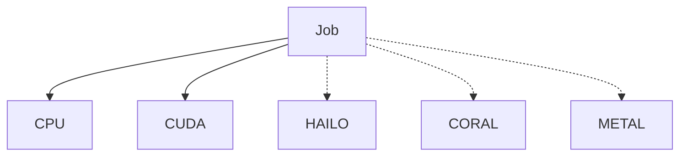

# Analysts, Models, and Hardware

This document defines the executable Analyst package, execution provenance, and
hardware strategy. Container lifecycle behavior is defined in
[Analyst Runtime and Recovery](analyst-runtime-and-recovery.md). The canonical
capability inventory is defined in the
[Analyst Capability Catalog](analyst-capability-catalog.md).

## Analyst Containers

An Analyst Container (AC) is self-contained. SocAlytics defines exactly two
tiers:

- **Low-level ACs** produce foundational match facts. They primarily execute
    against segments, but may execute at match scope when foundational
    continuity crosses segments, such as match identity linkage.
- **High-level ACs** produce soccer concepts and execute at match scope.
    Representative capabilities include possession and transition analysis,
    counter-attack and set-play detection, offensive and defensive formation
    analysis, pressing analysis, and match-level tactical aggregation.

Intermediate soccer concepts remain high-level outputs and may feed later
high-level ACs; there is no third Analyst tier. Tier and execution scope are
independent capability declarations. Example images include:

- `analyst-person-role-detector-rtdetrv2s:cuda`
- `analyst-person-role-detector-rtdetrv2s:hailo8`
- `analyst-person-role-detector-rtdetrv2s:cpu`
- `analyst-ball-detector-rtdetrv2s:cuda`

Contents:

- Model
- Runtime
- Preprocessing
- Tiling
- Postprocessing
- Result uploader
- Versioned `analyst-manifest.json`

### Image Metadata And Packaging

Each Analyst is published to GHCR as an immutable, digest-pinned image. A
versioned `analyst-manifest.json` lives beside its Dockerfile, is copied into
the image, and supplies essential `io.socalytics.*` OCI labels at build time.
The manifest declares capability and dependency versions, runtime and resource
requirements, output schema, video policy, retry and timeout requirements, and
independent image, model, policy, and Analyst-profile versions and digests.

Image publication or registration imports the manifest into a queryable
control-plane metadata cache keyed by immutable image digest. The Scheduler
uses that cache to validate dependencies and resolve an approved Analyst
profile to an immutable image and model pair when it creates an analysis run.
The Analyst Manager advertises host capabilities and admits only jobs whose
pinned image and model it can execute. Changed metadata always produces a new
image digest and manifest version.

The first implementation bundles model weights and all preprocessing and
postprocessing implementation inside the image while recording an independent
model digest. This accepts larger images and duplicated weights in exchange for
reproducible execution without runtime artifact downloads or credentials.
External digest-pinned model artifacts remain a future optimization.

### Implementation Profile

Analyst Containers use Python projects managed with `uv`, `pyproject.toml`, and
committed lockfiles. Python is the provisional default because the required
PyTorch, ONNX Runtime, OpenCV, NumPy, SciPy, scikit-learn, SAHI, and accelerator
vendor ecosystems provide the paved path for model and computer-vision work.

Each runtime-specific image may pin a different Python minor version when
native or vendor compatibility requires it. Production builds use locked
dependencies and record package and native-library provenance; they do not
select the newest Python release independently of the validated runtime matrix.

Versioned JSON Schema documents will become canonical for job inputs and result
manifests when the first Analyst implementation slice introduces those
contracts. The shared internal Analyst SDK will expose Pydantic models and
validate both boundaries. The platform will independently validate the same
schemas rather than treating Python types as cross-language authority.

### Analyst Profiles And Container-Owned Preprocessing

An Analyst profile is a versioned, digest-addressed execution choice for one
capability. It binds an immutable Analyst Container image digest and model
digest to compatible runtime, accelerator, compiler, driver, resource, retry,
lease, stale-timeout, and execution-timeout requirements. Analysis-run creation
resolves one approved profile per capability. Every recording, segment, and
retry for that capability in the match uses the same image and model pair;
changing either artifact creates a new analysis run.

Spatial tiling is detector-specific in-memory processing inside the AC, not a
separate Analyst capability or Segment Service operation. The AC decodes a
source frame once, creates any overlapping tiles in memory, runs inference,
maps detections to source-frame coordinates, and merges overlap duplicates. It
emits only the merged frame-level detections, and tracking runs once on that
merged set. Tiles are not persisted by default or scheduled as logical jobs.
Pixel conversion, model input layout, quantization, normalization, resizing,
padding, tiling, batching, coordinate transforms, and duplicate merging are
opaque implementation details of the digest-pinned container. The Scheduler
and Analyst Manager neither select nor override them.

The hardware-neutral job specifies context appropriate to its declared scope,
for example:

- Team: `team-42`
- Match: `match-17`
- Analyst: `person-role-detection`
- Analyst profile: `person-role-detection-rtdetrv2s-cuda-v1`
- Analyst-profile digest: `sha-256:<profile-digest>`
- OCI image digest: `sha-256:<image-digest>`
- Model digest: `sha-256:<model-digest>`
- Recording-set version: `recording-set-v7`
- Recording version: `recording-v3`
- Timeline-mapping digest: `sha-256:<mapping-digest>`
- Segmentation-policy digest: `sha-256:<policy-digest>`
- Segment number: `34`

A match-scoped job instead identifies the analysis run, match, capability, and
dependency results; it does not invent a synthetic segment.

The Scheduler resolves a mutable profile alias, if one was requested, before
creating the immutable analysis-run snapshot. The Analyst Manager does not
resolve tags or select an alternative image or model. It may claim the job only
when the host satisfies the pinned profile and reports the image and model
digests actually used after execution.

The Analyst uploads its result and manifest to stamp-local object storage.
The Manager then calls the stamp API with team, match, job, and execution
identifiers, the manifest URI and checksum, status, idempotency key, selected
runtime, executed image and model digests, and current lease/fencing token.
Analysts and Analyst Managers never receive database credentials.

### Capability Declaration

The control-plane metadata cache owns the imported, versioned declaration from
each digest-pinned Analyst image. It includes:

- capability ID and version, Analyst tier, and independently declared execution
    scope (`segment` or `match`)
- required upstream capability and schema versions
- whether source video access is required, optional, or forbidden
- output schema version and compatible Analyst-profile identities
- immutable image and model digests plus runtime and hardware constraints
- resource requirements plus retry, lease, stale-timeout, and execution-timeout
    requirements
- deterministic behavior and idempotency expectations

The Analysis Scheduler uses this declaration to construct workflow nodes and
evaluate readiness, then copies resolved declarations and Analyst-profile
bindings into the immutable run and node snapshots. The Analyst Manager uses
only the ready job's pinned artifacts and requirements to determine whether it
can claim the work; it does not select artifacts, classify the tier, or evaluate
dependencies.

### Result Manifest And Lineage

Every tier emits a versioned result manifest containing:

- team, match, recording-set version, and either complete materialized-segment
    identities and nominal half-open windows or full-match scope
- capability, Analyst profile, model or policy, output schema, workflow, and
    OCI image versions and immutable digests where applicable
- accepted execution-attempt identity and immutable result URI and checksum
- nominal validity window and fact count
- complete upstream lineage: accepted result IDs, capability and schema
    versions, and algorithm-qualified artifact digests
- output type (`foundational-facts` or `soccer-concepts`), confidence, and
    supporting evidence references
- optional supporting video-segment identifiers that the API can resolve,
    never embedded credentials or durable presigned URLs

The AC writes immutable result artifacts and the manifest to stamp-local
object storage, then completes through the Manager and API callback. Before
acceptance, the API validates the current fenced attempt, manifest and schema,
team and match scope, pinned Analyst-profile, image and model digests, declared
dependencies, complete lineage, and that every emitted fact falls within the
nominal half-open validity window. It then marks the result accepted and indexes
queryable facts in stamp metadata. ACs never write metadata tables directly.

### Capability-Scoped Result Access

A high-level job receives its team, match, analysis-run, and accepted-
dependency context. It retrieves accepted upstream data through one
capability-scoped, schema-versioned API pattern. A query identifies the analysis
run, capability and schema version, match or team scope, optional segment or
time range, and pagination. The response uses a stable envelope with a
capability-owned payload and explicitly reports missing, blocked, failed, or
superseded coverage.

Only accepted results are visible. Every response and reference is constrained
to the job's authorized team and match, and Analysts never query PostgreSQL
directly. If the capability declaration permits video, the AC may request
short-lived presigned object-storage access for specific source segments;
video bytes do not pass through the API.

---

## Model Governance

Analyst-profile selection is controlled by the platform at analysis-run
creation. The resolved profile pins the model and OCI image. The Analyst
Manager may execute the work only on a compatible host and cannot substitute a
different runtime-specific image or model.

Every execution records the requested model and exact image provenance, for
example:

- Analyst capability: `person-role-detection`
- Analyst profile: `person-role-detection-rtdetrv2s-cuda-v1`
- Analyst-profile digest: `sha-256:<profile-digest>`
- Model digest: `sha-256:<model-digest>`
- OCI image digest: `sha-256:<image-digest>`

This allows:

- reproducibility
- auditing
- comparisons across seasons

Every named framework, transitive dependency, pretrained weight, and dataset
requires a recorded license and provenance audit. Training code, inference
graph, model weights, preprocessing, thresholds, and policy are independently
traceable through the image, model, and policy artifacts that contain them.
Production jobs resolve immutable Analyst-profile, OCI image, model, and policy
digests; floating profile, image, model, or package names are not valid
production provenance. Promoting a challenger changes only newly created run
snapshots; active and historical runs retain their pinned artifact pair.

Artifact authorization, vulnerability handling, exceptional execution, audit
evidence, retention, and deletion follow
[Security and Data Governance](security-and-data-governance.md).

### Implementation Validation

Implementation must verify stamp isolation, capability matching, lease and retry
behavior, duplicate completion handling, result-manifest validation, and OCI
digest capture. It must also compare the desktop technology alternatives on
Windows, macOS, and Linux; validate registration bootstrap, protected credential
storage, rotation, and revocation; and measure concurrency control, queue-depth
reporting, heartbeat ingestion cost, and suitable interval and timeout values.

Failure tests must cover pause with active jobs, local unregister after drain,
administrator revocation, process and host failure, network partition, forced
exit, stale re-enqueue, and late callbacks from fenced attempts. The choice is
also requires a Windows runtime spike covering Docker Desktop and Podman profile
APIs, local endpoint authorization, runtime and VM restart, orphan
reconciliation, incompatible upgrades, disk exhaustion, and image pull and
launch latency. Security tests must reject forbidden mounts, devices,
privileges, host namespaces, and runtime endpoint exposure.

CPU is the mandatory baseline. CUDA must be validated end to end through the
Windows Docker Desktop and WSL2 path. Hailo and Coral require separate proof of
Windows driver support, VM or WSL2 device visibility, safe device mapping,
vendor-runtime compatibility, reconnect behavior, and non-privileged operation.
If either accelerator cannot satisfy those requirements, it remains unsupported
on Windows in the first release; the architecture must not weaken isolation or
silently execute the Analyst natively.

The spike must also review Docker Desktop licensing and support obligations and
compare them with externally managed Podman. The resulting compatibility
matrix and evidence must support the desktop, registration, runtime ownership,
security, accelerator, job, callback, and provenance boundaries above before
additional host profiles are supported.

Workflow evidence must additionally validate capability and result-manifest
schema compatibility, complete upstream lineage, high-level API authorization,
presigned video access, and the performance and cost of match-level high-level
ACs on participating hosts.

---

## Hardware Strategy

### Execution Hardware

Examples:

| Runtime | Purpose |
| ---------- | ---------- |
| CPU | Mandatory Windows baseline |
| CUDA | First Windows accelerated profile to validate |
| Hailo | Requires Windows device-pass-through evidence |
| Coral | Requires Windows device-pass-through evidence |
| Metal | Future macOS execution profile |

---

Related architecture: [Index](README.md) |
[Platform Implementation Profile](platform-implementation.md) |
[Analyst Capability Catalog](analyst-capability-catalog.md) |
[Job Processing](job-processing.md) |
[Analyst Manager](analyst-manager.md) | [Analyst Runtime and Recovery](analyst-runtime-and-recovery.md)
