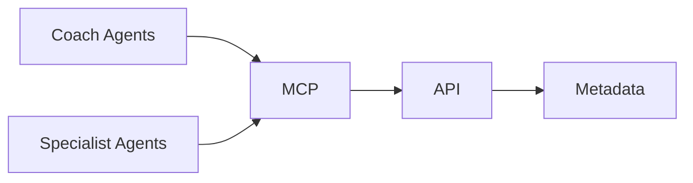
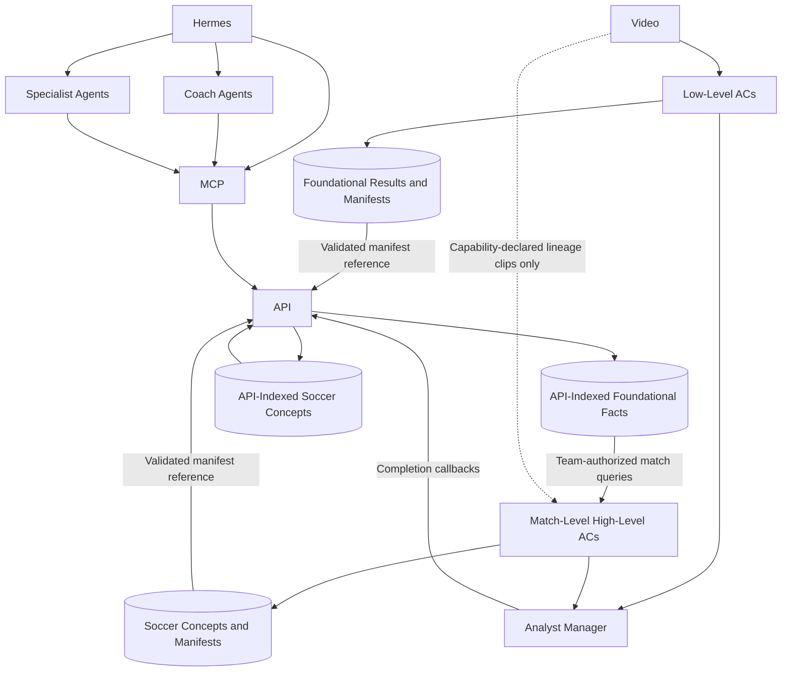
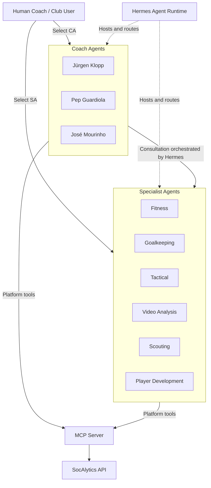
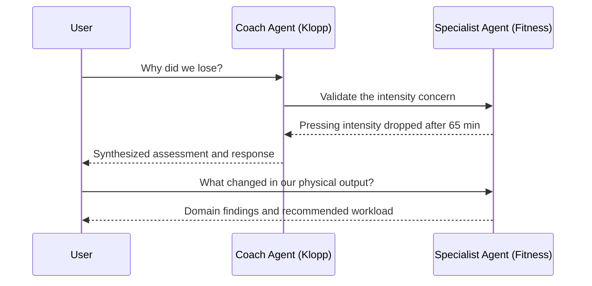

# Intelligence and Agents

This document defines AI-friendly access to platform facts and the coaching
agent model. All platform access follows the shared
[API-first principle](terminology-and-principles.md#1-api-first).
The [Intelligence Agent Catalog](intelligence-agent-catalog.md) defines the
canonical initial roster, prompt drafts, tool policies, and promotion gates.

## MCP Layer

The MCP layer provides AI-friendly access.

Agents never directly access databases.

---

### MCP Tools

MCP tools map one-to-one from an explicit allowlist of agent-safe, read-only
control-plane API operations with stable OpenAPI operation IDs. Administration,
mutation, lifecycle, worker, registration, claim, lease, checkpoint, and
completion operations are never exposed as tools. Every call retains the
initiating actor, team, match, conversation, and invocation context and is
reauthorized by the underlying API. Agent-specific tool policies select subsets
from this allowlist.

The allowlisted football-domain queries are backed by Analyst-generated and
API-indexed facts; MCP does not derive tactical events from raw detections.
Representative tools resolve as follows:

- `get_match()` and `get_player_stats()` query accepted match and player facts.
- `find_counter_attacks()` queries accepted `counter-attack-analysis`
    concepts.
- `find_turnovers()` queries accepted possession and transition concepts.
- `get_heatmap()` queries an accepted spatial-aggregation output.
- `find_ball_actions()` queries accepted `ball-action-analysis` concepts.
- `find_set_plays()` queries accepted `set-play-analysis` concepts.
- `get_formations()` queries accepted `formation-analysis` windows.
- `find_pressing_phases()` queries accepted `pressing-analysis` concepts.
- `get_tactical_phases()` queries accepted `tactical-phase-aggregation`
    summaries.
- `get_video_clip()` resolves accepted evidence time ranges to short-lived
    presigned media access.

When required analysis is unavailable or incomplete, MCP reports that state. It
does not infer missing concepts from bounding boxes, silently trigger ad hoc LLM
derivation, or access raw metadata tables.

The [Analyst Capability Catalog](analyst-capability-catalog.md) defines the
canonical producers and dependencies for these accepted concepts.

---

## Intelligence Layer

Low-level Analyst Containers generate foundational facts from video. The API
validates and indexes accepted results. Match-level high-level ACs query those
facts to generate soccer concepts that the API validates and indexes for domain
queries. A high-level AC may access source video only when its capability
declaration explicitly permits short-lived, authorized lineage clips; the
initial catalog grants that exception only to `ball-action-analysis`.

Agents generate insights.

---

## Agent Groups And Interaction

**Coach Agents (CAs)** are strategic advisors modeled on named famous soccer
coaches and their documented philosophies. During a match debrief, they
interpret the match as a whole, prioritize the important problems, challenge
assumptions, and propose a coherent response. During practice planning, they
translate findings into a training approach consistent with their philosophy.
The canonical initial roster is defined in the
[Intelligence Agent Catalog](intelligence-agent-catalog.md). Each CA is disclosed
as an AI simulation and must not impersonate its namesake, fabricate quotations
or private knowledge, or imply participation or endorsement.

CAs use versioned philosophy profiles over one shared dimension set to make
their priorities comparable. The applied profile orders investigation,
consultation, and recommendations; it never changes MCP facts, evidence
availability, or confidence. Adding or revising a CA follows the catalog's
profile provenance, compatibility, comparison, evaluation, and promotion
process. A CA cannot introduce private dimensions or bypass dimension-set
versioning.

**Specialist Agents (SAs)** are domain experts focused on bounded areas such as
fitness, goalkeeping, tactics, video analysis, scouting, and player
development. They provide evidence-based, narrowly scoped findings and
recommend concrete exercises, workloads, clips, or individual interventions.
Their canonical domains and safety, privacy, evidence, and professional
boundaries are defined in the
[Intelligence Agent Catalog](intelligence-agent-catalog.md).

**SAs establish what happened and provide specialist interventions; CAs decide
what matters, connect the findings, and propose how the team should respond.**

The human coach remains the decision-maker. The user can start a conversation
directly with either a CA or an SA. A CA can consult one or more SAs and
synthesize their findings for the user. An SA response returns either directly
to the initiating user or to the invoking CA while preserving the initiating
conversation context.

### Post-Analysis Match Triage

Agent participation occurs in a user-created triage conversation bound to one
match and one terminal `Completed` or `PartiallyCompleted` analysis run. The
user explicitly adds Coach and Specialist participants and addresses or invites
them to respond. Multiple Coach Agents may share the thread and see its
history, but they do not autonomously invoke or debate one another.

A Coach may autonomously consult an allowed Specialist. The question, response,
evidence, and influence on the Coach's synthesis remain visible and attributed.
Agents access only accepted facts, concepts, evidence timestamps, and authorized
clip references through MCP/API tools. The triage remains bound to its selected
analysis run; a newer run requires a new triage until an explicit rebase design
is introduced.

### Agent Orchestration Authority

The control plane's Agent Orchestration module is the authoritative owner for
agent conversations, logical invocations, delegated consultations, execution
attempts, accepted advice, lineage, and lifecycle tombstones. It owns its
commands, queries, PostgreSQL objects, migrations, projections, and outgoing
events in the stamp database. Other modules use its application boundary and
must not write its tables directly.

The planned control-plane API exposes versioned submission, private query,
claim, lease, checkpoint, consultation, completion, and lifecycle operations.
The module will use PostgreSQL, optimistic concurrency, idempotency, fencing, a
transactional outbox, bounded recovery, and tombstone reapplication.

Hermes is a separate Python OCI service using Microsoft Agent Framework for
agent execution and CA-to-SA orchestration. Framework-specific types remain
behind Hermes adapters, and framework persistence or checkpoint features must
not become a second durable workflow authority. Agent Orchestration remains
authoritative for logical invocations, consultations, attempts, leases,
retries, lineage, and accepted advice.

Hermes hosts only active execution context, routes user selections, and uses
authenticated Agent Orchestration API operations. It has no direct PostgreSQL
access and is recoverable from durable control-plane state. MCP remains the
team-authorized evidence boundary and is not the agent-to-agent message bus.

OpenAI API is the default model provider. GitHub Models is an explicitly and
manually selected development alternative. Configuration selects exactly one
provider and deployment; Hermes performs no silent fallback. A provider-neutral
adapter isolates catalog and orchestration logic from provider SDK details, and
lineage records the provider, model, deployment or configuration, and resolved
parameters for every invocation.

The durable identity model is:

- `conversation_id` identifies one user-owned conversation.
- `invocation_id` identifies one logical direct or delegated request and
    remains stable across retries.
- `consultation_id` identifies a CA-to-SA child and links its child invocation
    to the parent CA invocation.
- `attempt_id` identifies one execution try and never replaces the logical
    invocation identity.
- correlation and causation identifiers order direct, parent, child, and retry
    activity without becoming authorization grants.

A direct `User -> CA` or `User -> SA` request creates one logical invocation in
the initiating conversation. A Hermes-orchestrated `CA -> SA` consultation
creates a child logical invocation that inherits the initiating actor, stamp,
team, match, conversation, correlation, route, and tool-policy context. Its
response can return only to the invoking CA. `CA -> CA`, `SA -> SA`, and
SA-initiated `SA -> CA` requests are rejected before executable child work is
created.

Every direct or delegated invocation retains the authenticated user's team and
match permissions and conversation context. Both agent groups use MCP and the
API rather than accessing databases directly.

### Durable State And Transaction Boundaries

Logical invocations move through `accepted/queued`, `claimed/running`,
`waiting-for-consultations`, `synthesizing`, and one terminal state:
`succeeded`, `failed`, or `lifecycle-suppressed`. Attempts move through
`claimed`, `active`, and one terminal state: `completed`, `failed`, `expired`,
or `fenced`. A retry creates a new attempt for the same logical invocation; it
does not erase earlier attempt outcomes.

Every state-changing command checks current authorization, expected record
version, allowed prior state, and, for active execution, the current attempt
and fencing token. The Agent Orchestration module applies these transitions:

- **Submit direct invocation:** requires a supported `User -> CA` or
    `User -> SA` route, an authorized initiating user, and a new or equivalent
    scoped idempotency key. It commits the conversation and logical invocation
    snapshot in `accepted/queued` with its work outbox event.
- **Create consultation:** requires an active parent CA attempt, a supported
    `CA -> SA` route, currently authorized inherited context, and a new or
    equivalent operation identifier. It commits the child consultation and
    invocation, parent waiting edge and state, and child work outbox event.
- **Claim work:** requires an executable invocation, no unexpired active
    attempt, and current execution authorization. It commits a new `attempt_id`,
    bounded lease, opaque fencing token, and `claimed/running` invocation state.
- **Record checkpoint:** requires an active attempt, current lease and fencing
    token, and a new or equivalent operation. It commits ordered checkpoint and
    lineage entries with a renewed durable progress version.
- **Accept child outcome:** requires one valid terminal child completion and a
    current, authorized parent attempt. It commits accepted child advice and
    lineage, child terminal state, and parent resume eligibility.
- **Complete direct or parent invocation:** requires the current fenced
    attempt, resolved required child outcomes, current authorization, and no
    accepted result. It commits exactly one accepted response, immutable lineage,
    terminal state, and result outbox event.
- **Expire or fail attempt:** requires lease expiry or an attributable
    execution failure on a nonterminal invocation. It retains the attempt outcome
    and either makes a retry eligible under versioned limits or fails the
    invocation.
- **Suppress lifecycle state:** requires an authorized lifecycle request and a
    state not already suppressed. It commits revoked query and execution
    authority, a durable tombstone and `lifecycle-suppressed` state, and a purge
    outbox event.

PostgreSQL commits each row and corresponding outgoing event in one
transaction. Optimistic concurrency rejects stale expected versions. A failed
publication leaves committed work discoverable in the outbox; a stale,
duplicate, or fenced operation reports its disposition without changing the
accepted state.

### Client, Transport, And Runtime Protocol

Connected Web UI and Coach Client requests use one versioned API/BFF surface;
neither client calls Hermes. An authorized submission includes an idempotency
key scoped to initiating actor, conversation, and operation. The API returns
`202 Accepted`, the durable conversation and invocation identifiers, a status
location, and retry guidance. Repeating equivalent content with the same key
returns the existing invocation; conflicting reuse fails without changing it.
Clients retrieve status, result, and lineage through conditional REST polling.
An unchanged representation produces the protocol's unchanged response and
never creates another invocation or attempt.

The module publishes minimal stamp-local work notifications from its
transactional outbox to NATS JetStream with at-least-once delivery. A message
contains only resource identifiers, route and schema version, and correlation
data. Prompt text, conversation content, evidence, and generated advice remain
out of transport. Duplicate delivery converges on the same logical invocation,
and missing or rolled-back broker state is republished or reconciled from
PostgreSQL and the outbox. JetStream is never conversation or workflow
authority.

Hermes authenticates as a stamp-local workload and uses versioned Agent
Orchestration API operations to claim work, renew its bounded lease, checkpoint
progress, request a delegated consultation, and complete or fail an attempt.
Claims return the bounded execution envelope, `attempt_id`, lease, and opaque
fencing token from durable authority. Stable operation identifiers make claim,
checkpoint, consultation, and completion replay idempotent. Only the current
attempt and fencing token can mutate active state; an expired, duplicate, or
late operation receives an explicit stale disposition.

If Hermes stops or a lease expires, the module retains partial lineage, expires
and fences the attempt, and creates a new attempt for the same logical
invocation within versioned retry limits. Parent waiting edges and accepted
child outcomes survive the restart. A child that exhausts its retry budget is
recorded as an attributed unavailable consultation; the parent then continues
or fails according to its versioned orchestration policy, never through an
unrecorded fallback.

Hermes resolves the versioned prompt, model/deployment, tool-policy, safety-
policy, and CA philosophy-profile artifacts for each direct or delegated
invocation. For a CA, Hermes validates the profile and renders its complete base
vector, modifier policy, and any evidence-backed applied modifiers into the
system-prompt context. Supplying only a profile ID is insufficient, and an
invalid or incompatible profile fails the invocation rather than causing an
implicit fallback. Advice lineage retains those versions, the invoking actor
and context, consulted agents, MCP calls, evidence references, and any applied
philosophy modifiers. The catalog defines the required lineage fields; the
Agent Orchestration module owns their durable representation.

### Authorization, Lineage, And Lifecycle

Stored initiating-actor, stamp, team, match, conversation, route, and
tool-policy context provides attribution, not a perpetual grant. The Agent
Orchestration module re-evaluates current authorization at submission, claim,
delegation, status, result and lineage query, checkpoint, and completion. MCP
and the API re-evaluate current team, match, resource, route, and permitted-tool
scope for every evidence request. Scope loss fails closed: subsequent evidence
access and result disclosure are denied. When any authorization re-evaluation
detects scope loss during an active attempt, Agent Orchestration invalidates the
attempt's lease and fencing token, denies every subsequent MCP call, rejects
partial or final output, and records an attributable non-success outcome. The
attempt cannot finish with stale authority even when revocation occurs between
claim and the next evidence request.

Ordinary conversation, status, advice, and lineage reads require both the
initiating user and current team and match access. Another team member, club
administrator, or security administrator receives no implicit ordinary read
access. Exceptional governance review uses a separate purpose-limited
operation and audits its actor, purpose, scope, affected resources, and outcome
under Security and Data Governance.

Accepted advice has one append-oriented, ordered, idempotent lineage across its
parent, consultations, and attempts. It retains the initiating actor and
authorization context; agent and consulted-agent identities; immutable prompt,
model and deployment, tool, safety, philosophy-profile, dimension-set, and
context-policy references; applied modifier snapshots; MCP calls; evidence
references; attempts and failures; generated responses; and exactly one
accepted outcome. Replay reads that record without invoking a model, repeating
an MCP call, or gaining historical evidence access. A deleted or unavailable
evidence item remains a historical reference with its current availability or
deletion status.

Agent state follows `DAT-008` and `POL-008`: module-owned PostgreSQL objects are
the Primary copy, JetStream is a bounded Transport copy, projections are Index
copies, and active Hermes context is a Cache. Telemetry, replicas, backups, and
separately governed minimized audit evidence retain their data-governance
classifications. Accepted deletion first denies query and execution authority
and commits the tombstone and purge event. Purge then propagates to governed
active copies and records each outcome or bounded-backup disposition. Restore
applies current tombstones before ingress or work intake so deleted state never
regains visibility or execution authority. This architecture does not select
retention periods, residency values, approval owners, or other open
data-governance policy values.

Conversation, invocation, evidence-reference, and advice-lineage
classification and lifecycle obligations are defined by
[Security and Data Governance](security-and-data-governance.md). That policy
governs every primary, transport, cache, index, telemetry, replica, backup, and
audit copy without granting Hermes or transport durable authority.

Conversations remain `Active` until the user explicitly archives or deletes
them. `Archived` conversations leave active views but preserve history and may
be resumed. Deletion creates the governed tombstone and purge workflow above.
The first implementation has no automatic inactivity archival or expiration.

### Supported Interactions

| Path | Status |
| --- | --- |
| `User → CA` | Supported |
| `User → SA` | Supported |
| `CA → SA` | Supported |
| `CA → CA` | Unsupported |
| `SA → SA` | Unsupported |
| SA-initiated `SA → CA` | Unsupported |

Unsupported paths are outside the initial architecture and must not be routed
by Hermes. A future architecture change may add a path only with explicit loop,
authority, context, attribution, latency, cost, and safety controls.

### Match Debrief And Practice Planning

1. **Review:** the user asks a CA for an overall assessment or consults an SA
   directly about a specific concern.
2. **Investigation:** the CA asks relevant SAs to validate its interpretation
   with domain evidence.
3. **Synthesis:** the CA reconciles those findings into priorities and explains
   them through its coaching philosophy.
4. **Planning:** SAs turn priorities into detailed practice components; the CA
   shapes them into a coherent session.
5. **Decision:** the human coach accepts, modifies, or rejects the advice.

---

## Agent Discussion Model

The user decides which advice to follow.

---

Related architecture: [Index](README.md) | [Overview](overview.md) |
[Analysts, Models, and Hardware](analysts-models-and-hardware.md) |
[Intelligence Agent Catalog](intelligence-agent-catalog.md) |
[Tenancy and Technology](tenancy-and-technology.md)
