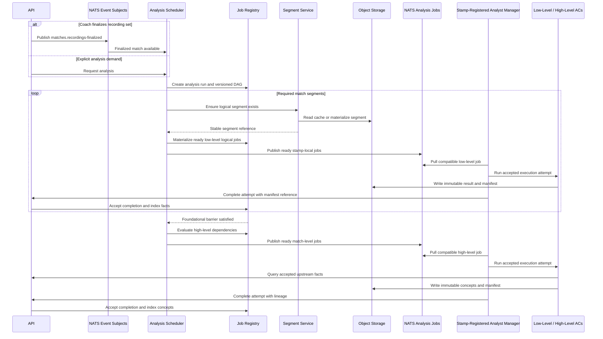

# Event-Driven Job Processing (Provisional)

NATS carries two distinct kinds of traffic:

- event subjects publish lifecycle notifications such as
    `matches.recordings-finalized`
- analysis job subjects use JetStream work-queue and pull-consumer semantics

The control-plane Analysis Scheduler reacts to upload policy or explicit
analysis demand and executes a versioned full-match capability graph. The Job
Registry is the durable system of record for workflow state and dependency
readiness. NATS transports lifecycle notifications and ready jobs only.
Analyst Managers pull work; the platform does not push jobs to a specific host.

## Reliable Event Publication

The control plane writes domain state and outgoing event records to a
PostgreSQL transactional outbox in the same database transaction. A background
publisher delivers pending records to NATS JetStream with bounded retries and
records successful publication. Direct publish-after-commit is not the durable
boundary because a process failure between commit and publish could lose an
event.

Delivery is at least once. Event consumers, job materialization, and completion
handlers therefore use stable identifiers and idempotent processing. Outbox
age, retry count, failure state, and publication lag are observable, and
retention removes only records whose publication outcome is known. Retention,
deletion, audit, replica, and backup obligations then follow
[Security and Data Governance](security-and-data-governance.md).

## Durable Workflow Model

The Scheduler owns graph evaluation and the Job Registry persists four related
levels of state:

- **Analysis run:** team, match, finalized recording-set version, workflow
    definition and version, requested capability set, overall state,
    timestamps, and completion policy.
- **Workflow node:** one capability in the graph, including tier, execution
    scope, required inputs, resolved Analyst-profile, OCI image, model and
    policy digests, retry and timeout policy, and dependency edges.
- **Logical job:** one schedulable segment-level or match-level realization of
    a workflow node. Logical jobs are hardware-neutral.
- **Execution attempt:** one leased execution of a logical job using the claim,
    heartbeat, fencing, retry, and accepted-completion semantics defined in
    [Analyst Runtime and Recovery](analyst-runtime-and-recovery.md).

This hierarchy is `analysis run → workflow node → logical job → execution
attempt`. NATS is not a workflow state store and does not decide dependency
readiness.

### Planned Durable Foundation

The planned Analysis functional area will persist, in the platform's
application schema, Analysis Runs, Workflow Nodes and run-local dependency
edges, Logical Jobs, Execution Attempts, immutable accepted-result references,
idempotency, notification deduplication, and its outgoing events through the
platform outbox. Registry-owned workflow,
capability, Analyst-profile, model, schema, runtime, policy, resource, retry,
and timeout versions are validated through typed Registry application queries;
Analysis stores the resolved capability declaration, Analyst-profile, OCI
image, model, policy, schema, resource, retry, lease, stale-timeout, and
execution-timeout identities and values in immutable run and node snapshots.
Container-owned preprocessing has no independently selectable job identity.

Implementation evidence must cover hierarchy round trips, immutable run
snapshots, acyclic graph validation, hardware-neutral Logical Jobs, attempt
number and entity-version conflicts, accepted-result lineage and fencing,
duplicate or fabricated notification rejection, and complete restart recovery
with NATS empty or unavailable. Outbox tests cover atomic state publication
records, broker outage, retry, restart, and expired leases.

For a segment-level logical job, the stable segment reference is an analysis
segment reference from the [Segment Contract](match-data-pipeline.md#segment-contract):
the finalized recording-set-version ID plus the complete materialized identity
of recording-version ID, timeline-mapping digest, segmentation-policy digest,
and segment number. The Scheduler accepts it only after membership and
match/team scope validation. Recording-set-only revisions may reuse the same
materialized media while retaining distinct analysis-run lineage.
Machine-readable job and completion schemas will be introduced with the first
Scheduler and Analyst implementation slice and must preserve these identities
and fencing boundaries.

## Readiness And Dependencies

For each analysis run, the Scheduler:

1. Materializes required logical segments on demand.
2. Creates one logical job per segment for each segment-scoped capability and
    one logical job per match for each match-scoped capability. Every job for a
    capability copies the same run-pinned Analyst-profile, OCI image, and model
    digests.
3. Fans out ready low-level jobs across segments and capabilities. Foundational
    capabilities may depend on other foundational capabilities, such as
    tracking depending on detections.
4. Waits until accepted, API-indexed foundational results exist at the declared
     versions for all required match segments. Match-consistent continuity work,
     such as track and identity reconciliation, is part of this barrier when a
     downstream capability declares it.
5. Publishes a match-level high-level job only after every declared upstream
     capability, schema, and result version is available. High-level nodes may
     depend on other high-level nodes, for example possession and transition
     analysis before counter-attack classification.
6. Marks downstream nodes blocked when required upstream work fails. Blocked
     logical jobs are never published to NATS.

Each dependency edge is explicitly `required`, `optional`, or `conditional`.
A required failure blocks the dependent job. An optional result is consumed
when accepted but never delays or blocks readiness. A conditional dependency is
required only when its declared predicate applies; otherwise it behaves as an
optional input. For `person-tracking`, accepted media context is consumed when
available, but missing or failed media context does not block tracking from
accepted person detections.

Match-scoped foundational jobs wait for the required segment results declared
by their capability. When a capability permits partial coverage, its job
snapshot records the accepted, failed, missing, and skipped segments and the
result reports that coverage explicitly; partial input is never mistaken for a
complete match barrier.

Detection, tracking, counter-attack detection, and formation analysis are
capability names, not execution components. New capabilities extend a versioned
graph and capability registry rather than requiring a new workflow service.
The representative dependency graph and complete initial inventory are defined
in the [Analyst Capability Catalog](analyst-capability-catalog.md).

Spatial inference tiles are internal, in-memory detector inputs. They are not
workflow nodes, logical jobs, or NATS messages. The Scheduler operates on the
declared detector capability and receives only its merged source-frame result.

## Run State And Recovery

An analysis run can be `Requested`, `Running`, `PartiallyCompleted`,
`Completed`, `Failed`, or `Cancelled`. A workflow node may additionally be
`Blocked` when a required dependency fails. Node and logical-job state
is sufficient to reconstruct dependency readiness after a Scheduler or control-
plane restart.

Retrying an execution attempt does not restart its analysis run. Accepted
upstream outputs are reused, duplicate or stale completions are rejected by the
existing fencing rules, and cancellation immediately stops publication,
revokes queued work, advances or invalidates attempt fencing tokens, and
rejects later completions. Stopping an active container is best effort;
correctness relies on completion rejection.

The immutable logical-job snapshot owns `max_attempts` and the effective lease,
stale-timeout, and execution-timeout values copied from its capability's
resolved Analyst profile. Each successful claim creates one numbered execution
attempt and consumes one attempt from that budget. A stale or failed attempt is
republished only while budget remains. Exhaustion permanently fails the logical
job and applies the normal descendant-blocking rules. A retry on another
Manager must use the same pinned OCI image and model digests.

A permanently failed capability blocks only its descendants. Independent
successful branches remain accepted and the run terminates as
`PartiallyCompleted`. A run is `Failed` only when no required useful result can
be accepted or run creation itself fails.

Any changed source input, Analyst profile, OCI image, model, policy, capability,
or contract version creates an entirely new analysis run and recomputes every
node. Prior runs and accepted results remain immutable history but are never
imported as completed nodes into the new run. Descendant-only recomputation is
a future optimization, not initial behavior.

## Production Queue Recovery and Backpressure

Production JetStream persistence, consumer recovery, backlog objectives,
alerts, capacity thresholds, and backpressure actions follow
[Production Deployment and Operations](production-operations.md). Those
mechanisms preserve this topic's authority boundary: PostgreSQL and the Job
Registry remain workflow truth, the transactional outbox remains the durable
publication boundary, delivery remains at least once, and completion remains
idempotent and attempt-fenced.

After broker loss or restore, streams and consumers are reconciled from durable
Job Registry and outbox state. Queue depth and oldest-work age can trigger
admission throttling or pause/drain procedures, but they never authorize work,
drop logical jobs, publish blocked descendants, or override accepted state.

## Implementation Validation

Implementation requires evidence for:

- Scheduler evaluation and Job Registry DAG recovery after control-plane
    restart
- full-match fan-out, barrier, and fan-in behavior
- dependency-version validation and complete reruns
- partial failure, cancellation, supersession, and duplicate completion

New Analysts can be added without changing the platform.

---

Related architecture: [Index](README.md) |
[Platform Implementation Profile](platform-implementation.md) |
[Match Data Pipeline](match-data-pipeline.md) |
[Analyst Capability Catalog](analyst-capability-catalog.md) |
[Analyst Manager](analyst-manager.md) | [Analyst Runtime and Recovery](analyst-runtime-and-recovery.md)
