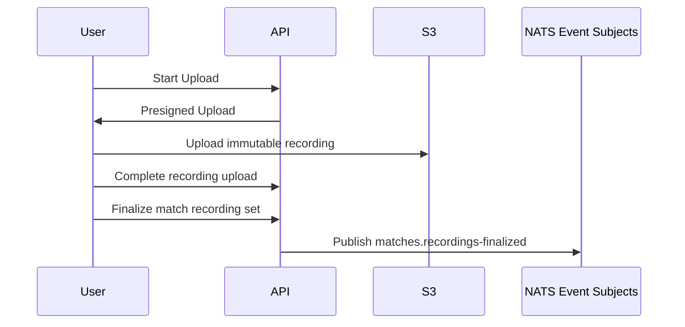
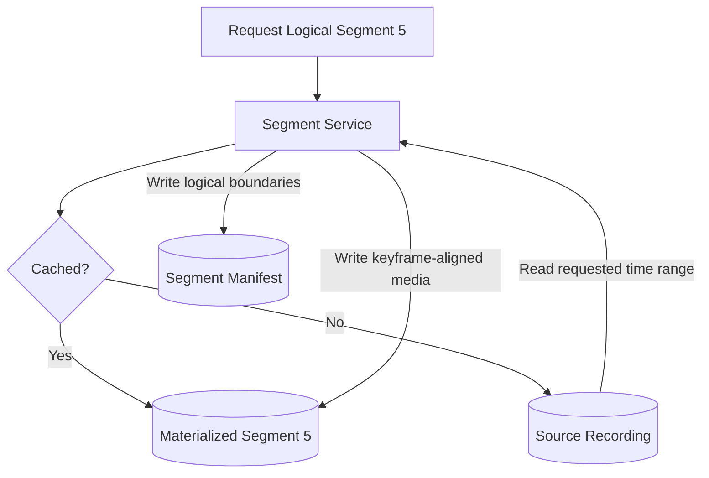

# Match Data Pipeline

This document covers recording upload and on-demand materialization. Both flows
follow the [S3 data-plane and video-isolation principles](terminology-and-principles.md#3-s3-as-universal-data-plane).

## Match Processing Pipeline

### Upload



  A match belongs to one season-owned team and contains one or more immutable
  source recordings. Opponent details are stored as a snapshot on the match.
  Only a club administrator or a user with the team's `Coach` role may create a
  match, upload recordings, or finalize its recording set. Finalization freezes
  the set used by an analysis run. A later recording addition or correction
  creates a new recording-set version and a new run rather than overwriting
  accepted evidence.

  An upload grant will be a presigned single-object `PUT` for one
  platform-chosen key whose declared SHA-256 is bound as a signed
  `x-amz-checksum-sha256` header. Completion will accept the object only when
  object storage reports the declared size and a full-object SHA-256 checksum
  equal to the declaration; when storage cannot report that evidence,
  completion fails closed. The API never reads or relays the media.

### Planned Recording-Lineage Foundation

The planned Recordings functional area will persist, in the platform's
application schema, upload sessions as its only mutable aggregate, and
immutable recording versions, immutable timeline mappings, finalized
recording-set versions, ordered memberships, scoped idempotency outcomes, and
exactly one immutable recordings-finalized event record per recording-set
version, committed in the same transaction as the set. The Durable Analysis
workflow will introduce the platform outbox and NATS publisher, add the outbox
call to the finalization handler, and backfill records finalized before it; it
will publish them to `matches.recordings-finalized`, track publication state
separately, and never rewrite the record. Match and Team existence and
authorization are resolved through the Club and Identity and Access application
handlers; downstream validation uses a typed Recordings lineage query rather
than reading Recordings tables directly.

Its implementation tests must cover immutable metadata and mapping revisions,
mapping/recording mismatch, missing Match and unauthorized Team access, empty
or cross-scope sets, atomic finalization and rollback, replay behavior, one
canonical finalized event, and revision through a new recording-set identity.

---

## On-Demand Video Segmentation

The data-plane Segment Service materializes independently decodable media only
when a logical segment is requested. It is not an Analyst and does not run
through an Analyst Manager.



### Segment Contract

The accepted logical-segment design uses immutable values, not mutable labels:

- A **recording version** identifies one immutable source-video version owned
  by one match.
- A **timeline mapping** immutably maps that recording version's media time to
  match time as an ordered list of spans, each mapping a half-open media
  interval to match time at a 1:1 rate, strictly increasing and
  non-overlapping in both media and match time. Its digest is `sha-256` over a
  canonical JSON form with integer milliseconds and changes whenever the
  mapping changes.
- A **segmentation policy** has a fixed positive duration and an immutable
  digest over the policy version and all inputs that affect logical windows.
- A **materialized-segment identity** is the complete tuple
  `(recording-version-id, timeline-mapping-digest,
  segmentation-policy-digest, segment-number)`, where the segment number is a
  positive one-based integer. The cache key is a deterministic projection of
  every field in this tuple; its canonical serialization is deferred to the
  future machine-readable contract work.
- An **analysis segment reference** combines one finalized
  `recording-set-version-id` with one complete materialized-segment identity.
  Validation confirms that the recording version and exact timeline mapping
  are immutable members of that finalized set and belong to the analysis
  run's match and team scope.

The recording-set version is analysis lineage, not part of reusable
materialized identity. For example, `(recording-v3, mapping-a, policy-p1, 4)`
always identifies the same materialized segment. Finalized sets `set-v7` and
`set-v8` produce distinct analysis references to it when both contain
`recording-v3` with `mapping-a`. Changing the recording version, mapping digest,
policy digest, or segment number produces a different materialized identity.

For fixed positive policy duration `D`, segment `n` owns the half-open nominal
match-time window:

```text
nominal-start = (n - 1) * D
nominal-end   = n * D
nominal-window = [nominal-start, nominal-end)
```

The requested source interval is the non-empty intersection of the nominal
window and the selected recording version's mapped match-time coverage.
Coverage may clip extraction but never shifts or renumbers nominal ownership.
An empty intersection is an invalid reference.

Segmentation policy v1 fixes `D = 5 minutes`. Segment 1 owns `[00:00, 05:00)`
and segment 2 owns `[05:00, 10:00)`: an event exactly at `05:00` belongs only
to segment 2. Football-period boundaries do not reset numbering; period context
is metadata rather than segment identity. Changing the duration creates a new
policy version and digest.

A published segment manifest records:

- the complete materialized-segment identity;
- the nominal match-time window and requested source interval;
- the actual encoded media boundaries;
- an immutable artifact reference; and
- an algorithm-qualified media digest, `sha-256:<hex-digest>`.

Machine-readable segment schemas will be introduced with the Segment Service
implementation and must encode these identities without redefining them.

Encoded boundaries may extend beyond the requested interval when keyframe
alignment requires decoding context, but they must cover the complete requested
interval. They neither change the logical identity nor authorize foundational
facts outside the nominal half-open window. The media digest verifies bytes and
is distinct from both logical identity and cache key. Bytes that do not match
the manifest digest are rejected as a cache hit and as lineage input.

Materialization exposes the abstract states `absent`, `materializing`,
`available`, and `failed`. Only an immutable `available` artifact with a valid
digest is visible as a cache hit or lineage input. Concurrent requests for one
materialized identity may coordinate by any implementation mechanism, but at most
one artifact-and-digest association becomes current and every successful caller
receives that same association. Temporary, partial, failed, and losing
candidates remain invisible.

A request is rejected before publication when any identity field is missing;
the duration or segment number is nonpositive; the policy or mapping is
unknown; recording-set membership, match scope, or team scope disagrees; the
coverage intersection is empty; or published bytes fail digest validation.
These failures never create a cache entry or lineage input.

Transient extraction or storage failures may be retried using the unchanged
materialized identity. No failed or partial candidate becomes visible between
attempts. Success publishes the one current immutable association; retry-budget
exhaustion returns an explicit failure and leaves no published cache entry or
lineage input. Whether a failure is retryable and the retry budget are runtime
policy, not part of this identity contract.

Recording versions, mappings, and segmentation policies are immutable and
coexist by identity. A changed recording version, timeline-mapping digest,
segmentation-policy digest, or segment number creates a new materialized
identity rather than invalidating or reinterpreting an existing one. Historical
artifacts remain addressable for auditable runs. A recording-set-only revision
creates a distinct analysis reference but reuses existing materialized media
when all materialized identity inputs are unchanged. Physical retention and
garbage collection do not alter this logical addressability and follow
[Security and Data Governance](security-and-data-governance.md), including
source-deletion propagation and backup-expiry requirements.

During initial private development, materialized segments remain cached until
an explicit manual purge. No automatic age- or capacity-based eviction is
implemented initially. Purge never changes logical identity: a later request
deterministically rematerializes the same logical segment, subject to the same
manifest and digest validation.

### Segment And Match Analysis Scope

Low-level Analyst Containers primarily consume materialized segments and emit
foundational facts only for each segment's nominal logical window. Encoded
overlap exists for decoding context and does not authorize duplicate facts
outside that window.

The API validates and indexes accepted low-level result manifests, then exposes
an ordered, match-wide fact stream to authorized high-level Analyst Containers.
The stream preserves source time ranges, capability and schema versions, result
identities, and confidence while hiding storage layout and segment boundaries
that are irrelevant to football reasoning. High-level ACs execute at match
scope and query this stream through team-authorized, match-scoped APIs.

Track and identity reconciliation, and any other declared foundational
continuity work, must produce accepted match-consistent facts before dependent
high-level jobs become ready. A soccer concept may span multiple segments; its
manifest references the contributing time ranges and complete accepted
upstream-result lineage. Segment cuts are media-processing boundaries, not
football-event boundaries.

These temporal segments are distinct from spatial inference tiles. A detector
AC may divide a decoded frame into overlapping in-memory tiles as an internal
implementation detail of its digest-pinned container, but the Segment Service
does not create, persist, or schedule those tiles. Downstream facts use merged
source-frame coordinates and remain bounded to the segment's nominal half-open
validity window. Result acceptance rejects facts outside that window.

### Implementation Validation

A prototype must verify keyframe-aligned extraction, stable logical boundaries, concurrent
cache-miss behavior, storage cost, and policy-version migration. The choice is
revisited only if measured results challenge the segment identity, cache, and
materialization boundaries above. Workflow evidence must also verify cross-
segment identity continuity and concepts that span segment boundaries.

---

Related architecture: [Index](README.md) | [Job Processing](job-processing.md) |
[Analysts, Models, and Hardware](analysts-models-and-hardware.md) |
[Analyst Capability Catalog](analyst-capability-catalog.md)
