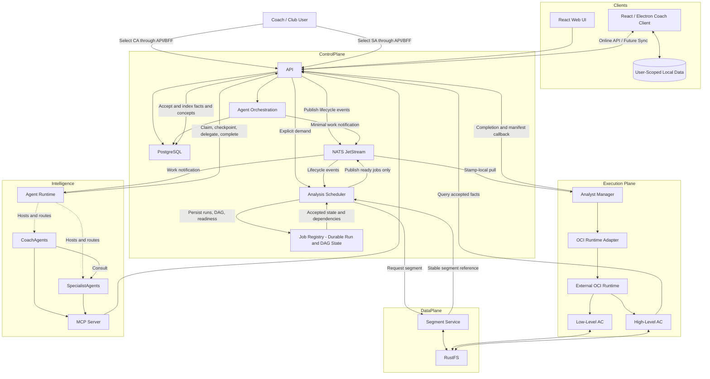

# SocAlytics Architecture Overview

This document provides the system-level entry point. Detailed contracts and
decisions are linked from the [architecture index](README.md).

SocAlytics is currently in its pre-implementation architecture phase. Unless a
document explicitly says otherwise, components, contracts, workflows, and
technology profiles describe the intended system rather than existing code or
deployed services.

## Vision

SocAlytics is an API-first football analytics platform designed for:

- Large match recordings (90+ minutes)
- Distributed AI analytics
- Self-hosted and SaaS deployments
- One club per independently operated deployment stamp
- Local hardware acceleration (GPU, Hailo, Coral, CPU, Mac)
- Agent-driven coaching insights

The architecture follows a strict separation of:

- **Control Plane**
- **Data Plane**
- **Execution Plane**
- **Intelligence Plane**

---

## Decision Status

During the pre-implementation phase, accepted decisions update their owning
architecture documents directly. The future use of ADRs is described in the
[architecture decision policy](decisions/README.md). `Accepted` below means
accepted as the implementation target; it does not imply that code exists.

<!-- markdownlint-disable MD013 -->

| Architecture group | Status |
| --- | --- |
| Client application boundary and offline-ready coach client | Accepted ([decision evidence](client-decision-evidence.md)) |
| Detailed client architecture gate | Accepted ([decision evidence](client-decision-evidence.md)) |
| API-first interfaces and plane boundaries | Provisional |
| S3-compatible data plane and control-plane video isolation | Provisional |
| On-demand five-minute segment model | Accepted |
| Analysis DAG completion, cancellation, and rerun semantics | Accepted |
| Analyst image metadata, packaging, and runtime adapters | Accepted |
| Capability-scoped accepted-result access | Accepted |
| Post-analysis triage, Hermes, model providers, and MCP boundary | Accepted |
| Single-club stamp and organizational hierarchy | Provisional |
| Security and server data-lifecycle governance | Provisional / Blocking production |
| Production deployment and operations | Provisional / Blocking production |
| Technology stack selections | Provisional |

<!-- markdownlint-enable MD013 -->

The [Analyst Capability Catalog](analyst-capability-catalog.md) provides the
canonical initial capability inventory, dependency graph, implementation
waves, Analyst profiles, container-owned processing expectations, and
validation gates without changing these decision statuses.

The [Intelligence Agent Catalog](intelligence-agent-catalog.md) provides the
canonical initial CA and SA roster, prompt drafts, tool policies, rollout waves,
and validation gates without changing these decision statuses.

The [Security and Data Governance](security-and-data-governance.md) topic is
the authoritative provisional threat model and server lifecycle policy. Its
unresolved owners, deployment-specific policy values, and implementation
evidence block production acceptance without selecting a production topology.
Its versioned decision register and profile-scoped `GOV-SIGN-001` are required
readiness inputs; unresolved entries do not change the authority or deployment
invariants summarized here.

The [Production Deployment and Operations](production-operations.md) topic
maps the control, data, execution, and intelligence planes to the initial
Provisional Docker Compose profile and owns recovery, service objectives,
telemetry, capacity, incidents, upgrades, and production-readiness evidence.

---

## Planned Implementation Profile

The logical architecture is planned provisionally as a .NET 10 and ASP.NET
Core monolith structured in application layers and composed locally with
Aspire, with React and
TypeScript clients, one PostgreSQL database per stamp, Dapper-based logical
CQRS, NATS JetStream, RustFS/S3, a .NET and Avalonia Analyst Manager, and Python
Analyst Containers. Hermes is planned as a separate Python OCI service. Source
will remain in one monorepo and production artifacts will be cloud-neutral OCI
images.

The canonical technologies, boundaries, and required evidence are defined in
the [Platform Implementation Profile](platform-implementation.md).

---

## High Level Architecture

```mermaid
flowchart TB

    User[Coach / Club User]

    subgraph Clients[Client Applications]
        WEB[React Web UI]
        COACH[React / Electron Coach Client]
        LOCAL[(Local Coach Data)]
        COACH <--> LOCAL
    end

    subgraph ControlPlane["Control Plane"]
        API[SocAlytics API]
        DB[(PostgreSQL)]
        AGENTS[Agent Orchestration]
        JOBS[Job Registry - Durable Run and DAG State]
        SCHEDULER[Analysis Scheduler]
        MODEL[Model Registry]
        CLUB[Club / Season / Team Management]
    end

    subgraph Messaging["Event & Job Backbone"]
        NATS[NATS JetStream]
    end

    subgraph DataPlane["Data Plane"]
        SEGMENTS[Segment Service]
        S3[(RustFS / S3)]
    end

    subgraph AnalystManagers["Execution Plane"]
        AM1[Analyst Manager 1] --> RA1[Runtime Adapter 1]
        RA1 --> L1[Low-Level AC]
        RA1 --> H1[High-Level AC]
        AM2[Analyst Manager 2] --> RA2[Runtime Adapter 2]
        RA2 --> L2[Low-Level AC]
        RA2 --> H2[High-Level AC]
        AM3[Analyst Manager 3] --> RA3[Runtime Adapter 3]
        RA3 --> L3[Low-Level AC]
        RA3 --> H3[High-Level AC]
    end

    subgraph Agents["Intelligence Plane"]
        Hermes[Agent Runtime]
        CoachAgents[Coach Agents]
        SpecialistAgents[Specialist Agents]
        MCP[MCP Server]
    end

    User --> WEB
    User --> COACH

    WEB --> API
    COACH <-->|Online API / Future Sync| API

    API --> DB
    API --> AGENTS
    AGENTS --> DB
    API --> JOBS
    API --> SCHEDULER
    API --> MODEL

    SCHEDULER -->|Persist runs, DAG, readiness| JOBS
    JOBS -->|Accepted state and dependencies| SCHEDULER
    SCHEDULER -->|Request segment| SEGMENTS
    SEGMENTS -->|Stable segment reference| SCHEDULER
    API -->|Publish lifecycle events| NATS
    NATS -->|Lifecycle events| SCHEDULER
    SCHEDULER -->|Publish ready jobs only| NATS
    AGENTS -->|Publish minimal work notifications| NATS

    API -->|Presigned access| S3
    SEGMENTS <--> S3

    NATS -->|Stamp-local pull| AM1
    NATS -->|Stamp-local pull| AM2
    NATS -->|Stamp-local pull| AM3
    NATS -->|Work notification| Hermes

    L1 <--> S3
    L2 <--> S3
    L3 <--> S3
    H1 <--> S3
    H2 <--> S3
    H3 <--> S3

    H1 -->|Query accepted facts| API
    H2 -->|Query accepted facts| API
    H3 -->|Query accepted facts| API

    AM1 -->|Completion and manifest callback| API
    AM2 -->|Completion and manifest callback| API
    AM3 -->|Completion and manifest callback| API
    API -->|Accept and index facts and concepts| DB

    User -->|Select CA through API/BFF| API
    User -->|Select SA through API/BFF| API
    Hermes -->|Claim, checkpoint, delegate, complete| API
    Hermes -.->|Hosts and routes| CoachAgents
    Hermes -.->|Hosts and routes| SpecialistAgents
    CoachAgents -->|Consult| SpecialistAgents
    CoachAgents --> MCP
    SpecialistAgents --> MCP
    MCP --> API
```

For the detailed boundaries, see [Terminology and Principles](terminology-and-principles.md),
[Match Data Pipeline](match-data-pipeline.md), [Job Processing](job-processing.md),
[Analyst Manager](analyst-manager.md), [Analyst Runtime and Recovery](analyst-runtime-and-recovery.md),
[Intelligence and Agents](intelligence-and-agents.md),
[Intelligence Agent Catalog](intelligence-agent-catalog.md), and
[Tenancy and Technology](tenancy-and-technology.md), and
[Production Deployment and Operations](production-operations.md).

---

## Final Mental Model

**In one sentence:**

SocAlytics is a distributed, S3-centric football analytics platform where
Analyst Managers coordinate autonomous Analysts that process video artifacts
and publish structured football knowledge, while Coach Agents and Specialist
Agents turn that knowledge into actionable coaching insights.

---

Related architecture: [Index](README.md) |
[Platform Implementation Profile](platform-implementation.md) |
[Client Applications](client-applications.md) |
[Tenancy and Technology](tenancy-and-technology.md) |
[Production Deployment and Operations](production-operations.md)
