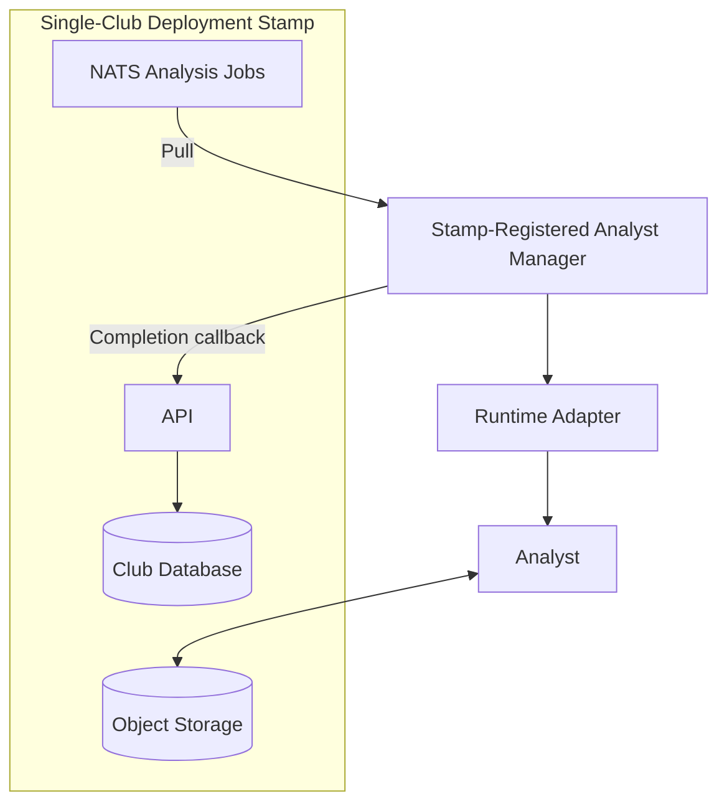

# Deployment and Technology

This document summarizes the cross-cutting single-club stamp requirements and
the current technology selections. Detailed behavior remains in the linked
topic documents.

## Single-Club Deployment Stamp

Each SocAlytics deployment stamp represents exactly one club. The club is the
implicit domain root, so requests, jobs, manifests, and persistence records do
not carry a cross-club discriminator. Each stamp owns dedicated logical
database, object-storage, queue, credential, and configuration resources;
physical hosts and managed service instances may be shared between stamps.

The organizational hierarchy inside a stamp is `Club > Season > Team > Match`.
Users belong to the club, while non-admin access is granted at team level and
inherits to matches, recordings, analytics, and agent evidence. See
[Terminology and Principles](terminology-and-principles.md) for the canonical
ownership and lifecycle rules.

Logical isolation does not relax encryption, residency, privileged-access, or
copy-lifecycle obligations when physical infrastructure is shared. Those
requirements are defined by
[Security and Data Governance](security-and-data-governance.md).

Requirements:

- exactly one club per stamp
- dedicated logical data, messaging, credentials, and configuration per stamp
- team-scoped authorization within the club hierarchy
- stamp-specific analytics and model tracking
- stamp-registered Analyst Managers

### Stamp Persistence

The control-plane foundation implements the stamp's database side as one
PostgreSQL database with module-owned schemas: `club` for the singleton
Club root and `Club > Season > Team > Match` hierarchy, `identity_access` for
membership and Club/Team grants, `recordings` for immutable recording lineage,
`registry` for immutable capability and model metadata, and `analysis` for
durable run and result lineage, and `agent_orchestration` for agent state.
Shared migration history is isolated in `socalytics_migrations`; it owns no
domain records. Each module has a NOLOGIN owner and runtime role, and
cross-schema access is denied. Only the schemas, roles, and migration history
exist today; no domain tables do. Details, the ADR disposition, and executable
evidence are in the
[Platform Implementation Profile](platform-implementation.md#persistence-and-cqrs).

Persistence tests already verify that no schema, table, view, column, or
function argument carries `club_id`. Domain tests must still verify that the
Club row is a singleton, hierarchy parents are required, protected resources
resolve to Team scope, and revoked and cross-Team grants do not authorize
access. These checks validate the single-club invariant only. They do not approve shared physical production
infrastructure, credentials, residency, encryption, retention, or other
production-policy values.

## Initial Production Profile

The initial production orchestrator is **Provisional Docker Compose**. One
Compose project namespace represents one deployment stamp and uses
Compose-managed PostgreSQL, NATS JetStream, and S3-compatible storage on
durable, stamp-dedicated logical volumes and networks. Physical hosts may be
shared only when database, storage, messaging, credentials, configuration,
network, volume, and resource isolation remain independently verifiable.

.NET Aspire remains the local-development composition and is not the
production orchestrator. The complete environment inventory, persistence,
backup/restore, service-objective, telemetry, capacity, incident, upgrade, and
readiness contract is defined in
[Production Deployment and Operations](production-operations.md). Host,
provider, ports, secret source, resource values, and numeric objectives remain
profile-specific and Open / Blocking until approved with evidence.

The profile also adopts exact approved versions from the
[Security-Governance Decision Register](security-and-data-governance.md#security-governance-decision-register)
and a valid profile-scoped `GOV-SIGN-001`. This gate does not reopen the
single-club stamp: each stamp still has exactly one club and dedicated logical
data, messaging, credentials, configuration, networks, and volumes. PostgreSQL
remains domain and workflow authority, NATS remains transport only, and the
architecture remains cloud-neutral. Any unresolved or mismatched governance
entry keeps production promotion blocked.

---

## Technology Stack

The detailed planned implementation baseline and validation criteria are
defined in the
[Platform Implementation Profile](platform-implementation.md#planned-acceptance-evidence).

### Client Applications

- React and TypeScript web UI built with Vite
- React Router, TanStack Query, and MUI with a SocAlytics theme
- React, TypeScript, and Electron coach desktop client
- separately packaged application shells with selected environment-neutral
    packages shared through a `pnpm` workspace
- future offline boundaries governed by
    [Client Applications](client-applications.md)

### Control Plane

- .NET 10 LTS and C#
- .NET Aspire for development composition and service defaults
- ASP.NET Core modular monolith and backend-for-frontend
- Agent Orchestration module with module-owned PostgreSQL state, migrations,
  projections, and transactional outbox
- REST and JSON with OpenAPI; Kiota-generated clients
- PostgreSQL, hosted locally through Aspire
- Npgsql, Dapper, logical CQRS, and plain typed handlers
- DbUp and module-owned versioned PostgreSQL SQL migrations recorded with
  checksums in `socalytics_migrations.history`
- ASP.NET Core Identity with Dapper stores, always-available local accounts,
    and optional external OpenID Connect providers

### Event Backbone

- NATS
- JetStream
- PostgreSQL transactional outbox and idempotent consumers

### Data Plane

- RustFS
- S3 Protocol

### Execution Plane

- .NET 10 Generic Host and Avalonia Analyst Manager
- OCI Runtime Adapter
- Externally managed runtime profiles (Docker Desktop first to validate)
- OCI Images

### Analytics

- Python projects managed by `uv` with `pyproject.toml` and committed lockfiles
- JSON Schema contracts with Pydantic models in the Analyst SDK
- RT-DETRv2-S baseline and YOLOX-S/M challenger
- PyTorch training and ONNX export
- ONNX Runtime CPU/CUDA inference
- Optional TensorRT optimization
- OpenCV and classical numerical and machine-learning libraries
- SAHI slicing and postprocessing after license and dependency audit
- HailoRT and Coral Edge TPU runtime-specific adapters with fixed-shape
    compiled artifacts

Exact versions and artifacts are controlled by the Model/Capability Registry
and remain Provisional pending license, provenance, quality, runtime, and cost
evidence. Coral profiles additionally require fully 8-bit-quantized TensorFlow
Lite artifacts and matching Edge TPU compiler and runtime versions.

### AI

- MCP with an explicit agent-safe read-only API allowlist
- Hermes as a separate Python OCI runtime with no database access
- Microsoft Agent Framework behind Hermes-owned adapters
- OpenAI API as the default model provider
- GitHub Models as a manually selected development alternative

For each invocation, Hermes resolves versioned prompt,
model/deployment, tool-policy, and safety-policy artifacts under the
authenticated user's team and resource authorization. Hermes claims durable
work through versioned Agent Orchestration API operations. PostgreSQL remains
authoritative; transactional-outbox notifications on JetStream are minimal and
at least once. A provider-neutral adapter prevents provider SDK types from
entering catalog or orchestration contracts, and no silent provider fallback is
allowed. Prompt policy describes agent behavior; MCP and the API remain the
enforcement boundary for platform access. See the
[Intelligence Agent Catalog](intelligence-agent-catalog.md).

### Engineering Baseline

- one monorepo using native .NET, `pnpm`, and `uv` workspaces
- cloud-neutral OCI production artifacts
- OpenTelemetry with Aspire ServiceDefaults for .NET components
- xUnit v3, Shouldly, NSubstitute, Vitest, Testing Library, pytest,
  Playwright, and Testcontainers

The .NET foundation, project and schema ownership, and validation
criteria are recorded in the
[Platform Implementation Profile](platform-implementation.md).

---

Related architecture: [Index](README.md) |
[Platform Implementation Profile](platform-implementation.md) |
[Client Applications](client-applications.md) |
[Job Processing](job-processing.md) | [Analyst Manager](analyst-manager.md) |
[Analyst Capability Catalog](analyst-capability-catalog.md) |
[Intelligence and Agents](intelligence-and-agents.md) |
[Intelligence Agent Catalog](intelligence-agent-catalog.md) |
[Production Deployment and Operations](production-operations.md)
