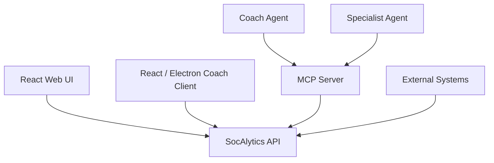
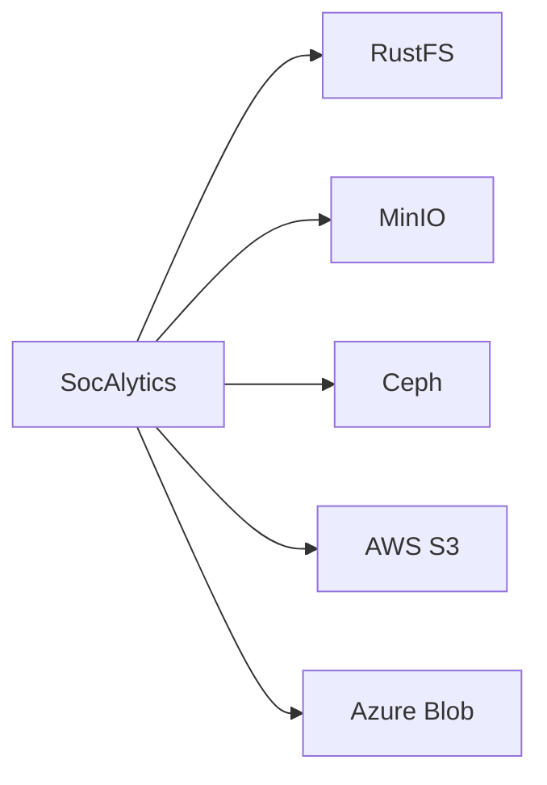
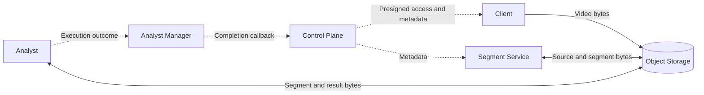

# Architectural Principles

These definitions and constraints apply across every architecture topic. See
the [architecture overview](overview.md) for the system topology.

## Terminology

- **Deployment stamp, or stamp:** one independently operated SocAlytics
  deployment representing exactly one club. The club is the implicit root of
  the stamp; internal contracts do not carry a cross-club discriminator. Each
  stamp owns dedicated logical database, object-storage,
  messaging, credential, and configuration resources, although physical
  infrastructure may be shared between stamps.
- **Club:** the organizational root represented by a stamp. Club administrators
  manage club settings, users, seasons, teams, grants, and all stamp content.
- **Registrar:** a club-level role that may initiate Analyst Manager
  registration. Club administrators inherit this capability. Activation still
  requires a separate, explicit Club Admin approval operation.
- **Season:** a club-owned period in `draft`, `active`, or `archived` state. A
  club has at most one active season. Teams belong to exactly one season, and
  archived seasons are read-only.
- **Team:** a season-owned squad and the authorization boundary for non-admin
  users. A club user may receive a `Coach` or `Viewer` role independently for
  each team. Club administrators inherit access to every team. Team access
  extends to the team's matches, recordings, analytics, and agent evidence.
- **Match:** a team-owned container for match metadata, an immutable opponent
  snapshot, uploaded source recordings, and analysis runs. A Coach explicitly
  finalizes the current recording set before match analysis begins.
- **Recording:** an immutable source video asset owned by one match. A match may
  contain multiple recordings; correcting or replacing one creates a new
  version rather than overwriting evidence.
- **Analyst Container (AC), or Analyst:** an OCI-packaged executable component
  that performs one analysis capability. **Analyst** remains the architecture
  term; **AC** is its abbreviation and does not mean Analyst capability.
- **Analyst capability:** the task an Analyst performs, such as
  `player-detector`, `tracking`, or `event-detection`. Detector describes a
  capability or model type, never an execution component.
- **Low-level Analyst Container:** an AC that produces foundational,
  time-aligned match facts rather than soccer interpretations. Tier does not
  determine execution scope: low-level ACs are primarily segment-scoped but
  may be match-scoped for cross-segment continuity such as identity linkage.
  They include object detection, tracking, pitch calibration, team
  classification, and identity linkage.
- **Foundational match fact:** a versioned observation or state derived from
  match video, such as a detection, track, calibrated coordinate, team
  assignment, or ball/player identity link.
- **High-level Analyst Container:** a match-scoped AC that combines accepted
  foundational facts, outputs from other high-level ACs, and optionally
  relevant video segments to produce a higher-level soccer concept.
- **Soccer concept:** a versioned domain fact such as a counter-attack, set
  play, offensive or defensive formation, pressing phase, or transition.
- **Analysis run:** one durable execution of a versioned full-match capability
  graph for a finalized match recording set.
- **Analyst Manager:** stamp-registered, cross-platform operator software installed
  on a participating host. It runs primarily in the system tray, advertises
  host capabilities, pulls compatible jobs, selects and launches Analyst
  images, and reports execution outcomes.
- **Analyst Manager registration:** a revocable stamp-local machine identity
  bound to one protected asymmetric device key. It remains valid across restart
  until local unregister or Club Admin revocation; short-lived API and broker
  credentials do not define its lifetime.
- **Coach Agent (CA):** a disclosed AI simulation inspired by a named famous
  soccer coach's documented public philosophy. It applies that perspective when
  prioritizing SocAlytics facts without impersonating the person, fabricating
  quotations or private knowledge, or implying endorsement. A Coach Agent is
  distinct from the **Coach Client**, which is a human-facing application.
- **Philosophy dimension set:** the semantically versioned shared dimensions
  against which every CA expresses its relative priorities. Structural changes
  require a major version and migration review for all active CA profiles.
- **Philosophy weight:** one integer share of a CA's 100-point attention budget.
  It affects prioritization, not factual confidence, performance evaluation,
  predicted success, or coaching quality.
- **Base philosophy profile:** an immutable, versioned CA vector containing one
  philosophy weight for every dimension in its declared dimension-set version.
- **Applied philosophy profile:** a base philosophy profile plus bounded,
  evidence-backed, budget-neutral context modifiers for one invocation. It
  cannot alter evidence, confidence, or the underlying base profile.
- **Specialist Agent (SA):** an AI advisor focused on a bounded soccer domain
  such as fitness, goalkeeping, tactics, video analysis, scouting, or player
  development. Its advice remains within its declared evidence, safety, privacy,
  and professional boundaries.
- **Segment:** a positive one-based logical fixed-duration, half-open match-time
  window. Segment 1 begins at match time zero. A recording's immutable timeline
  mapping may clip extraction to mapped coverage, but the nominal window remains
  the foundational-fact ownership boundary. The complete formulas and identity
  relationships are defined by the [Segment Contract](match-data-pipeline.md#segment-contract).
- **Materialized segment:** an immutable, independently decodable media artifact
  for one recording version, timeline mapping, segmentation policy, and segment
  number, cached in stamp-local object storage. It is reusable across finalized
  recording-set versions only under the owning Segment Contract.
- **Spatial inference tile:** an ephemeral crop of one decoded source frame,
  created in memory by the implementation inside a digest-pinned detector AC.
  It is not an independently selected profile, temporal segment, or workflow
  job.

Both Analyst tiers use the same OCI packaging and Analyst Manager execution
model. Neither tier receives database credentials. High-level ACs obtain facts
through match-scoped API queries and obtain video only through short-lived
presigned object-storage references.

Coach and Specialist Agents may use general football methods for interpretation,
but every current match, team, or player claim requires authorized MCP/API
evidence. They expose uncertainty, never access databases directly, and provide
advice for a human coach or authorized club user to accept, modify, or reject.

## 1. API-First

Everything is exposed through APIs.

User interfaces are first-class API consumers. API-first does not mean
UI-optional: supported user workflows must be available through an appropriate
client without coupling business logic to that client.

See [Client Applications](client-applications.md) for the supported user-facing
API consumers and [Intelligence and Agents](intelligence-and-agents.md) for the
MCP boundary.

---

## 3. S3 As Universal Data Plane

SocAlytics treats S3 as a protocol, not a product.

Possible implementations:

- RustFS
- MinIO
- Ceph RGW
- AWS S3
- Azure Blob Adapter

The platform never depends on a specific storage implementation.

---

## 4. Control Plane Never Touches Video

The control plane only handles metadata.

Video traffic flows between clients, the Segment Service, Analysts, and object
storage. The API issues presigned access but does not proxy video bytes.

This prevents the API from becoming a bottleneck.

---

Related architecture: [Index](README.md) |
[Match Data Pipeline](match-data-pipeline.md) |
[Analyst Runtime and Recovery](analyst-runtime-and-recovery.md)
