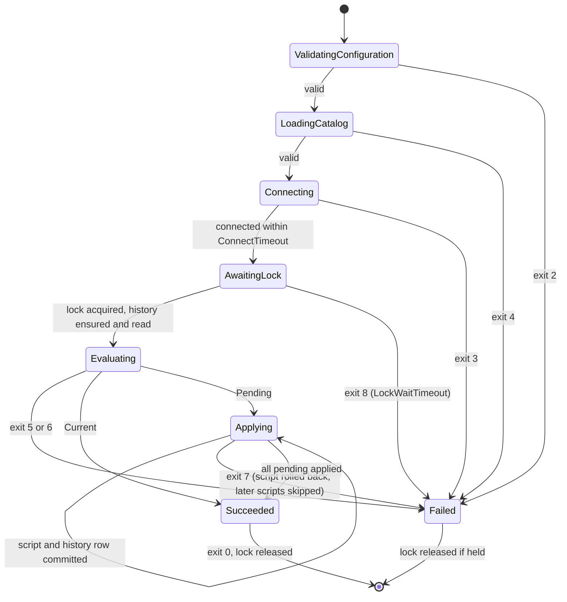
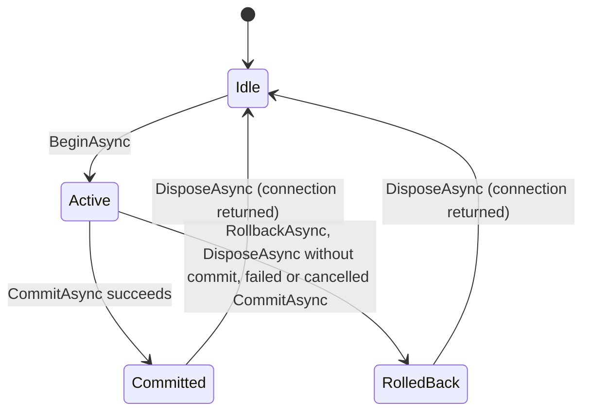

# Data Model: Platform Persistence Foundation

This feature adds no domain tables. It defines the database layout, the roles,
the migration history, the version mechanism that later features attach to
their tables, the runtime persistence types, and the test-only data used to
prove the behavior. Decisions behind each element are in
[research.md](research.md).

## Database and Schemas

| Element | Name | Owner | Purpose |
| --- | --- | --- | --- |
| Database | `socalytics` locally; production name deferred | `socalytics_migrator` | The single platform database of one stamp. |
| Application schema | `socalytics` | `socalytics_migrator` | Application Data Area. Holds all application data of all functional areas. Tables may be prefixed by area for readability; there are no per-area schemas. |
| History schema | `socalytics_migrations` | `socalytics_migrator` | Holds only the migration history; never domain data. |
| `public` schema | `public` | database owner | Unused by the platform. Runtime access cannot create objects there (PostgreSQL 15+ defaults plus database-level revokes). |

## Roles and Privileges

Roles are provisioned by the environment. Locally this is
`SocAlytics.Platform.AppHost/PostgresInit/01-socalytics-roles.sql`, which the
integration tests reuse. Migrations only grant privileges.

| Privilege | `socalytics_migrator` | `socalytics_app` | `PUBLIC` |
| --- | --- | --- | --- |
| `CONNECT` on database | yes (owner) | yes | revoked |
| `CREATE` on database (new schemas) | yes (owner) | no | revoked |
| `TEMPORARY` on database | yes (owner) | no | revoked |
| `USAGE` on schema `socalytics` | yes (owner) | yes | revoked |
| `CREATE` on schema `socalytics` | yes (owner) | no | no |
| Tables in `socalytics` | owner (all, including DDL) | `SELECT, INSERT, UPDATE, DELETE` (default privileges) | none |
| Sequences in `socalytics` | owner | `USAGE, SELECT, UPDATE` (default privileges) | none |
| `USAGE` on schema `socalytics_migrations` | yes (owner) | yes | none |
| `socalytics_migrations.history` | owner (`SELECT, INSERT`) | `SELECT` only | none |
| `EXECUTE` on `socalytics.attach_*` procedures | yes (owner) | no | revoked |
| Effective suppression of version advancement | yes (member check) | no (setting ignored) | n/a |

Validation rules:

- Every connection the Migrator opens sets `role=socalytics_migrator`, so all objects are owned by that role whatever the login identity is.
- Runtime access attempting `CREATE`, `ALTER`, or `DROP` on any structure, or `INSERT`, `UPDATE`, or `DELETE` on the history, fails with SQLSTATE `42501` (SC-006).

## Migration (catalog entry)

An immutable, registered migration loaded from embedded resources.

| Field | Type | Rule |
| --- | --- | --- |
| `Sequence` | `int` | Four-digit prefix, `1`–`9999`; unique within the catalog. |
| `Identity` | `string` | File name without `.sql`, matching `^[0-9]{4}_[a-z][a-z0-9]*_[a-z0-9]+(_[a-z0-9]+)*$`; unique within the catalog; stable forever. |
| `Area` | `string` | Second name segment (for example `foundation`, `club`, `identityaccess`, `recordings`, `registry`, `analysis`, `agentorchestration`; `test` only in test catalogs). Informational. |
| `Checksum` | `string` | `sha-256:` followed by the lowercase hex SHA-256 of the UTF-8 content, after stripping a leading BOM and normalizing CRLF and CR to LF. |
| `Content` | `string` | Script text. Never logged. |

Catalog validation fails as `catalog-invalid` (Migrator exit `4`) when:

- a name is malformed;
- a script is empty after trimming;
- a sequence or identity is duplicated.

## Migration History Record

Table `socalytics_migrations.history`. The Migrator creates it idempotently
from the embedded `Persistence/MigrationHistory/EnsureHistory.sql` while it
holds the lock.

| Column | Type | Constraint |
| --- | --- | --- |
| `sequence` | `integer` | `PRIMARY KEY`, `CHECK (sequence BETWEEN 1 AND 9999)` |
| `identity` | `text` | `NOT NULL`, `UNIQUE` |
| `checksum` | `text` | `NOT NULL`, `CHECK (checksum ~ '^sha-256:[0-9a-f]{64}$')` |
| `applied_at` | `timestamptz` | `NOT NULL DEFAULT now()` |

Rules:

- One row per successfully applied migration. It is inserted in the same transaction as the script, so a failed script leaves no row (FR-002, FR-003, FR-007).
- Rows are never updated or deleted by the platform. Unknown rows (identity not in the catalog) are left untouched (FR-009).
- The table has no club identifier and no domain data (FR-002, FR-019).

## Migration State

`MigrationStateEvaluator` combines the catalog and the history rows. The
Migrator (before applying) and the API readiness check both use it.

| Result | Condition | Migrator effect | Readiness effect |
| --- | --- | --- | --- |
| `ChecksumMismatch(identity)` | A catalog entry is in the history with a different checksum. | Exit `5`, nothing applied. | Unhealthy (`migration-state-conflict`) |
| `SequenceConflict(identity)` | A pending catalog entry has a sequence ≤ the highest applied sequence, counting unknown rows. | Exit `6`, nothing applied. | Unhealthy (`migration-state-conflict`) |
| `Pending(entries)` | Some catalog entries are absent from the history (or the history table is missing). | Apply in sequence order. | Unhealthy (`migration-state-not-current`) |
| `Current` | Every catalog entry is in the history with a matching checksum. | Exit `0`, nothing applied. | Healthy |
| `UnknownApplied(identities)` | History identities that are not in the catalog. | Attribute of any result above. Warning diagnostic only. | Warning diagnostic only |

The evaluation order is checksum mismatch, then sequence conflict, then
pending or current. The first failing rule determines the result.

## Migrator Run Lifecycle

Any state can end with exit `9` on cancellation, which rolls back the
in-flight script, or exit `1` on an unexpected error.

## Foundation Migrations

| Identity | Effect |
| --- | --- |
| `0001_foundation_application_schema` | Fails with a clear exception if role `socalytics_app` does not exist. Creates schema `socalytics`, revokes it from `PUBLIC`, and grants `USAGE` to `socalytics_app`. Sets `ALTER DEFAULT PRIVILEGES FOR ROLE socalytics_migrator IN SCHEMA socalytics` for tables (`SELECT, INSERT, UPDATE, DELETE`) and sequences (`USAGE, SELECT, UPDATE`) to `socalytics_app`. |
| `0002_foundation_version_triggers` | Creates the functions `socalytics.advance_version()` and `socalytics.touch_aggregate_root()` and the procedures `socalytics.attach_version_trigger(regclass)` and `socalytics.attach_aggregate_child_triggers(regclass, regclass, name, name)`. Revokes `EXECUTE` on both procedures from `PUBLIC`. |

Neither migration creates a table in `socalytics`.

## Record Version

The convention every later feature applies to mutable aggregate roots:

| Element | Definition |
| --- | --- |
| Column | `version bigint NOT NULL DEFAULT 1` on the aggregate root table only. |
| Root trigger | `<table>_version_advance`: `BEFORE UPDATE ON <root> FOR EACH ROW WHEN (OLD.* IS DISTINCT FROM NEW.*) EXECUTE FUNCTION socalytics.advance_version()`, attached by `CALL socalytics.attach_version_trigger('socalytics.<root>')`. |
| Child triggers | `<child>_root_touch`: `AFTER INSERT OR DELETE`, and `<child>_root_touch_update`: `AFTER UPDATE … WHEN (OLD.* IS DISTINCT FROM NEW.*)`. Both `FOR EACH ROW EXECUTE FUNCTION socalytics.touch_aggregate_root('<root>', '<root_key>', '<child_key>')`, attached by `CALL socalytics.attach_aggregate_child_triggers('socalytics.<child>', 'socalytics.<root>', '<child_key>')`. |
| Child rows | Carry no `version` column (FR-032). |
| Immutable records | Have no `version`; classified `Immutable` in the manifest. |

Function behavior:

- `advance_version()`:
  - not suppressed: `NEW.version := OLD.version + 1`;
  - suppressed: `NEW.version := OLD.version`.

  The result is exactly one increment per changed row, whatever the statement wrote into `version`. A no-op update does not fire the trigger.
- `touch_aggregate_root()`:
  - not suppressed: runs `UPDATE socalytics.<root> SET version = version + 1 WHERE <root_key> = <child_key value>` for the new row (insert or update) and the old row (delete, or update with a changed key);
  - suppressed: does nothing.

  The root update fires `advance_version()`, so the net effect is `+1` per child change. If the root was deleted in the same statement, the touch affects zero rows.
- **Suppression**: Active only when `current_setting('socalytics.suppress_version', true) = 'on'` and `pg_has_role(current_user, 'socalytics_migrator', 'MEMBER')`. A migration declares the opt-out with `SET LOCAL socalytics.suppress_version = 'on';`, which is scoped to its own transaction.

Write patterns (handler side; see [contracts/persistence-abstractions.md](contracts/persistence-abstractions.md)):

- **Edit**: `UPDATE … SET … WHERE id = @Id AND version = @ExpectedVersion RETURNING version`.
- **Lifecycle transition**: `UPDATE … SET state = @NewState … WHERE id = @Id AND state = @ExpectedState RETURNING version`.
- **Unguarded change**: `UPDATE … WHERE id = @Id`. It still advances the version by one when the row changes (FR-030).

## Runtime Persistence Types

| Type | Layer and visibility | Fields and members | Rules |
| --- | --- | --- | --- |
| `IUnitOfWork` | Application, public | `BeginAsync(CancellationToken) → IUnitOfWorkScope` | Scoped per DI scope. At most one active scope; a second `BeginAsync` throws `InvalidOperationException`. |
| `IUnitOfWorkScope` | Application, public | `CommitAsync(CancellationToken)`, `RollbackAsync(CancellationToken)`, `DisposeAsync()` | Dispose without commit rolls back. After commit or rollback, further commit or rollback throws. |
| `VersionedWriteOutcome` | Application, public enum | `Applied`, `NotFound`, `ConcurrencyConflict` | |
| `VersionedWriteResult` | Application, public `readonly record struct` | `Outcome`, `long? Version` | `Version` is the new version for `Applied`, the current version for `ConcurrencyConflict`, and `null` for `NotFound`. |
| `DbSession` | Infrastructure, internal | Implements `IUnitOfWork` and `IDbSession`; holds one `NpgsqlConnection` and one `NpgsqlTransaction` (Read Committed) | Opens the connection lazily. Releases it to the pool on scope end. |
| `IDbSession` | Infrastructure, internal | `GetConnectionAsync(CancellationToken)`, `NpgsqlTransaction? Transaction`, `NpgsqlTransaction RequireTransaction()` | Writes call `RequireTransaction()`, which throws `InvalidOperationException` without an active unit of work (FR-015). |
| `VersionedWrites` | Infrastructure, internal static | `ExecuteAsync(IDbSession, CommandDefinition guardedWrite, CommandDefinition currentVersionProbe) → VersionedWriteResult` | Runs inside the active transaction. A returned row gives `Applied`; otherwise the probe returns `NotFound` (no row) or `ConcurrencyConflict` (current version). |

Unit-of-work scope states:

## Configuration Keys

| Key | Consumer | Meaning |
| --- | --- | --- |
| `ConnectionStrings:socalytics` | API (Infrastructure) | Runtime-role connection. A missing value makes readiness report `configuration`. |
| `ConnectionStrings:socalytics-migrator` | Migrator | Migration-role connection. A missing value gives exit `2`. |
| `Migrator:ConnectTimeout` | Migrator | Bounded connection retry, default `00:01:00`. |
| `Migrator:LockWaitTimeout` | Migrator | Bounded advisory-lock wait, default `00:02:00`. |
| `Migrator:ScriptTimeout` | Migrator | Per-script command timeout, default `00:05:00`. |
| `SocAlytics:LocalDatabase:Persistent` | AppHost | `true` (default) mounts volume `socalytics-postgres-data`; host tests set `false`. |

## Test-Only Data

These live only in `SocAlytics.Platform.Integration.Tests/TestMigrations/` and
never ship. Each scenario catalog is the platform catalog plus one folder.

| Scenario folder | Migration(s) | Purpose |
| --- | --- | --- |
| `Versioning` | `9001_test_versioned_aggregate` | Tables `socalytics.test_widget (id uuid PK, name text, version bigint …)` with the advance trigger, and `socalytics.test_widget_part (id uuid PK, widget_id uuid FK, label text)` with the child triggers. Used by version, conflict, child-root, unit-of-work, and runtime-suppression tests. |
| `VersioningData` | `9002_test_backfill_advances`, `9003_test_backfill_suppressed` | Data migrations over seeded widgets: one without opt-out (versions advance by exactly one) and one with `SET LOCAL socalytics.suppress_version = 'on'` (versions unchanged). |
| `Failing` | `9001_test_fails_midway` | Creates a table, inserts a row, then raises. Proves rollback and no history row. |
| `Slow` | `9001_test_slow` | `pg_sleep` long enough to hold the lock while a second run waits, or times out with a short `LockWaitTimeout`. |
| `Marker` | `9001_test_content_marker` | Contains a unique marker token in a syntax error. Proves redaction. |
| `StructureViolations` | `9001_test_structure_violations` | A versioned table without the advance trigger, a table declared as a child without touch triggers, a child table with a `version` column, and a `club_id` column. Proves the structural checker detects each. |

Checksum-conflict and sequence-conflict scenarios use in-memory catalogs built
from these scripts. For example, they alter the content of an applied script,
or register `0001_test_late` after `9001` was applied.

## Table Classification Manifest

`SocAlytics.Platform.Integration.Tests/Structure/PersistedTableClassifications.cs`
lists every table in schema `socalytics` that has no `version` column. Later
features add entries.

| Classification | Required evidence in the database |
| --- | --- |
| `Versioned` (implicit, any table with `version`) | `version bigint NOT NULL DEFAULT 1` and the `advance_version` trigger. |
| `ChildOf(root, childKey, rootKey = "id")` | Both `touch_aggregate_root` triggers with matching arguments; no `version` column. |
| `Immutable` | No `version` column. |
| `Unversioned(reason)` | No `version` column; reason documented (for example outbox or audit rows added later). |

With the platform catalog alone, the manifest is empty because no tables
exist.

## Invariants

- No table or column in `socalytics` or `socalytics_migrations` is named `club_id`, `clubid`, or `tenant_id` (FR-019, SC-009).
- No public Domain or Application type declares a `ClubId` member.
- Migrations are forward-only. There are no down scripts, and an applied script's content never changes (FR-008).
