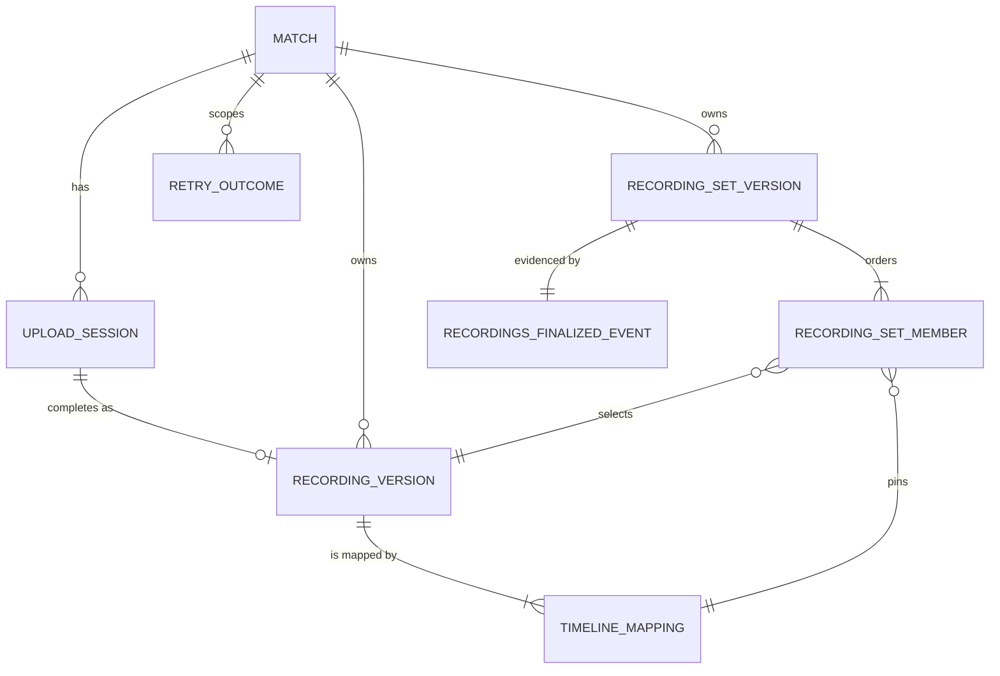
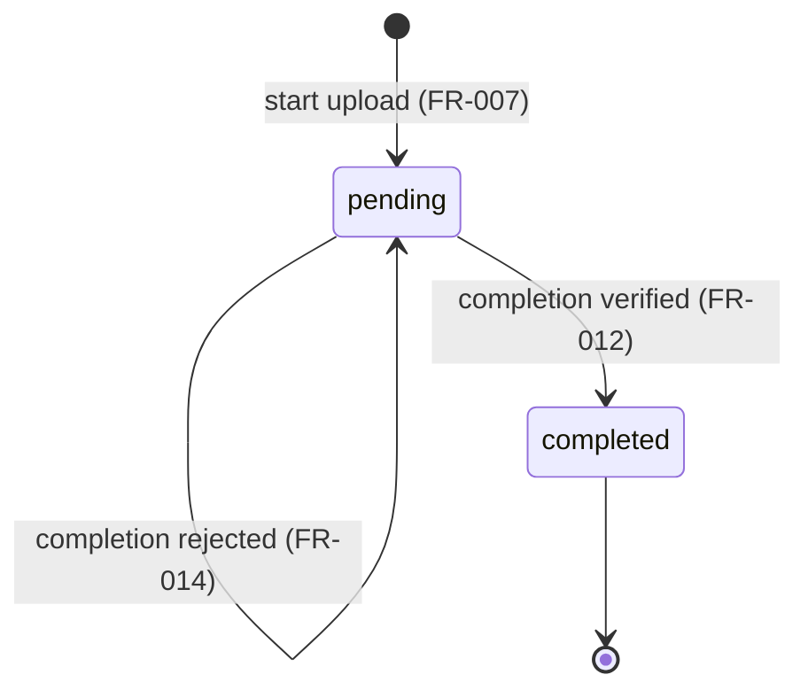

# Data Model: Recording Lineage and Upload

**Feature**: [spec.md](spec.md) | **Plan**: [plan.md](plan.md) | **Research**: [research.md](research.md)

All tables live in the shared application schema `socalytics` and are created
by one forward-only migration named by description,
`recordings_create_upload_and_lineage_tables` (sequence number assigned at
implementation time). Identifiers are UUID version 7 values generated by the
Application layer and exposed as opaque strings. Timestamps are `timestamptz`
in UTC. Digests use `sha-256:<64 lowercase hex>` and are stored as `text` with
a `CHECK (value ~ '^sha-256:[0-9a-f]{64}$')` constraint.

## Entity overview



`MATCH` is owned by Club and Identity; this feature references it by
`match_id` and stores the Match's `team_id` (a Match never changes Team).

| Entity | Table | Mutability | `version` column |
| --- | --- | --- | --- |
| Upload Session | `recording_upload_sessions` | Mutable aggregate root (one lifecycle transition) | Yes, with `socalytics.advance_version()` trigger |
| Upload Grant | none (transient) | Never stored | n/a |
| Recording Version | `recording_versions` | Immutable | No |
| Timeline Mapping | `recording_timeline_mappings` | Immutable | No |
| Recording Set Version | `recording_set_versions` | Immutable | No |
| Recording Set Membership | `recording_set_members` | Immutable | No |
| Retry Outcome | `recording_retry_outcomes` | Immutable (append-only) | No |
| Recordings-Finalized Event Record | `recording_finalized_events` | Immutable (append-only) | No |

Immutable tables get the shared trigger function
`socalytics.reject_immutable_change()` (`BEFORE UPDATE OR DELETE`, raises), and
the migration revokes `UPDATE, DELETE` on them from `socalytics_app`. None of
them is a child of the upload-session aggregate, so no child-touch triggers are
needed.

## Upload Session — `recording_upload_sessions`

Workflow state for one intended upload; not accepted evidence.

| Column | Type | Rules |
| --- | --- | --- |
| `id` | `uuid` PK | Generated at start |
| `match_id` | `uuid` not null | FK to the Club and Identity match table |
| `team_id` | `uuid` not null | Match's Team at start (immutable relationship) |
| `state` | `text` not null | `CHECK (state IN ('pending','completed'))`, default `pending` |
| `display_name` | `text` not null | 1–200 characters after trimming |
| `description` | `text` null | ≤ 2000 characters |
| `content_type` | `text` not null | Member of `Recordings:Upload:AllowedContentTypes` |
| `declared_size_bytes` | `bigint` not null | `> 0` and ≤ `Recordings:Upload:MaxObjectSizeBytes` (≤ 5 GiB) |
| `declared_content_digest` | `text` not null | `sha-256:<hex>` |
| `object_key` | `text` not null unique | Platform-chosen: `{prefix}matches/{matchId}/upload-sessions/{id}` |
| `created_by` | `uuid` not null | Authenticated member account id |
| `created_at` | `timestamptz` not null | |
| `completed_at` | `timestamptz` null | `CHECK ((state = 'completed') = (completed_at IS NOT NULL))` |
| `version` | `bigint` not null default 1 | Advanced by the shared trigger |

Index: `(match_id, created_at)`.

**State transitions**:



- Completion uses `UPDATE … SET state = 'completed', completed_at = @Now WHERE
  id = @Id AND state = 'pending'`; zero rows → the session was completed
  concurrently (resolved via the retry outcome as replay or
  `409 upload-session-completed`).
- No edit operation exists; the strong ETag is `"<version>"` for reads only.
- Abandoned pending sessions stay pending (cleanup deferred, POL-003).

## Upload Grant (transient)

`{ method: "PUT", url, requiredHeaders: { "Content-Type", "x-amz-checksum-sha256" }, expiresAt }`.
Issued for a `pending` session only; lifetime `Recordings:Upload:GrantLifetime`.
Never written to any table, log, audit event, retry outcome, or event record.

## Recording Version — `recording_versions`

| Column | Type | Rules |
| --- | --- | --- |
| `id` | `uuid` PK | |
| `match_id` | `uuid` not null | Equals the session's `match_id` |
| `team_id` | `uuid` not null | Equals the session's `team_id` |
| `upload_session_id` | `uuid` not null unique | FK → `recording_upload_sessions(id)`; at most one per session (FR-012) |
| `object_key` | `text` not null | Copied from the session |
| `size_bytes` | `bigint` not null | Verified `ContentLength` |
| `content_digest` | `text` not null | Verified storage SHA-256 (equals declaration) |
| `display_name`, `description`, `content_type` | as session | Copied descriptive metadata |
| `storage_etag` | `text` null | Non-authoritative storage evidence |
| `storage_version_id` | `text` null | Present only when the bucket reports versions |
| `created_by` | `uuid` not null | Completing actor |
| `created_at` | `timestamptz` not null | |

Constraints: `UNIQUE (id, match_id)` (target of composite FKs). Index
`(match_id, created_at)`. The object key is never exposed through the API.

## Timeline Mapping — `recording_timeline_mappings`

| Column | Type | Rules |
| --- | --- | --- |
| `id` | `uuid` PK | |
| `recording_version_id` | `uuid` not null | FK → `recording_versions(id)` (FR-017) |
| `match_id` | `uuid` not null | Composite FK `(recording_version_id, match_id)` → `recording_versions(id, match_id)` |
| `spans` | `jsonb` not null | Canonical span list in integer milliseconds |
| `mapping_digest` | `text` not null | `sha-256` over the canonical form (research R6) |
| `created_by` | `uuid` not null | |
| `created_at` | `timestamptz` not null | |

Constraints: `UNIQUE (recording_version_id, mapping_digest)` (identical content
returns the existing mapping, FR-016); `UNIQUE (id, recording_version_id)`
(target of the membership binding FK).

**Validation (FR-013)**, applied to the request before persistence:

- 1–64 spans; each has `mediaStartSeconds`, `mediaEndSeconds`,
  `matchStartSeconds`, all nonnegative with at most millisecond precision.
- `mediaEndSeconds > mediaStartSeconds` (positive length; a mapping that maps no
  media time is rejected).
- Spans strictly increasing and non-overlapping in media time and in match time
  (`next.mediaStart ≥ prev.mediaEnd`,
  `next.matchStart ≥ prev.matchStart + (prev.mediaEnd − prev.mediaStart)`).
- Coverage of a span: match time `[matchStart, matchStart + (mediaEnd − mediaStart))`.

## Recording Set Version — `recording_set_versions`

| Column | Type | Rules |
| --- | --- | --- |
| `id` | `uuid` PK | |
| `match_id` | `uuid` not null | |
| `team_id` | `uuid` not null | |
| `member_count` | `integer` not null | `CHECK (member_count BETWEEN 1 AND 100)` |
| `created_by` | `uuid` not null | Finalizing actor |
| `finalized_at` | `timestamptz` not null | |

Constraints: `UNIQUE (id, match_id)`. Index `(match_id, finalized_at)`.

## Recording Set Membership — `recording_set_members`

| Column | Type | Rules |
| --- | --- | --- |
| `recording_set_version_id` | `uuid` not null | Composite FK `(recording_set_version_id, match_id)` → `recording_set_versions(id, match_id)` |
| `position` | `integer` not null | 1-based submitted order, `CHECK (position >= 1)` |
| `match_id` | `uuid` not null | Same Match as the set |
| `recording_version_id` | `uuid` not null | Composite FK `(recording_version_id, match_id)` → `recording_versions(id, match_id)` |
| `timeline_mapping_id` | `uuid` not null | Composite FK `(timeline_mapping_id, recording_version_id)` → `recording_timeline_mappings(id, recording_version_id)` |

Constraints: `PRIMARY KEY (recording_set_version_id, position)`;
`UNIQUE (recording_set_version_id, recording_version_id)` (no duplicate
recording, FR-020). The composite FKs make cross-Match members and mismatched
mapping pairs impossible at the database level in addition to the handler's
validation, which rejects the whole request first (FR-020).

**Finalization validation (FR-019, FR-020)**: 1–100 members; every recording
version exists and belongs to the route Match (and therefore its Team); every
timeline mapping exists and is bound to its paired recording version; no
recording version repeats. Any failure rejects the whole request with `400`
and field violations by member index, without disclosing whether an id exists
in another Match.

## Retry Outcome — `recording_retry_outcomes`

| Column | Type | Rules |
| --- | --- | --- |
| `operation` | `text` not null | `start-upload`, `complete-upload`, `revise-timeline-mapping`, `finalize-recording-set` |
| `match_id` | `uuid` not null | Scope |
| `idempotency_key` | `text` not null | 1–255 visible ASCII characters |
| `request_digest` | `text` not null | `sha-256` over canonical operation, route targets, and normalized body |
| `status_code` | `smallint` not null | Original success status (`200` or `201`) |
| `result` | `jsonb` not null | Identities only, e.g. `{"uploadSessionId": "…"}`, `{"recordingVersionId": "…", "timelineMappingId": "…"}`, `{"recordingSetVersionId": "…"}` |
| `created_by` | `uuid` not null | |
| `created_at` | `timestamptz` not null | |

Constraint: `PRIMARY KEY (operation, match_id, idempotency_key)`. Rows are
inserted only in the same unit of work as a successful change (FR-026) and
never contain grants or credentials (FR-029).

**Replay rules (FR-025)**: authorize first (FR-004); then same digest → return
the original status and re-read the referenced immutable resources (start
upload additionally issues a fresh grant); different digest →
`409 idempotency-key-reused`; same key under another operation or Match → an
independent row.

## Recordings-Finalized Event Record — `recording_finalized_events`

| Column | Type | Rules |
| --- | --- | --- |
| `event_id` | `uuid` PK | |
| `event_type` | `text` not null | `matches.recordings-finalized` |
| `contract_version` | `text` not null | `1.0.0` |
| `recording_set_version_id` | `uuid` not null unique | FK → `recording_set_versions(id)`; exactly one per set version (FR-024) |
| `match_id` | `uuid` not null | |
| `team_id` | `uuid` not null | |
| `occurred_at` | `timestamptz` not null | Equals the set's `finalized_at` |
| `payload` | `jsonb` not null | Valid against [recordings-finalized.schema.json](contracts/schemas/recordings/recordings-finalized/v1/recordings-finalized.schema.json) (published as `contracts/recordings/recordings-finalized/v1/recordings-finalized.schema.json`) |

The row has no publication state, and this feature makes no outbox call.
Durable Analysis adds the `IOutbox` call to the finalize handler, backfills
outbox entries for earlier records, and records publication state in its own
structure keyed by `event_id`; it never updates this row.

## Atomic units of work

| Operation | Rows written in one transaction | Outside the transaction |
| --- | --- | --- |
| Start upload | session, retry outcome, audit event | storage reachability probe before the transaction (`503` and no state when unreachable); grant presigned locally after commit |
| Issue grant | audit event | storage reachability probe, then grant presigned locally |
| Complete upload | session transition, recording version, first timeline mapping, retry outcome, audit event | `HeadObject` integrity check before the transaction |
| Revise mapping | timeline mapping (or none when identical), retry outcome, audit event | none |
| Finalize | set version, all memberships, finalized event record, retry outcome, audit event (FR-022) | none |
| Denial | audit event only | none |

## Application read model for other features

`IRecordingSetLookup` (namespace `SocAlytics.Platform.Application.Recordings`)
returns, for one recording-set version, the frozen lineage that Durable
Analysis consumes (FR-028):

```text
Task<RecordingSetLineage?> GetAsync(Guid recordingSetVersionId, CancellationToken cancellationToken)

RecordingSetLineage(
    Guid RecordingSetVersionId,
    Guid MatchId,
    Guid TeamId,
    DateTimeOffset FinalizedAt,
    IReadOnlyList<RecordingSetLineageMember> Members)        // ordered by Position

RecordingSetLineageMember(
    int Position,                                             // 1-based
    Guid RecordingVersionId,
    string RecordingContentDigest,                            // sha-256:<hex>
    Guid TimelineMappingId,
    string TimelineMappingDigest,                             // sha-256:<hex>
    IReadOnlyList<TimelineSpan> Spans)                        // additive: mapped coverage

TimelineSpan(long MediaStartMilliseconds, long MediaEndMilliseconds, long MatchStartMilliseconds)
```

It returns `null` for an unknown id, performs no authorization (callers are
platform capabilities acting on validated platform input), reads only the
database (no object storage, SC-009), and is implemented in Infrastructure as
one SQL projection.
