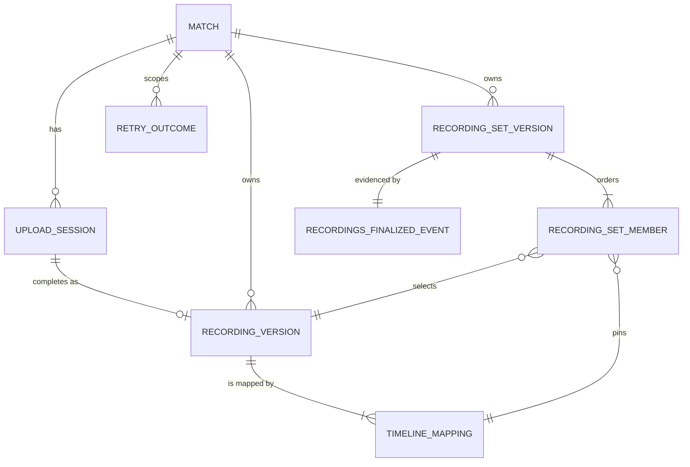
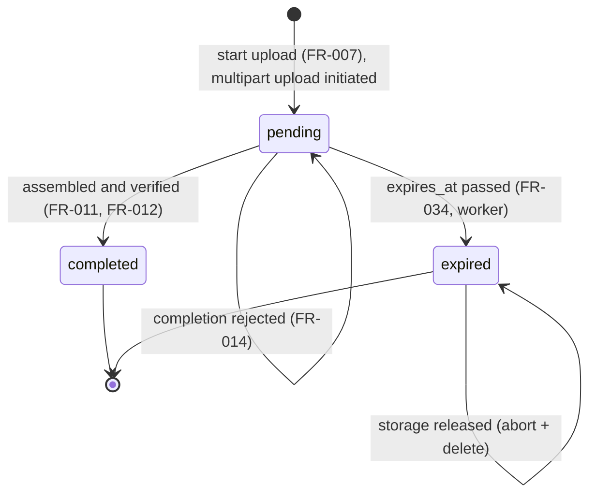

# Data Model: Recording Lineage and Upload

**Feature**: [spec.md](spec.md) | **Plan**: [plan.md](plan.md) | **Research**: [research.md](research.md)

All tables live in the shared application schema `socalytics` and are created
by one forward-only migration named by description,
`recordings_create_upload_and_lineage_tables` (sequence number assigned at
implementation time). Identifiers are UUID version 7 values generated by the
Application layer and exposed as opaque strings. Timestamps are `timestamptz`
in UTC.

Digest forms ([research.md](research.md) R4, R9):

| Form | Used for | Database check |
| --- | --- | --- |
| `sha-256:<64 lowercase hex>` | Declared part digests (API), timeline-mapping digests, retry request digests | `~ '^sha-256:[0-9a-f]{64}$'` |
| `sha-256-parts:<partSizeBytes>:<partCount>:<64 lowercase hex>` | Recording content digest (upload session and recording version) | `~ '^sha-256-parts:[1-9][0-9]*:[1-9][0-9]*:[0-9a-f]{64}$'` plus equality of the embedded part size and count with the row's columns |

The composite hex is `SHA-256(d₁ ‖ … ‖ dₙ)` over the raw 32-byte part
digests; storage reports it as `base64(bytes) + "-" + partCount`.

## Entity overview



`MATCH` is the Club and Identity table `socalytics.match`; this feature
references it by `match_id` and stores the Match's `team_id` (a Match never
changes Team).

| Entity | Table | Mutability | `version` column |
| --- | --- | --- | --- |
| Upload Session | `recording_upload_sessions` | Mutable aggregate root (lifecycle transitions only) | Yes, via `socalytics.attach_version_trigger(regclass)` |
| Upload Part Grant | none (transient) | Never stored | n/a |
| Recording Version | `recording_versions` | Immutable | No |
| Timeline Mapping | `recording_timeline_mappings` | Immutable | No |
| Recording Set Version | `recording_set_versions` | Immutable | No |
| Recording Set Membership | `recording_set_members` | Immutable | No |
| Retry Outcome | `recording_retry_outcomes` | Immutable (append-only) | No |
| Recordings-Finalized Event Record | `recording_finalized_events` | Immutable (append-only) | No |

Immutable tables get `socalytics.reject_immutable_change()` (`BEFORE UPDATE OR
DELETE`, raises); the migration revokes `UPDATE, DELETE` on them from
`socalytics_app`, and `Structure/PersistedTableClassifications.cs` classifies
them as immutable and the session table as a versioned root. The session has no
child tables (part digests are a column), so no child-touch triggers are
needed.

## Upload Session — `recording_upload_sessions`

Workflow state for one intended multipart upload; not accepted evidence.

| Column | Type | Rules |
| --- | --- | --- |
| `id` | `uuid` PK | Generated at start |
| `match_id` | `uuid` not null | FK → `socalytics.match(id)` |
| `team_id` | `uuid` not null | Match's Team at start |
| `state` | `text` not null | `CHECK (state IN ('pending','completed','expired'))`, default `pending` |
| `display_name` | `text` not null | 1–200 characters after trimming |
| `description` | `text` null | ≤ 2000 characters |
| `content_type` | `text` not null | Member of `Recordings:Upload:AllowedContentTypes` |
| `total_size_bytes` | `bigint` not null | `1 … MaxObjectSizeBytes` (≤ 5 TiB) |
| `part_size_bytes` | `bigint` not null | `≤ MaxPartSizeBytes` (≤ 5 GiB); `≥ MinPartSizeBytes` (≥ 5 MiB) when `part_count > 1` |
| `part_count` | `integer` not null | `= ceil(total_size_bytes / part_size_bytes)`, `1 … MaxPartCount` (≤ 10 000) |
| `part_digests` | `bytea` not null | Raw 32-byte SHA-256 digests in part order; `CHECK (octet_length(part_digests) = 32 * part_count)` |
| `content_digest` | `text` not null | Expected `sha-256-parts` composite computed at start |
| `object_key` | `text` not null unique | `{prefix}matches/{matchId}/upload-sessions/{id}` |
| `multipart_upload_id` | `text` not null unique | Storage upload id from `InitiateMultipartUpload`; never exposed |
| `created_by` | `uuid` not null | FK → `socalytics.member_account(id)` |
| `created_at` | `timestamptz` not null | |
| `expires_at` | `timestamptz` not null | `created_at + Recordings:Upload:SessionLifetime` |
| `completed_at` | `timestamptz` null | `CHECK ((state = 'completed') = (completed_at IS NOT NULL))` |
| `expired_at` | `timestamptz` null | `CHECK ((state = 'expired') = (expired_at IS NOT NULL))` |
| `storage_released_at` | `timestamptz` null | Only when `state = 'expired'`; set after abort and delete succeed |
| `version` | `bigint` not null default 1 | Advanced by the shared trigger |

Indexes: `(match_id, created_at)`; partial `(expires_at) WHERE state = 'pending'`;
partial `(expired_at) WHERE state = 'expired' AND storage_released_at IS NULL`.

**Declaration validation (FR-007)** happens before any storage call: total
size, part size, and part count are consistent; non-final parts are exactly
`part_size_bytes`; the final part is `total − (count − 1) · part_size`;
configured bounds and the 5 MiB storage minimum hold; each declared digest is a
well-formed `sha-256` value. Failures return `400 upload-declaration-invalid`
and create nothing.

**State transitions**:



- Completion: `UPDATE … SET state = 'completed', completed_at = now() WHERE
  id = @Id AND state = 'pending' AND expires_at > now()`.
- Expiry: `UPDATE … SET state = 'expired', expired_at = now() WHERE id = @Id
  AND state = 'pending' AND expires_at <= now()`; storage release follows and
  sets `storage_released_at`.
- Grants and completion refuse a session whose `expires_at <= now()` even
  before the worker runs (`409 upload-session-expired`).
- No edit operation exists; the strong ETag is `"<version>"` for reads only.

## Upload Part Grant (transient)

Per part: `{ partNumber, method: "PUT", url, requiredHeaders: { "Content-Length", "x-amz-checksum-sha256" } }`,
grouped in a batch with `expiresAt = min(now + GrantLifetime, session.expires_at)`.
The URL is a presigned `UploadPart` for the session's key, `uploadId`, and
`partNumber`, signing the exact part size and the base64 part digest. Never
written to any table, log, audit event, retry outcome, or event record.

## Recording Version — `recording_versions`

| Column | Type | Rules |
| --- | --- | --- |
| `id` | `uuid` PK | |
| `match_id` | `uuid` not null | Equals the session's `match_id` |
| `team_id` | `uuid` not null | Equals the session's `team_id` |
| `upload_session_id` | `uuid` not null unique | FK → `recording_upload_sessions(id)`; at most one per session (FR-012) |
| `object_key` | `text` not null | Copied from the session; never exposed |
| `total_size_bytes` | `bigint` not null | Verified `HeadObject.ContentLength` |
| `part_size_bytes` | `bigint` not null | From the declaration |
| `part_count` | `integer` not null | From the declaration; equals the storage checksum suffix |
| `content_digest` | `text` not null | Verified `sha-256-parts` composite (FR-033) |
| `display_name`, `description`, `content_type` | as session | Copied descriptive metadata |
| `storage_etag` | `text` null | Non-authoritative storage evidence |
| `created_by` | `uuid` not null | Completing actor |
| `created_at` | `timestamptz` not null | |

Constraints: `UNIQUE (id, match_id)` (target of composite FKs). Index
`(match_id, created_at)`.

## Timeline Mapping — `recording_timeline_mappings`

| Column | Type | Rules |
| --- | --- | --- |
| `id` | `uuid` PK | |
| `recording_version_id` | `uuid` not null | FK → `recording_versions(id)` (FR-017) |
| `match_id` | `uuid` not null | Composite FK `(recording_version_id, match_id)` → `recording_versions(id, match_id)` |
| `spans` | `jsonb` not null | Canonical span list in integer milliseconds |
| `mapping_digest` | `text` not null | `sha-256` over the canonical form |
| `created_by` | `uuid` not null | |
| `created_at` | `timestamptz` not null | |

Constraints: `UNIQUE (recording_version_id, mapping_digest)` (identical content
returns the existing mapping, FR-016); `UNIQUE (id, recording_version_id)`.

**Validation (FR-013)**: 1–64 spans; values nonnegative with at most
millisecond precision; `mediaEnd > mediaStart`; spans strictly increasing and
non-overlapping in media time and match time
(`next.mediaStart ≥ prev.mediaEnd`,
`next.matchStart ≥ prev.matchStart + (prev.mediaEnd − prev.mediaStart)`).

## Recording Set Version — `recording_set_versions`

| Column | Type | Rules |
| --- | --- | --- |
| `id` | `uuid` PK | |
| `match_id` | `uuid` not null | |
| `team_id` | `uuid` not null | |
| `member_count` | `integer` not null | `CHECK (member_count BETWEEN 1 AND 100)` |
| `created_by` | `uuid` not null | Finalizing actor |
| `finalized_at` | `timestamptz` not null | |

Constraints: `UNIQUE (id, match_id)`. Index `(match_id, finalized_at)`.

## Recording Set Membership — `recording_set_members`

| Column | Type | Rules |
| --- | --- | --- |
| `recording_set_version_id` | `uuid` not null | Composite FK `(recording_set_version_id, match_id)` → `recording_set_versions(id, match_id)` |
| `position` | `integer` not null | 1-based submitted order |
| `match_id` | `uuid` not null | Same Match as the set |
| `recording_version_id` | `uuid` not null | Composite FK `(recording_version_id, match_id)` → `recording_versions(id, match_id)` |
| `timeline_mapping_id` | `uuid` not null | Composite FK `(timeline_mapping_id, recording_version_id)` → `recording_timeline_mappings(id, recording_version_id)` |

Constraints: `PRIMARY KEY (recording_set_version_id, position)`;
`UNIQUE (recording_set_version_id, recording_version_id)`.

**Finalization validation (FR-019, FR-020)**: 1–100 members; every recording
version exists in the route Match; every mapping is bound to its paired
recording version; no recording version repeats. Any failure rejects the whole
request with `400` and field violations by member index, without disclosing
whether an id exists in another Match.

## Retry Outcome — `recording_retry_outcomes`

| Column | Type | Rules |
| --- | --- | --- |
| `operation` | `text` not null | `start-upload`, `complete-upload`, `revise-timeline-mapping`, `finalize-recording-set` |
| `match_id` | `uuid` not null | Scope |
| `idempotency_key` | `text` not null | 1–255 visible ASCII characters |
| `request_digest` | `text` not null | `sha-256` over canonical operation, route targets, and normalized body |
| `status_code` | `smallint` not null | Original success status (`200` or `201`) |
| `result` | `jsonb` not null | Identities only, e.g. `{"uploadSessionId": "…"}` |
| `created_by` | `uuid` not null | |
| `created_at` | `timestamptz` not null | |

Constraint: `PRIMARY KEY (operation, match_id, idempotency_key)`. Inserted only
with a successful change (FR-026); never contains grants or credentials
(FR-029). Replay: authorize first; same digest → original status with re-read
resources (start upload issues fresh grants); different digest →
`409 idempotency-key-reused`.

## Recordings-Finalized Event Record — `recording_finalized_events`

| Column | Type | Rules |
| --- | --- | --- |
| `event_id` | `uuid` PK | |
| `event_type` | `text` not null | `matches.recordings-finalized` |
| `contract_version` | `text` not null | `1.0.0` |
| `recording_set_version_id` | `uuid` not null unique | FK → `recording_set_versions(id)`; exactly one per set (FR-024) |
| `match_id` | `uuid` not null | |
| `team_id` | `uuid` not null | |
| `occurred_at` | `timestamptz` not null | Equals the set's `finalized_at` |
| `payload` | `jsonb` not null | Valid against [recordings-finalized.schema.json](contracts/schemas/recordings/recordings-finalized/v1/recordings-finalized.schema.json) (published as `contracts/recordings/recordings-finalized/v1/recordings-finalized.schema.json`) |

The row has no publication state, and this feature makes no outbox call.
Durable Analysis adds the `IOutbox` call to the finalize handler, backfills
`outbox_messages` entries for earlier records, and tracks publication state
keyed by `event_id`; it never updates this row.

## Units of work and storage calls

| Operation | Storage calls (outside transactions) | Rows written in one transaction |
| --- | --- | --- |
| Start upload | `InitiateMultipartUpload` (SHA256, COMPOSITE) before the transaction; best-effort `AbortMultipartUpload` if the transaction fails; presign grants after commit | session, retry outcome, audit event |
| Issue grants | `ListParts` (max 1) as reachability and upload-existence probe; presign | audit event (`RecordIndependentAsync`) |
| Complete upload | `ListParts` (paged) → `CompleteMultipartUpload` → `HeadObject` | session transition, recording version, first timeline mapping, retry outcome, audit event |
| Revise mapping | none | timeline mapping (or none when identical), retry outcome, audit event |
| Finalize | none | set version, memberships, finalized event record, retry outcome, audit event (FR-022) |
| Expire (worker) | after commit: `AbortMultipartUpload`, `DeleteObject`, then a second transaction sets `storage_released_at` | session transition, system audit event |
| Denial | none | audit event through `IAccessAuthorizer` |

## Application read model for other features

`IRecordingSetLookup` (namespace `SocAlytics.Platform.Application.Recordings`)
returns the frozen lineage Durable Analysis consumes (FR-028):

```text
Task<RecordingSetLineage?> GetAsync(Guid recordingSetVersionId, CancellationToken cancellationToken)

RecordingSetLineage(
    Guid RecordingSetVersionId,
    Guid MatchId,
    Guid TeamId,
    DateTimeOffset FinalizedAt,
    IReadOnlyList<RecordingSetLineageMember> Members)        // ordered by Position

RecordingSetLineageMember(
    int Position,                                             // 1-based
    Guid RecordingVersionId,
    string RecordingContentDigest,                            // sha-256-parts:<partSizeBytes>:<partCount>:<hex>
    Guid TimelineMappingId,
    string TimelineMappingDigest,                             // sha-256:<hex>
    IReadOnlyList<TimelineSpan> Spans)                        // mapped coverage

TimelineSpan(long MediaStartMilliseconds, long MediaEndMilliseconds, long MatchStartMilliseconds)
```

It returns `null` for an unknown id, performs no authorization (callers are
platform capabilities acting on validated platform input), reads only the
database (no object storage, SC-009), and is one SQL projection in
Infrastructure.
