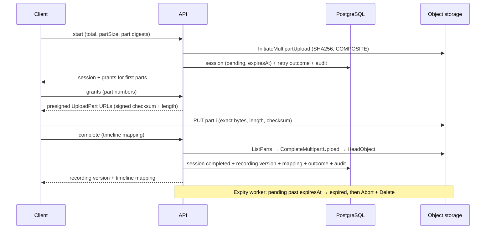

# Implementation Plan: Recording Lineage and Upload

**Branch**: `20261005-130702-recording-lineage-upload` | **Date**: 2026-10-07 (revised after the storage and platform spikes) | **Spec**: [spec.md](spec.md)

**Input**: Feature specification from `specs/20261005-130702-recording-lineage-upload/spec.md`

## Summary

Authorized Coaches and Club Admins upload a Match's source recordings directly
to S3-compatible object storage, accept each verified upload as an immutable
recording version with an immutable timeline mapping, and finalize an ordered
recording set whose frozen lineage and single recordings-finalized event record
commit atomically for Durable Analysis.

Every upload is one S3 multipart upload with SHA-256 composite checksums. At
start the client declares the total size, a fixed part size, and the ordered
part digests; the platform validates the declaration, initiates the multipart
upload, and stores the declaration with an expiry time. Each part grant is a
presigned `UploadPart` URL that signs the part number, exact `Content-Length`,
and `x-amz-checksum-sha256`, so storage refuses any other bytes, size, or part.
On completion the platform lists the parts, completes the multipart upload
itself with platform-built part entries and the expected composite, and accepts
the object only when `HeadObject` reports the composite
`sha-256-parts:<partSizeBytes>:<partCount>:<hex>`, type `COMPOSITE`, and the
declared total size; it fails closed otherwise. A hosted expiry worker marks
abandoned sessions expired and aborts their multipart uploads. The API never
receives media bytes.

Recording versions, timeline mappings, recording-set versions, memberships,
retry outcomes, and event records are append-only tables protected by
`socalytics.reject_immutable_change()` and revoked runtime privileges; the
upload session is the only mutable aggregate. Retry keys (`Idempotency-Key`)
are stored with request digests and resource identities, never grants.
`IRecordingSetLookup` gives Durable Analysis the frozen lineage from the
database alone. S3 access uses `AWSSDK.S3` in Infrastructure only; locally the
AppHost runs `rustfs/rustfs:1.0.1` through a plain container resource and
integration tests use the same image, including a store conformance probe.
This feature also creates the repository-root `contracts/` folder, its index,
the recordings-finalized event schema, and the contract test project
`SocAlytics.Platform.Contracts.Tests`. It stores the immutable event record
only; Durable Analysis later adds the `IOutbox` call to the finalize handler
and a backfill ([research.md](research.md) R3–R7, R11, R19).

## Technical Context

**Language/Version**: C# on .NET 10 (SDK 10.0.400 pinned by `src/platform/global.json`, roll-forward latest patch), nullable enabled, warnings as errors as already configured.

**Primary Dependencies**: ASP.NET Core minimal APIs with built-in OpenAPI (`/openapi/v1.json`); Npgsql + Dapper and DbUp (persistence foundation); session cookie `__Host-socalytics-session`, `X-CSRF-Token`, `IRequestContext`, `IAccessAuthorizer`, `ITeamScopeResolver`, `IAuditTrail`, `OperationResult<T>` (Club and Identity); new: `AWSSDK.S3` 4.0.103.4 (Infrastructure only). Aspire AppHost SDK 13.4.6 with `AddContainer("rustfs", "rustfs/rustfs", "1.0.1")` and generated persisted secret parameters; no community hosting package ([research.md](research.md) R2).

**Storage**: PostgreSQL schema `socalytics` — new tables `recording_upload_sessions` (versioned root), `recording_versions`, `recording_timeline_mappings`, `recording_set_versions`, `recording_set_members`, `recording_retry_outcomes`, `recording_finalized_events` (immutable) in one migration named `recordings_create_upload_and_lineage_tables` ([data-model.md](data-model.md)). S3-compatible object storage (one bucket per stamp; RustFS locally) holds media bytes only, written through multipart uploads.

**Testing**: xUnit v3, Shouldly, NSubstitute; NetArchTest.Rules (architecture); Testcontainers 4.15.0 — `Testcontainers.PostgreSql` (persistence) plus the generic container for RustFS — in `src/platform/Tests/SocAlytics.Platform.Integration.Tests`, including `ObjectStoreConformanceTests` and `LargeRecordingUploadTests`; Aspire.Hosting.Testing in Host.Tests; new `src/platform/Tests/SocAlytics.Platform.Contracts.Tests` (xUnit v3, Shouldly, `JsonSchema.Net` 8.0.5) as the repository contract command `dotnet test src/platform/Tests/SocAlytics.Platform.Contracts.Tests`.

**Target Platform**: Linux OCI containers for deployment profiles (not delivered here); local development on Windows, macOS, or Linux through the Aspire AppHost with Docker.

**Project Type**: Web service — the platform control-plane API (layered monolith; Recordings is a functional-area folder in each layer) with one hosted background worker in the same host.

**Performance Goals**: SC-002 — each platform operation (start, grants, complete, finalize) acknowledged within 2 s at p95 in acceptance runs with up to 100 parts; completion makes `⌈partCount / 1000⌉` `ListParts` calls, one `CompleteMultipartUpload`, and one `HeadObject`; finalization is one transaction for ≤ 100 members. SC-010 — a recording above 5 GiB uploads and completes in acceptance testing.

**Constraints**: No media bytes through the API (FR-010; recording endpoints cap JSON request bodies at 1 MiB, enough for a 10 000-part declaration); parts ≥ 5 MiB except the last, ≤ 5 GiB each, ≤ 10 000 per upload, objects ≤ 5 TiB; session lifetime, grant lifetime, sweep interval, size and part bounds, grants per request, and content types are required configuration with no production defaults; fail closed on missing or different integrity evidence (FR-011); no grants, credentials, or secrets in durable records, logs, or telemetry (FR-029); storage I/O never inside a database transaction.

**Scale/Scope**: Development stamp; tens of recordings and set versions per Match; lineage returned as one unpaginated view per Match; 10 HTTP operations ([contracts/openapi.yaml](contracts/openapi.yaml)); 1 event contract ([recordings-finalized.schema.json](contracts/schemas/recordings/recordings-finalized/v1/recordings-finalized.schema.json), published as `contracts/recordings/recordings-finalized/v1/recordings-finalized.schema.json`).

No `NEEDS CLARIFICATION` items remain; every open choice is resolved in [research.md](research.md).

## Constitution Check

*GATE: Must pass before Phase 0 research. Re-check after Phase 1 design.*

Constitution version 1.1.0. Pre-design evaluation:

| Gate | Status | Justification |
| --- | --- | --- |
| I. Architecture Is the Design Authority | PASS | Follows [match-data-pipeline.md](../../docs/architecture/match-data-pipeline.md) (Planned Recording-Lineage Foundation, Segment Contract), [terminology-and-principles.md](../../docs/architecture/terminology-and-principles.md) (S3 as protocol, control plane never touches video), [platform-implementation.md](../../docs/architecture/platform-implementation.md) (layers, Dapper, version triggers, immutable records without `version`), and [contracts-and-compatibility.md](../../docs/architecture/contracts-and-compatibility.md) (`/api/v1`, digests, ETags, retry keys, repository-root contracts). Decisions the narratives leave open (multipart upload with per-part grants, the `sha-256-parts` digest form, event record before publication, adopted S3 client and local container, timeline-mapping form, contract baseline) are stated verbatim under [Required Architecture Updates](#required-architecture-updates). Production-blocking items (POL-003, THR-003, GOV-OWN-004) stay unresolved. |
| II. Respect Source-Area Ownership | PASS | All production code lives in `src/platform/` inside existing layer projects under `Recordings` and `ObjectStorage` folders; no new production project. Tests go into the existing Host and Architecture test projects, the Integration.Tests project created by the persistence foundation, and the new test project `src/platform/Tests/SocAlytics.Platform.Contracts.Tests`. The repository-root `contracts/` folder is the location the contracts architecture defines; it is not a child of `src/`. |
| III. API-First Control Plane | PASS | Every capability is a REST operation in the OpenAPI document; the API initiates, grants, assembles, and verifies uploads through metadata calls only and never reads or relays media; storage is reached only through the S3 protocol with path-style addressing, and `AWSSDK.S3` is confined to Infrastructure (architecture test). Contracts are OpenAPI 3.1 and JSON Schema 2020-12; the event schema is a canonical repository-root contract. |
| IV. Evidence Over Claims | PASS | Behavior is proven by integration tests against real PostgreSQL and RustFS containers (including the conformance probe and an above-5-GiB upload), contract tests, and architecture and host tests; existing suites must keep passing. Local evidence is not production readiness, and the conformance probe must pass against any production store before adoption. |
| V. Focused, Minimal Changes | PASS | Adds only `AWSSDK.S3`, the generic `Testcontainers` package, and `JsonSchema.Net`; one hosted worker required by FR-034; no publisher or outbox call, verification worker, playback grants, or client code; one `IObjectStorage` abstraction with only the operations this feature uses. |
| Technology and Tooling Constraints | PASS | .NET 10 via `global.json` and the existing solution; supported commands unchanged; Aspire remains local-only composition and uses stable 13.4.6 APIs only; S3-compatible storage is a deferred technology that this spec adopts (FR-007–FR-011, FR-033, FR-034) and this plan adopts explicitly; `.gitignore` needs no change. |
| Environment-feature rule | PASS (depends on environment feature) | Tasks need the .NET SDK from `src/platform/global.json` (provided by `.github/actions/environment-setup`), Docker for Testcontainers (present on the runner; RustFS and PostgreSQL images pulled at test time), NuGet restore, and the Markdown linters (provided). The current `.github/actions/environment-verify` covers `src/platform/` and Markdown but would report changes under the new repository-root `contracts/` folder as uncovered. This feature therefore depends on the environment feature `specs/20261007-115855-environment-verification-coverage`, which extends `environment-verify` so `contracts/` changes run the platform checks (including `SocAlytics.Platform.Contracts.Tests`); it must be reviewed and merged before this feature starts, and the spec names it under Assumptions → Dependencies. With it merged, the environment provides everything the tasks need. |
| Development Workflow and Quality Gates | PASS | Spec Kit flow followed; `README.md` (composite-action coverage of `contracts/`, the contract command, repository structure), `contracts/README.md`, `src/platform/README.md`, and `AGENTS.md` updates are implementation tasks listed under [Documentation Updates](#documentation-updates); Markdown validated with `node .github/scripts/check-markdown.mjs`; no commits or pushes. |

Feature dependencies (merge order): the environment feature
`specs/20261007-115855-environment-verification-coverage`,
`specs/20261005-130700-platform-persistence-foundation`, and
`specs/20261005-130701-club-identity-foundation` must be merged first.

## Project Structure

### Documentation (this feature)

```text
specs/20261005-130702-recording-lineage-upload/
├── spec.md
├── plan.md                                   # This file
├── research.md                               # Phase 0 decisions R1–R19
├── data-model.md                             # Tables, rules, state transitions, lookup shape
├── quickstart.md                             # Validation scenarios and manual run
├── contracts/
│   ├── openapi.yaml                          # OpenAPI 3.1 fragment (10 operations)
│   └── schemas/                              # mirrors the repository-root contracts/ tree
│       └── recordings/
│           └── recordings-finalized/
│               └── v1/
│                   └── recordings-finalized.schema.json   # JSON Schema 2020-12 event payload
├── checklists/
│   └── requirements.md
└── tasks.md                                  # Phase 2 output (/speckit-tasks; not created here)
```

### Source Code (repository root)

```text
contracts/                                                # new repository-root canonical contracts folder
├── README.md                                             # index: artifact, owner, version, example, validation command
└── recordings/
    └── recordings-finalized/
        └── v1/
            └── recordings-finalized.schema.json          # copy of the mirrored schema

src/platform/
├── SocAlytics.Platform.slnx                              # + Tests/SocAlytics.Platform.Contracts.Tests
├── Directory.Packages.props                              # + AWSSDK.S3 4.0.103.4, Testcontainers 4.15.0, JsonSchema.Net 8.0.5
├── README.md                                             # current status (task)
├── SocAlytics.Platform.Domain/
│   └── Recordings/
│       ├── Sha256Digest.cs                               # `sha-256:<hex>` value object
│       ├── CompositeContentDigest.cs                     # `sha-256-parts:<partSize>:<partCount>:<hex>`; S3 form conversion
│       ├── MultipartDeclaration.cs                       # total size, part size, part digests; FR-007 rules
│       ├── RecordingDescriptor.cs                        # display name, description, content type
│       ├── UploadSession.cs                              # pending → completed | expired rules
│       ├── UploadSessionState.cs
│       ├── RecordingVersion.cs
│       ├── TimelineSpan.cs
│       ├── TimelineMapping.cs                            # validation + canonical digest
│       ├── RecordingSetVersion.cs                        # membership rules (FR-019/FR-020)
│       └── RecordingSetMember.cs
├── SocAlytics.Platform.Application/
│   ├── Abstractions/
│   │   └── ObjectStorage/
│   │       ├── IObjectStorage.cs                         # initiate, presign parts, list parts, complete, head, abort, delete
│   │       ├── MultipartUploadReference.cs               # object key + upload id
│   │       ├── PartUploadGrant.cs
│   │       ├── StoredPart.cs                             # part number, ETag, size
│   │       ├── CompositeIntegrityEvidence.cs             # checksum, checksum type, content length
│   │       ├── ObjectStorageRejectedException.cs         # InvalidPart / BadDigest / EntityTooSmall
│   │       └── ObjectStorageUnavailableException.cs
│   └── Recordings/
│       ├── IRecordingSetLookup.cs                        # public; consumed by Durable Analysis
│       ├── RecordingSetLineage.cs                        # lookup result records
│       ├── RecordingUploadOptions.cs                     # lifetimes, sweep interval, size/part bounds, grants per request, content types, key prefix
│       ├── RecordingAuditActions.cs
│       ├── CanonicalJson.cs                              # deterministic digests for mappings and retry requests
│       ├── IRecordingStore.cs                            # write-side persistence port
│       ├── IRecordingRetryOutcomeStore.cs
│       ├── IRecordingLineageQueries.cs                   # read-side projections
│       ├── Commands/
│       │   ├── StartRecordingUploadHandler.cs
│       │   ├── IssueRecordingUploadGrantsHandler.cs
│       │   ├── CompleteRecordingUploadHandler.cs         # ListParts → Complete → HeadObject → commit; recovery path
│       │   ├── ExpireUploadSessionsHandler.cs            # expire due sessions, then release storage
│       │   ├── ReviseTimelineMappingHandler.cs
│       │   └── FinalizeRecordingSetHandler.cs
│       └── Queries/
│           ├── GetRecordingUploadSessionHandler.cs
│           ├── GetRecordingVersionHandler.cs
│           ├── GetTimelineMappingHandler.cs
│           ├── GetRecordingSetVersionHandler.cs
│           └── GetMatchRecordingLineageHandler.cs
├── SocAlytics.Platform.Infrastructure/
│   ├── ObjectStorage/
│   │   ├── ObjectStorageOptions.cs                       # ServiceUrl, Region, AccessKey, SecretKey, Bucket, ForcePathStyle, EnsureBucketOnStartup
│   │   ├── S3ObjectStorage.cs                            # AWSSDK.S3 adapter (internal)
│   │   └── DevelopmentBucketInitializer.cs               # hosted; creates the bucket only when EnsureBucketOnStartup
│   ├── Recordings/
│   │   ├── RecordingStore.cs                             # Dapper writes
│   │   ├── RecordingRetryOutcomeStore.cs
│   │   ├── RecordingLineageQueries.cs                    # Dapper projections
│   │   ├── RecordingSetLookup.cs                         # IRecordingSetLookup implementation
│   │   └── UploadSessionExpiryWorker.cs                  # BackgroundService invoking ExpireUploadSessionsHandler
│   └── Persistence/
│       ├── Structure/
│       │   └── PersistedTableClassifications.cs          # + Recordings tables (versioned root / immutable)
│       └── Migrations/
│           └── NNNN_recordings_create_upload_and_lineage_tables.sql   # NNNN = next free number at implementation
├── SocAlytics.Platform.Api/
│   └── Recordings/
│       ├── RecordingEndpoints.cs                         # MapRecordingEndpoints(): 10 operations under /api/v1/matches/{matchId}
│       ├── RecordingContracts.cs                         # request/response DTOs matching contracts/openapi.yaml
│       └── RecordingProblemCodes.cs                      # OperationFailure codes → problem details
├── SocAlytics.Platform.AppHost/
│   └── Program.cs                                        # + AddContainer("rustfs", "rustfs/rustfs", "1.0.1"), s3 endpoint, health check,
│                                                         #   generated persisted credentials, API environment + WaitFor (no new package)
└── Tests/
    ├── SocAlytics.Platform.Integration.Tests/
    │   └── Recordings/
    │       ├── RustFsContainerFixture.cs                 # container, bucket creation, S3 client for assertions
    │       ├── ObjectStoreConformanceTests.cs            # reduced storage spike; runnable against an external store
    │       ├── TimelineMappingCanonicalFormTests.cs      # pure, no containers
    │       ├── CompositeDigestTests.cs                   # pure: spike vector, single part, S3 form normalization
    │       ├── MultipartDeclarationTests.cs              # pure: FR-007 rules
    │       ├── UploadWorkflowTests.cs
    │       ├── PartGrantEnforcementTests.cs              # bytes, length, part number, header tampering
    │       ├── CompletionVerificationTests.cs            # missing/mismatched parts, evidence faults, recovery
    │       ├── UploadSessionExpiryTests.cs
    │       ├── LargeRecordingUploadTests.cs              # > 5 GiB, SC-010
    │       ├── FinalizationTests.cs
    │       ├── RetryKeyTests.cs
    │       ├── ImmutabilityTests.cs
    │       ├── RecordingAuthorizationTests.cs
    │       ├── RecordingSetLookupTests.cs
    │       ├── ObjectStorageUnavailableTests.cs
    │       └── SecretHygieneTests.cs
    ├── SocAlytics.Platform.Architecture.Tests/
    │   └── RecordingsArchitectureTests.cs                # no Amazon.* outside Infrastructure; internal implementations
    ├── SocAlytics.Platform.Contracts.Tests/              # new; repository contract command
    │   ├── SocAlytics.Platform.Contracts.Tests.csproj    # xUnit v3, Shouldly, JsonSchema.Net; links ../../../../contracts/**/* into output
    │   ├── ContractCatalog.cs                            # discovers *.schema.json under contracts/
    │   ├── SchemaMetaValidationTests.cs                  # 2020-12 meta-schema; $id ↔ path; x-socalytics-version
    │   ├── SchemaExampleTests.cs                         # every `examples` entry validates (format assertion on)
    │   └── ContractIndexTests.cs                         # every schema listed in contracts/README.md
    └── SocAlytics.Platform.Host.Tests/
        └── RecordingsOpenApiTests.cs                     # operationIds, response codes, no binary request bodies
```

**Structure Decision**: The feature extends the existing layered monolith in
`src/platform/` without new production projects. Recordings code sits in the
`Recordings` folder of each layer; the S3 port lives in
`SocAlytics.Platform.Application.Abstractions.ObjectStorage` and its adapter in
`SocAlytics.Platform.Infrastructure.ObjectStorage`; SQL lives in the shared
`Persistence/Migrations` folder. Registration (including the expiry worker and
the development bucket initializer) happens inside the existing public
`AddApplication()` and `AddInfrastructure(...)` methods, keeping all
implementation types internal. The repository-root `contracts/` folder, its
index, and `SocAlytics.Platform.Contracts.Tests` are created here as the first
canonical contract baseline; Durable Analysis extends them (R19).

## Design Overview

### Operation flow

Every request handler follows the same order, which makes denials fail closed
and replays safe (FR-004, FR-005, FR-025, FR-026):

1. Authenticate (session cookie; `401` otherwise; `X-CSRF-Token` on
   mutations).
2. Authorize the route Match with
   `IAccessAuthorizer.AuthorizeTeamResourceAsync` — `TeamPermission.Write`
   (Club Admin or Coach) for upload operations, mapping revision,
   finalization, and session reads; `TeamPermission.Read` (adds Viewer) for
   lineage reads. Missing Match → `404`; denial → `403` with the authorizer's
   independent denial audit.
3. For mutations, reject an archived Season (`TeamScope.SeasonState`;
   `409 season-archived`).
4. Validate the request and `Idempotency-Key` (`400`).
5. Look up the retry outcome; same digest → replay; different → `409`.
6. Perform storage calls outside any transaction; network failures and
   unexpected `5xx` → `503`.
7. In one `IUnitOfWorkScope`: re-check scope and state guards, write rows, the
   retry outcome, and the audit event (`IAuditTrail.RecordAsync`); commit. A
   unique violation on the retry key means a concurrent duplicate won: roll
   back, abort any multipart upload this request created, and replay.
8. After commit, presign grants where the operation returns them
   (`Cache-Control: no-store`).

### Upload lifecycle



### Key decisions

- **Multipart for every upload** with a validated declaration (5 MiB minimum
  except the last part, ≤ 10 000 parts, configured maxima) (R3).
- **Composite digest** `sha-256-parts:<partSizeBytes>:<partCount>:<hex>`,
  computable from the declaration and reported by storage as
  `base64-N`; `totalSizeBytes` is separate; never compared with a plain
  `sha-256` (R4).
- **Per-part grants** sign part number, exact `Content-Length`, and
  `x-amz-checksum-sha256`; storage refuses other bytes, sizes, or parts, and
  stored data is capped at the declared part sizes (R5).
- **Completion recipe** ListParts → platform-built Complete → `HeadObject`
  verification of composite, type, and length, with a recovery path after a
  completed-but-uncommitted attempt; RustFS deviations are absorbed by relying
  only on `HeadObject` (R6).
- **Session expiry** marks sessions expired before aborting and deleting in
  storage, so completion and expiry are mutually exclusive (R7).
- **Immutability**: no `version` on immutable tables; shared trigger and
  revoked privileges; composite foreign keys enforce Match and mapping pairing
  in the database (R12).
- **Upload session**: the only mutable aggregate, versioned, transitioned only
  under state guards (R13).
- **Retry keys**: identities only; start-upload replays issue fresh grants
  (R10).
- **Finalized event record**: one immutable row per set; no outbox call here;
  Durable Analysis adds the `IOutbox` call and backfill (R11).
- **Local storage and evidence**: RustFS via `AddContainer` with stable Aspire
  APIs; bucket created by the API's development initializer and by the test
  fixture; conformance probe and above-5-GiB acceptance test (R2, R15, R16).
- **Contracts baseline**: repository-root `contracts/` with index, the event
  schema (`$id` under `https://socalytics.invalid/contracts/…`,
  `x-socalytics-version`), and the contract command (R19).

### Interfaces consumed

| From | Interface | Use in this feature |
| --- | --- | --- |
| Persistence foundation | `IUnitOfWork.BeginAsync` → `IUnitOfWorkScope` (`CommitAsync`, `RollbackAsync`) | One transaction per command (rows, retry outcome, audit event) |
| Persistence foundation | `socalytics.attach_version_trigger(regclass)`, migration runner, `socalytics_app` / `socalytics_migrator` roles, `Structure/PersistedTableClassifications.cs` | Version trigger on `recording_upload_sessions`; new migration; table classification; privilege revocation on immutable tables |
| Persistence foundation | Integration.Tests PostgreSQL fixture; AppHost `<UserSecretsId>` | Shared database container; persisted generated RustFS credentials |
| Club and Identity | Session cookie `__Host-socalytics-session`, header `X-CSRF-Token`, `IRequestContext` | Authentication, CSRF, actor and correlation in handlers and the worker |
| Club and Identity | `IAccessAuthorizer`, `TeamPermission` (`Read`, `Write`), `TeamOwnedResource`, `TeamScope`, `ITeamScopeResolver` (`match` source) | Team-scoped authorization with built-in denial audit; Season state for archive checks |
| Club and Identity | `IAuditTrail` (`RecordAsync`, `RecordIndependentAsync`), `AuditEvent` | Minimized audit events in the same unit of work (FR-030); independent events for grant issuance |
| Club and Identity | `OperationResult<T>`, `OperationFailure`, problem types `urn:socalytics:problem:<code>`, table `match`, table `member_account` | Handler outcomes and problem details; FK targets |

### Interfaces provided to other features

- **`IRecordingSetLookup`** (namespace
  `SocAlytics.Platform.Application.Recordings`):
  `Task<RecordingSetLineage?> GetAsync(Guid recordingSetVersionId, CancellationToken cancellationToken)`
  returning
  `RecordingSetLineage(Guid RecordingSetVersionId, Guid MatchId, Guid TeamId, DateTimeOffset FinalizedAt, IReadOnlyList<RecordingSetLineageMember> Members)`
  with ordered
  `RecordingSetLineageMember(int Position, Guid RecordingVersionId, string RecordingContentDigest, Guid TimelineMappingId, string TimelineMappingDigest, IReadOnlyList<TimelineSpan> Spans)`
  and `TimelineSpan(long MediaStartMilliseconds, long MediaEndMilliseconds, long MatchStartMilliseconds)`.
  `RecordingContentDigest` is `sha-256-parts:<partSizeBytes>:<partCount>:<hex>`;
  `TimelineMappingDigest` is `sha-256:<hex>`. Returns `null` when unknown;
  database-only, no authorization (FR-028, SC-009). Details in
  [data-model.md](data-model.md#application-read-model-for-other-features).
- **Recordings-finalized event record**: table `recording_finalized_events`
  (immutable, one row per set version) with payload schema
  `contracts/recordings/recordings-finalized/v1/recordings-finalized.schema.json`
  (mirrored as
  [recordings-finalized.schema.json](contracts/schemas/recordings/recordings-finalized/v1/recordings-finalized.schema.json);
  `$id` `https://socalytics.invalid/contracts/recordings/recordings-finalized/v1/recordings-finalized.schema.json`),
  event type `matches.recordings-finalized`, contract version `1.0.0`, member
  recording digests in `sha-256-parts` form. This feature makes no outbox
  call; Durable Analysis adds the `IOutbox` call to the finalize handler,
  backfills `outbox_messages` entries for records finalized earlier, and
  tracks publication state keyed by `event_id` without updating the row.
- **Contracts baseline**: the repository-root `contracts/` folder, its index
  `contracts/README.md`, and `src/platform/Tests/SocAlytics.Platform.Contracts.Tests`
  (contract command), which Durable Analysis extends with `contracts/common/v1`
  and its own schemas.
- **`IObjectStorage`** (namespace
  `SocAlytics.Platform.Application.Abstractions.ObjectStorage`): initiate a
  composite-SHA-256 multipart upload, presign part uploads, list parts,
  complete, read integrity evidence, abort, and delete. Later data-plane
  features may extend it additively.

## Constitution Check (post-design)

| Gate | Status | Evidence in the design |
| --- | --- | --- |
| I. Architecture Is the Design Authority | PASS | Data model realizes the planned Recording-Lineage Foundation (immutable versions, mappings, set versions, ordered memberships, scoped idempotency outcomes, typed lineage query); every architecture change the design depends on is stated verbatim below, including the new `sha-256-parts` representation convention; no unresolved governance value is presented as adopted (lifetimes, size and part bounds, content types are configuration without production defaults). |
| II. Respect Source-Area Ownership | PASS | Project Structure lists only existing `src/platform/` production projects, the new `Tests/SocAlytics.Platform.Contracts.Tests` test project, and the repository-root `contracts/` folder; no new child of `src/`. |
| III. API-First Control Plane | PASS | 10 OpenAPI operations validated with an OpenAPI 3.1 validator; event payload validated as JSON Schema 2020-12 (a plain `sha-256` recording digest is rejected); no endpoint accepts binary bodies; `IObjectStorage` hides the S3 SDK; the AppHost needs no S3 SDK. |
| IV. Evidence Over Claims | PASS | [quickstart.md](quickstart.md) maps every user story, edge case, and success criterion (including SC-010 and session expiry) to an automated scenario against real PostgreSQL and RustFS; the conformance probe makes the store contract executable; the contract command validates the schema, its `$id`, version, index entry, and examples. |
| V. Focused, Minimal Changes | PASS | Three packages, seven tables, one migration, one hosted worker (FR-034), no new production project, one test project and one contract artifact required by the contract baseline; deferred work (publication, CORS, public endpoint, playback, lifecycle policy values) stays deferred. |
| Technology and Tooling Constraints | PASS | No change to the supported commands; the contract command is an ordinary `dotnet test`; the AppHost gains one container resource built from stable Aspire 13.4.6 APIs; nothing assumes Aspire in production. |
| Environment-feature rule | PASS (depends on environment feature) | Re-confirmed: the design needs only the .NET SDK, Docker (about 12 GB free disk for the above-5-GiB test), NuGet restore, and the Markdown linters, all provided by `environment-setup` and the runner. Verification of the new repository-root `contracts/` folder requires `specs/20261007-115855-environment-verification-coverage`, which must be merged before this feature starts; with it, the environment provides everything the tasks need. |
| Development Workflow and Quality Gates | PASS | Plan artifacts pass `node .github/scripts/check-markdown.mjs`; README (including the `environment-verify` coverage of `contracts/` that the environment feature cannot document), contract index, platform README, and `AGENTS.md` changes are planned under [Documentation Updates](#documentation-updates). |

## Documentation Updates

Implementation tasks of this feature make these repository documentation
changes. The environment feature
`specs/20261007-115855-environment-verification-coverage` may change only the
two action folders, so the README description of its behavior is updated here.

1. **`README.md`, section "Requesting Implementation on GitHub", list "In this
   repository:" under the composite actions** — replace the
   `environment-verify` bullet with:

   ```markdown
     - `environment-verify` runs the platform restore, build, and tests when
         `src/platform/**` or the repository-root `contracts/**` changed (the
         contract coverage is active because the platform solution exists, and
         the contract tests run as part of the platform tests) and the Markdown
         check when Markdown changed. It lists the paths it covers in
         `COVERED`; changed files outside them are reported as not covered,
         including platform and contract files when the platform solution is
         missing.
   ```

2. **`README.md`, section "Development"** — add a subsection after
   "Platform Host":

   ````markdown
   ### Contracts

   Canonical machine-readable contracts live in [`contracts/`](contracts/README.md),
   whose index lists every artifact with its owner, version, example, and
   validation command. Validate them from the repository root with the
   contract command:

   ```powershell
   dotnet test src/platform/Tests/SocAlytics.Platform.Contracts.Tests
   ```

   The platform `dotnet test` command above also runs these tests.
   ````

3. **`README.md`, section "Repository Structure"** — add after the
   `docs/` bullet:

   ```markdown
   - [`contracts/`](contracts/README.md) holds the canonical machine-readable
       contracts (JSON Schema 2020-12) and their index.
   ```

4. **`README.md`, section "Platform Host"** — in the current-evidence
   paragraph add multipart recording upload, lineage, and finalization with the
   local RustFS container, and remove "S3-compatible storage," from the
   deferred list (coordinated with the persistence and Club and Identity edits
   of the same paragraph); note that the above-5-GiB acceptance test needs about
   12 GB of free Docker disk.
5. **`contracts/README.md`** (new) — the index table with columns Artifact,
   Owner, Version, Example, Validation command, and one row:
   `recordings/recordings-finalized/v1/recordings-finalized.schema.json`,
   Recordings (control plane), `1.0.0`, embedded `examples`,
   `dotnet test src/platform/Tests/SocAlytics.Platform.Contracts.Tests`; plus
   the path, `$id`, and `x-socalytics-version` convention from
   [research.md](research.md) R19 and the two digest forms from R4.
6. **`src/platform/README.md`** — current status gains recording upload and
   lineage, the RustFS AppHost resource, the expiry worker, the
   Contracts.Tests project, and the contract command; remove "S3-compatible
   storage" from the deferred list.
7. **`AGENTS.md`, sections "Current State" and "Repository Setup"** — list the
   Contracts.Tests project and the repository-root `contracts/` folder in the
   current state, remove S3 from the absent infrastructure, and add the
   contract command to the supported platform commands.

## Required Architecture Updates

The coordinator applies these to `docs/architecture/`; this plan does not edit
them.

1. **`docs/architecture/match-data-pipeline.md`, section "Planned
   Recording-Lineage Foundation", first paragraph** — replace the sentence
   beginning "The planned Recordings functional area will persist" with:

   > The Recordings functional area persists, in the platform's application
   > schema, upload sessions as its only mutable aggregate, and immutable
   > recording versions, immutable timeline mappings, finalized recording-set
   > versions, ordered memberships, scoped idempotency outcomes, and exactly
   > one immutable recordings-finalized event record per recording-set
   > version, committed in the same transaction as the set. The Durable
   > Analysis workflow introduces the platform outbox and NATS publisher, adds
   > the outbox call to the finalization handler, and backfills records
   > finalized before it; it publishes them to `matches.recordings-finalized`,
   > tracks publication state separately, and never rewrites the record.

2. **`docs/architecture/match-data-pipeline.md`, section "Upload"** — add after
   the paragraph that ends "rather than overwriting accepted evidence.":

   > Every recording upload is one multipart upload of one platform-chosen
   > object. The client declares the total size, a fixed part size, and the
   > SHA-256 digest of every part; the platform issues one short-lived
   > presigned grant per part that binds the part number, its exact length,
   > and its declared digest, so storage refuses any other bytes, size, or
   > part. On completion the platform lists the stored parts, assembles
   > exactly the declared parts itself, and accepts the recording only when
   > object storage reports the expected composite digest and total size;
   > when storage cannot report that evidence, completion fails closed. An
   > upload session expires after a configured lifetime, and expiry discards
   > its stored parts. The API never reads or relays the media.

3. **`docs/architecture/match-data-pipeline.md`, section "Segment Contract",
   bullets "A recording version …" and "A timeline mapping …"** — replace the
   two bullets with:

   > - A **recording version** identifies one immutable source-video version
   >   owned by one match. Its content digest is the composite
   >   `sha-256-parts` digest of its upload, recorded with its part size,
   >   part count, and total size.
   > - A **timeline mapping** immutably maps that recording version's media
   >   time to match time as an ordered list of spans, each mapping a
   >   half-open media interval to match time at a 1:1 rate, strictly
   >   increasing and non-overlapping in both media and match time. Its digest
   >   is `sha-256` over a canonical JSON form with integer milliseconds and
   >   changes whenever the mapping changes.

4. **`docs/architecture/contracts-and-compatibility.md`, section
   "Representation Conventions"** — add after the bullet "SHA-256 digests use
   `sha-256:<64 lowercase hexadecimal characters>`.":

   > - Composite multipart content digests use
   >   `sha-256-parts:<partSizeBytes>:<partCount>:<64 lowercase hexadecimal characters>`,
   >   where the hexadecimal value is SHA-256 over the concatenated raw SHA-256
   >   digests of the parts in order. The value identifies content only
   >   together with its part size and part count, is never compared with a
   >   plain `sha-256` digest, and is accompanied by the total size in bytes as
   >   a separate field.

5. **`docs/architecture/platform-implementation.md`, new subsection
   "Object Storage" after "Persistence And CQRS"**:

   > ### Object Storage
   >
   > The Recordings area adopts S3-compatible object storage through the S3
   > protocol only. Infrastructure uses `AWSSDK.S3` with path-style addressing
   > against a configured endpoint; Application and Domain depend only on a
   > storage abstraction. Every upload is a multipart upload with composite
   > SHA-256 checksums: the API issues presigned per-part grants that sign
   > each part's length and checksum, assembles the declared parts itself, and
   > verifies the storage-reported composite digest and size; it never
   > receives media bytes. A hosted worker in the API host expires abandoned
   > upload sessions and aborts their multipart uploads. Locally the Aspire
   > AppHost runs a pinned RustFS container as a plain container resource, the
   > API creates the development bucket, and integration tests use the same
   > image through Testcontainers together with a store conformance probe that
   > any production store must pass. Bucket provisioning, production storage
   > selection, encryption, credentials, browser CORS, public endpoints, grant
   > and session lifetimes, and lifecycle policy remain governed by Production
   > Deployment and Operations and Security and Data Governance.

   In the architecture file, link the two topic names to
   `production-operations.md` and `security-and-data-governance.md`.

6. **`docs/architecture/platform-implementation.md`, section "Source And
   Runtime Baseline", sentence "Locally, the Aspire AppHost will mirror that
   order: PostgreSQL, then the Migrator, then the API, which waits for the
   Migrator to complete."** — replace with:

   > Locally, the Aspire AppHost will mirror that order: PostgreSQL, then the
   > Migrator, then the API, which waits for the Migrator to complete and for
   > the S3-compatible RustFS container to report healthy.

7. **`docs/architecture/platform-implementation.md`, section "Persistence And
   CQRS", first sentence** — once this feature is implemented, remove
   "S3-compatible storage," from the list of absent infrastructure, in the
   same edit the persistence foundation makes to that sentence.

8. **`docs/architecture/platform-implementation.md`, section "Source And
   Runtime Baseline", list of projects under `src/platform`** — add the item
   `` `Tests/SocAlytics.Platform.Contracts.Tests` `` after
   `` `Tests/SocAlytics.Platform.Architecture.Tests` ``, and change "except for
   the two test projects grouped under `src/platform/Tests`" to "except for the
   test projects grouped under `src/platform/Tests`".

9. **`docs/architecture/contracts-and-compatibility.md`, section "Contract
   Authority", first paragraph** — replace the paragraph beginning "No
   machine-readable contracts exist yet." with:

   > Canonical machine-readable contracts live under the repository-root
   > `contracts/` directory. Recording Lineage and Upload introduces the
   > directory, its index `contracts/README.md`, which identifies every
   > published artifact, owner, version, example, and validation command, and
   > the first artifact, the recordings-finalized event schema. Each schema
   > lives at `contracts/<area>/<name>/v<major>/<name>.schema.json`, declares
   > the `$id`
   > `https://socalytics.invalid/contracts/<area>/<name>/v<major>/<name>.schema.json`
   > on a reserved domain that is never dereferenced, and records its exact
   > semantic version in `x-socalytics-version`. Until a behavior has a
   > canonical artifact, the architecture topics linked below remain
   > authoritative for it.

10. **`docs/architecture/contracts-and-compatibility.md`, section "Scope And
    Dependencies", first paragraph** — replace the sentence beginning "The
    first future contract baseline will cover the documented Analyst
    workflow:" with:

    > Recording Lineage and Upload establishes the contract baseline with the
    > recordings-finalized event schema. The documented Analyst workflow
    > contracts (shared resources and errors under `contracts/common/v1`,
    > logical segments, Analyst jobs and result manifests, capability
    > declarations, accepted upstream facts, and fenced attempt completion)
    > follow with Durable Analysis and extend the same directory, index, and
    > contract command.

    Keep the following sentence ("It excludes service implementation, …")
    unchanged.

11. **`docs/architecture/contracts-and-compatibility.md`, section "Validation
    Authority", first paragraph** — replace the sentence beginning "Once
    contracts exist, one repository contract command will be the
    deterministic authority" with:

    > The repository contract command,
    > `dotnet test src/platform/Tests/SocAlytics.Platform.Contracts.Tests`,
    > introduced by Recording Lineage and Upload, is the deterministic
    > authority for JSON Schema syntax and 2020-12 dialect, `$id` and version
    > metadata, offline references, index coverage, and example outcomes.
    > Features that add further contract kinds extend the same command with
    > unique-identifier checks, OpenAPI linting and bundling, and same-major
    > compatibility checks.

    Keep the remaining sentences of that paragraph (independent .NET and
    Python fixture validation, Kiota generation) as future validation.

## Risk Register

| ID | Risk | Disposition | Evidence / Owner | Revisit trigger |
| --- | --- | --- | --- | --- |
| REC-R01 | Recordings above the 5 GiB single-write limit cannot be uploaded | **Mitigated** | Every upload is multipart (R3); up to 10 000 parts of ≤ 5 GiB; storage spike Q1–Q4; `LargeRecordingUploadTests` evidences SC-010 | A store with lower multipart limits, or recordings above 5 TiB |
| REC-R02 | Upload size is unbounded: a grant holder stores more bytes than declared | **Mitigated** | Each part grant signs `Content-Length`, checksum, and part number (R5); spike Q5: oversize body refused on headers in 8–16 ms, nothing stored; stored data ≤ `partCount × partSize` | A store that accepts unsigned or mismatched `Content-Length` (conformance probe failure) |
| REC-R03 | Fail-closed verification rejects every completion on a store that cannot report composite SHA-256 | **Mitigated** | AWS documents composite SHA-256 for multipart uploads and the completion checksum headers; RustFS 1.0.1 passes the full recipe (spike Q3); `ObjectStoreConformanceTests` must pass against every store before a profile adopts it (R16) | Conformance probe failure for a candidate production store; RustFS image upgrade |
| REC-R04 | RustFS deviates from AWS (ignores `MpuObjectSize`, `500` for a wrong composite, no per-part checksums in `ListParts`, wrong per-part checksums in `GetObjectAttributes`) | **Mitigated** | Design relies only on `ListParts` ETags and sizes and on `HeadObject` checksum, type, and length; completion failures are treated as rejected or unavailable and always post-verified (R6) | A RustFS release changing `HeadObject` checksum reporting |
| REC-R05 | Clients cannot reach storage through the endpoint grants are signed for, or browsers are blocked by CORS (`PUT` with `x-amz-checksum-sha256`) | **Deferred** | Owner: production deployment profile (Production Deployment and Operations) and the first client feature; local and test runs use a host-reachable endpoint | First deployment profile or browser client work |
| REC-R06 | Abandoned uploads hold storage indefinitely | **Mitigated** | Session expiry (FR-034): sessions expire after the configured lifetime; the worker marks them expired, aborts the multipart upload, and deletes any assembled object (R7); `UploadSessionExpiryTests` | Expiry sweep lag above one interval, or a crash window between initiation and the start transaction leaving orphan uploads (lifecycle rule owned by the production profile) |
| REC-R07 | CI pulls `rustfs/rustfs` from Docker Hub at test time | **Accepted** | Pinned tag `1.0.1` (spike image digest recorded in the storage report); same exposure as the PostgreSQL image; no registry mirror exists yet | Pull failures or rate limiting in CI, or a repository decision to pin by digest or mirror images |
| REC-R08 | Interfaces drift from the parallel foundation plans | **Mitigated** | This plan uses the canonical names from the persistence and Club and Identity plans (`IUnitOfWork`/`IUnitOfWorkScope`, `IAccessAuthorizer`, `TeamPermission`, `IAuditTrail`, `IRequestContext`, `OperationResult<T>`, cookie `__Host-socalytics-session`, `X-CSRF-Token`, `urn:socalytics:problem:<code>`, tables `match` and `member_account`) | Any rename in a merged foundation plan or implementation |
| REC-R09 | Event publication ownership unclear between this feature and Durable Analysis | **Mitigated** | Decided: this feature stores the immutable record only; Durable Analysis adds the `IOutbox` call and a backfill for records created before it merges (R11, Required Architecture Update 1) | Durable Analysis plan or implementation diverging from the decision |
| REC-R10 | The above-5-GiB acceptance test lengthens CI and needs about 12 GB of Docker disk | **Accepted** | Parts are generated and streamed, never held in memory; standard hosted runners provide the disk; required by SC-010 | CI duration or disk failures attributable to `LargeRecordingUploadTests` |
| REC-R11 | Presigned `UploadPart` with a signed checksum header is inferred, not explicitly documented, for AWS S3 | **Mitigated** | Follows from SigV4 signed-header semantics and the AWS presigned-checksum note; proven on RustFS; covered by the conformance probe for any store (R16) | Conformance probe failure on AWS S3 or another candidate store |

## Complexity Tracking

No constitution violations; no entries required.
