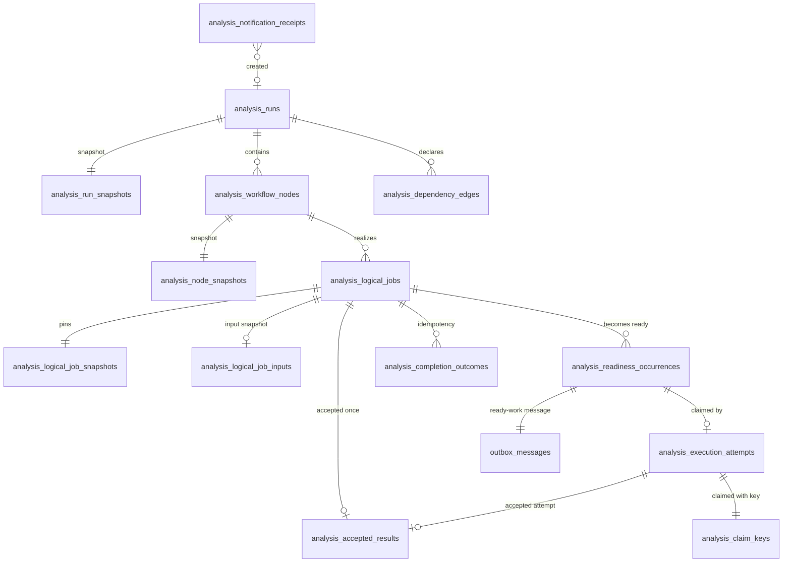
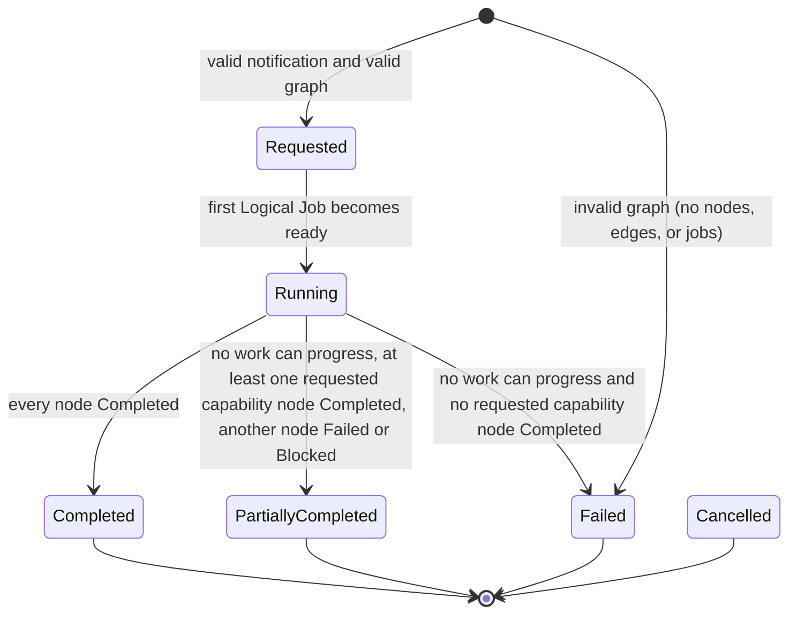
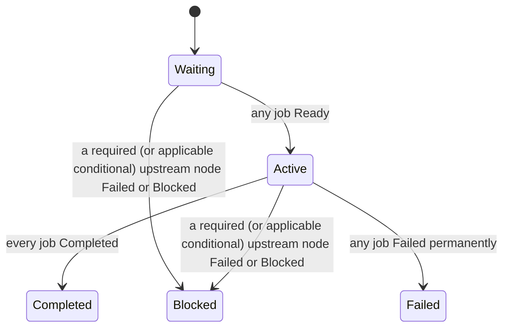
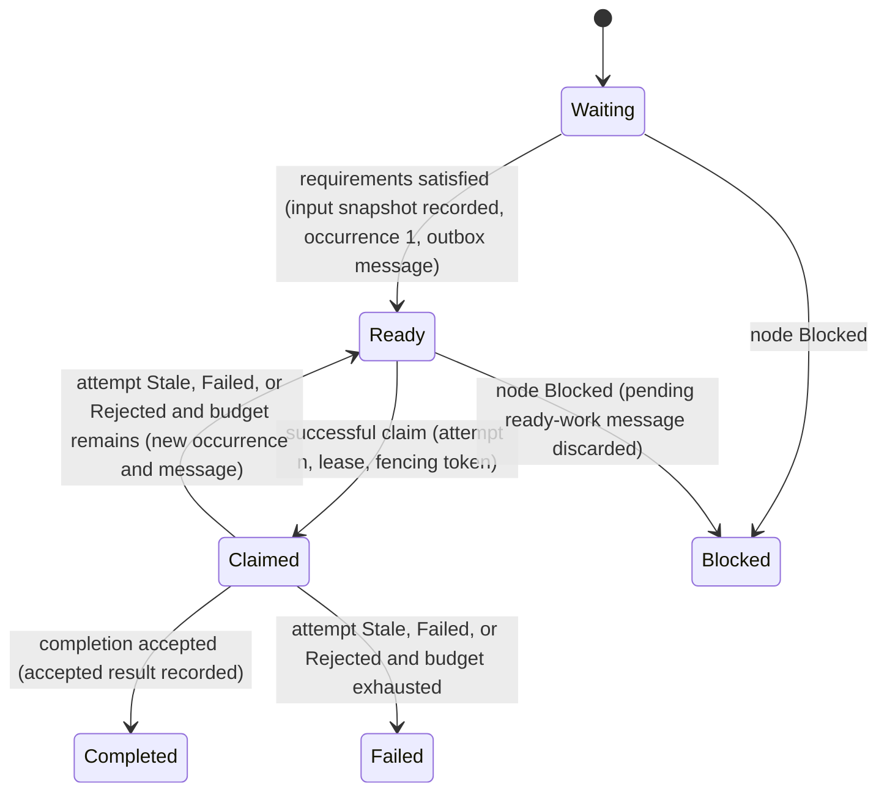
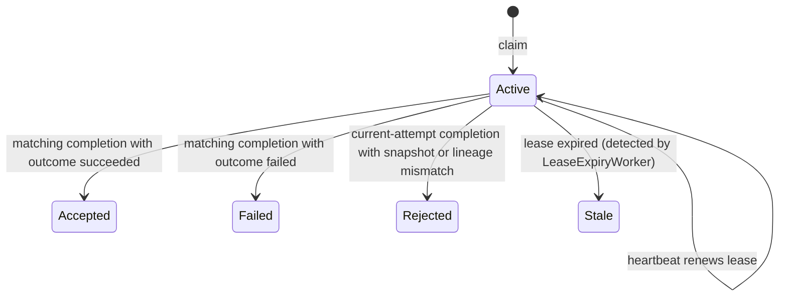
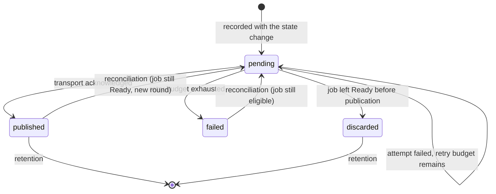

# Data Model: Durable Analysis Workflow

**Feature**: [spec.md](spec.md) | **Plan**: [plan.md](plan.md) | **Research**: [research.md](research.md)

All tables live in the single application schema `socalytics` defined by the
persistence foundation. Identifiers generated by this feature are UUID version 7
values (`Guid.CreateVersion7()`), stored as `uuid` and serialized as opaque
strings. References to Club, Recordings, and Registry identities use the
storage type chosen by their owning feature (planned as `uuid`). Timestamps are
`timestamptz` in UTC. Digests are stored as text in the contract form
`sha-256:<64 lowercase hex>`. No table or column is named `club_id`.

## Aggregates and versioning

| Aggregate root | Versioned (`version bigint`) | Child tables (child trigger touches root) | Immutable tables (no `UPDATE`/`DELETE` for `socalytics_app`) |
| --- | --- | --- | --- |
| Analysis Run (`analysis_runs`) | Yes | `analysis_run_snapshots`, `analysis_workflow_nodes`, `analysis_node_snapshots`, `analysis_dependency_edges` | `analysis_run_snapshots`, `analysis_node_snapshots`, `analysis_dependency_edges` |
| Logical Job (`analysis_logical_jobs`) | Yes | `analysis_logical_job_snapshots`, `analysis_logical_job_inputs`, `analysis_readiness_occurrences`, `analysis_execution_attempts` | `analysis_logical_job_snapshots`, `analysis_logical_job_inputs`, `analysis_readiness_occurrences` |
| Accepted Result Reference (`analysis_accepted_results`) | No (immutable record) | — | itself |
| Completion Outcome (`analysis_completion_outcomes`) | No (immutable record) | — | itself |
| Claim Key (`analysis_claim_keys`) | No (immutable record) | — | itself |
| Notification Receipt (`analysis_notification_receipts`) | No (immutable record) | — | itself |
| Outbox Message (`outbox_messages`) | No (operational record; row lock plus state guard) | — | — |

- Versioned roots get the advance trigger through
  `CALL socalytics.attach_version_trigger('socalytics.<root>')`; every listed
  child table gets both touch triggers through
  `CALL socalytics.attach_aggregate_child_triggers('socalytics.<child>',
  'socalytics.<root>', '<child_key>')` (procedures from the persistence
  foundation). Child tables carry no `version` column.
- Every table without `version` is added to the persistence foundation's
  manifest `Structure/PersistedTableClassifications.cs`: the child tables as
  `ChildOf(root, childKey)`, the immutable records as `Immutable`, and
  `outbox_messages` as `Unversioned("operational publication record; transitions
  guarded by row lock and state")`. The persistence-owned structural test then
  verifies triggers, absence of `version` on children, and no `club_id`.
- Immutability is enforced in the migrations twice: the shared
  `socalytics.reject_immutable_change()` trigger (`BEFORE UPDATE OR DELETE`,
  introduced by Recording Lineage and Upload) is attached to every immutable
  table, and `UPDATE` and `DELETE` on those tables are revoked from
  `socalytics_app`.
- Workflow transitions use state guards (`WHERE id = @Id AND state =
  @ExpectedState`) and never `If-Match`; fencing tokens are independent of
  `version` values. No HTTP edit operation exists for these aggregates.

## Entities

### Analysis Run — `analysis_runs`

| Column | Type | Rules |
| --- | --- | --- |
| `id` | uuid PK | Stable run identity |
| `team_id` | uuid | From the Recordings lookup, never from the notification alone |
| `match_id` | uuid | From the Recordings lookup |
| `recording_set_version_id` | uuid | Finalized recording-set version |
| `workflow_id` | text | Resolved workflow identity |
| `workflow_version` | text | Resolved workflow version |
| `requested_capabilities` | text[] | Non-empty for a valid graph; stored as resolved |
| `completion_policy` | text | `all-requested-capabilities` (v1) |
| `state` | text | `Requested`, `Running`, `PartiallyCompleted`, `Completed`, `Failed`, `Cancelled` |
| `failure_reason` | text null | Sanitized category, for example `invalid-graph:cycle` |
| `created_at`, `running_at`, `terminated_at`, `updated_at` | timestamptz | `running_at`/`terminated_at` set once by their transition |
| `version` | bigint | Trigger-managed |

Constraints: `UNIQUE (recording_set_version_id, workflow_id, workflow_version)`
(FR-002); `CHECK` on `state`; `terminated_at` non-null exactly in terminal
states.

### Run snapshot — `analysis_run_snapshots`

`run_id` (PK, FK), `snapshot jsonb`, `snapshot_digest text`. The snapshot is the
complete resolved workflow definition at creation: workflow identity and
version, requested capabilities, completion policy, segmentation policy
(version, duration, digest), every node's capability declaration, Analyst
profile, image and model digests, policies, schemas, resources, attempt budget,
lease, stale-timeout, and execution-timeout values, and every edge with its kind
and predicate (FR-005). Stored even when the graph is invalid, for
auditability; no nodes, edges, or jobs exist for an invalid graph.

### Workflow Node — `analysis_workflow_nodes`

| Column | Type | Rules |
| --- | --- | --- |
| `id` | uuid PK | |
| `run_id` | uuid FK | |
| `node_key` | text | Unique per run; stable key from the workflow definition |
| `capability_id`, `capability_version` | text | |
| `tier` | text | `low-level` or `high-level` |
| `execution_scope` | text | `segment` or `match` |
| `ordinal` | int | Topological order, used for deterministic reload ordering |
| `state` | text | `Waiting`, `Active`, `Completed`, `Failed`, `Blocked` |
| `blocked_by_node_id` | uuid null | First required upstream that caused `Blocked` |
| `updated_at` | timestamptz | |

`UNIQUE (run_id, node_key)`, `UNIQUE (run_id, ordinal)`.

### Node snapshot — `analysis_node_snapshots`

`node_id` (PK, FK), `run_id`, `snapshot jsonb`: capability declaration, schema
version, Analyst profile id and digest, image digest, model digest, policy
versions, resources, `max_attempts`, `lease_seconds`, `stale_timeout_seconds`,
`execution_timeout_seconds`. Immutable.

### Dependency edge — `analysis_dependency_edges`

`run_id`, `upstream_node_id`, `dependent_node_id`, `kind` (`required`,
`optional`, `conditional`), `predicate jsonb null` (non-null exactly when
`kind = 'conditional'`). PK `(run_id, upstream_node_id, dependent_node_id)`;
`CHECK (upstream_node_id <> dependent_node_id)`. Both endpoints must belong to
the same run (composite FKs). Immutable.

Predicate v1 vocabulary (closed): `{ "kind": "capabilityRequested",
"capabilityId": "…" }` and `{ "kind": "nodeAccepted", "nodeKey": "…" }`.

### Logical Job — `analysis_logical_jobs`

| Column | Type | Rules |
| --- | --- | --- |
| `id` | uuid PK | Stable across retries |
| `run_id`, `node_id` | uuid FK | |
| `execution_scope` | text | Copied from node |
| `recording_version_id` | uuid null | Segment scope only |
| `timeline_mapping_digest` | text null | Segment scope only |
| `segmentation_policy_digest` | text null | Segment scope only |
| `segment_number` | int null | Segment scope only, `> 0` |
| `state` | text | `Waiting`, `Ready`, `Claimed`, `Completed`, `Failed`, `Blocked` |
| `attempts_used` | int | `>= 0`, `<= max_attempts` (checked against snapshot) |
| `current_readiness_occurrence_id` | uuid null | Set while `Ready` or `Claimed` |
| `current_attempt_id` | uuid null | Set while `Claimed` |
| `failure_reason` | text null | `attempts-exhausted`, `upstream-required-failed` (for `Blocked`) |
| `updated_at` | timestamptz | |
| `version` | bigint | Trigger-managed |

Constraints: segment fields all non-null when `execution_scope = 'segment'` and
all null otherwise; `UNIQUE (node_id, recording_version_id,
timeline_mapping_digest, segmentation_policy_digest, segment_number)` with
`NULLS NOT DISTINCT` (one match-level job per node, one segment job per segment
per node). The recording-set version comes from the run (FR-012).

### Logical Job snapshot — `analysis_logical_job_snapshots`

`logical_job_id` (PK, FK), `max_attempts int > 0`, `lease_seconds int > 0`,
`stale_timeout_seconds int > 0`, `execution_timeout_seconds int > 0`,
`analyst_profile_digest`, `image_digest`, `model_digest text null`,
`resources jsonb`, `schema_version`. Copied from the node snapshot; identical for
every job of a node (FR-011, FR-014). Immutable.

### Logical Job input snapshot — `analysis_logical_job_inputs`

`logical_job_id` (PK, FK), `inputs jsonb`, `recorded_at`. Written once, when the
job first becomes ready (FR-017). Each entry: upstream node key, edge kind,
status (`accepted`, `absent`, `failed`, `not-applicable`), and accepted result
ids. Reused unchanged by every retry.

### Readiness occurrence — `analysis_readiness_occurrences`

`id` (PK), `logical_job_id`, `sequence int` (1, 2, … per job; unique),
`cause` (`initial`, `attempt-stale`, `attempt-failed`, `attempt-rejected`),
`created_at`. Each occurrence has exactly one ready-work outbox message
(`outbox_messages.causation_id = occurrence id`). A claim must name the current
occurrence.

### Execution Attempt — `analysis_execution_attempts`

| Column | Type | Rules |
| --- | --- | --- |
| `id` | uuid PK | |
| `logical_job_id` | uuid FK | |
| `readiness_occurrence_id` | uuid FK | Occurrence that was claimed; unique (one attempt per occurrence) |
| `attempt_number` | int | `UNIQUE (logical_job_id, attempt_number)`, consecutive from 1 |
| `manager_id` | uuid | Claiming Analyst Manager |
| `fencing_token` | bigint | From `socalytics.analysis_fencing_token_seq`, unique, `1..9007199254740991` |
| `state` | text | `Active`, `Stale`, `Failed`, `Accepted`, `Rejected` |
| `claimed_at`, `lease_expires_at`, `last_heartbeat_at`, `closed_at` | timestamptz | |
| `close_reason` | text null | Sanitized category |

Partial unique index: at most one `Active` attempt per Logical Job.

### Accepted result reference — `analysis_accepted_results`

`id` (PK), `logical_job_id` (**unique**, FR-027), `run_id`, `node_id`,
`attempt_id` (unique), `manifest_reference text` (opaque object key, never a
URL), `manifest_checksum`, `capability_id`, `capability_version`,
`schema_version`, `analyst_profile_digest`, `image_digest`, `model_digest`,
`policy_versions jsonb`, `executed_runtime jsonb`, `upstream_result_ids uuid[]`,
`accepted_at`. Immutable (FR-028).

### Completion outcome (idempotency) — `analysis_completion_outcomes`

PK `(logical_job_id, idempotency_key)`; `attempt_id`, `request_fingerprint`
(`sha-256:` of the RFC 8785 canonical payload), `outcome` (`accepted`,
`failure-recorded`), `accepted_result_id null`, `recorded_at`. Immutable.

### Claim key (idempotency) — `analysis_claim_keys`

PK `(manager_id, idempotency_key)` (FR-045: the key is scoped to the claiming
Manager); `logical_job_id`, `readiness_occurrence_id`, `attempt_id` (unique),
`recorded_at`. Inserted in the same transaction as the attempt it produced;
immutable. Claim resolution under the Logical Job row lock:

| Stored key for this Manager | Condition | Outcome |
| --- | --- | --- |
| None | Job `Ready`, occurrence current, budget remains | New attempt and key row; `201`, `replayed = false` |
| None | Otherwise | `409 claim-obsolete` (or `404` for an unknown job); nothing stored |
| Present, same job and occurrence | Attempt still current (`current_attempt_id` matches, `Active`, lease not expired) | Same attempt, current lease expiry, same fencing token; `200`, `replayed = true`; nothing created, no budget consumed, lease not renewed |
| Present, same job and occurrence | Attempt no longer current | `409 claim-obsolete` |
| Present | Different job or occurrence | `409 idempotency-key-reuse` |

Another Manager presenting the same key is in a different scope and makes an
ordinary claim, which is rejected as `claim-obsolete` because the job is no
longer `Ready`.

### Notification receipt — `analysis_notification_receipts`

PK `message_id` (the inbound event identity); `message_type`
(`recordings-finalized`), `recording_set_version_id null`, `outcome`
(`run-created`, `run-exists`, `rejected`), `rejection_category null`
(`schema-invalid`, `lineage-not-found`, `lineage-mismatch`, `scope-mismatch`),
`run_id null`, `received_at`. Immutable. Dependency-unavailable outcomes are not
recorded (the message is retried). While no workflow definition can be
resolved (FR-046), no receipt is written either: the message stays pending in
the transport and is processed once the definition becomes resolvable.

Recording content digests from `IRecordingSetLookup` use the Recordings
composite form `sha-256-parts:<partSize>:<partCount>:<hex>`; this feature only
compares them for equality with the notification and never stores or
recomputes them. Analysis-segment identity uses the timeline-mapping and
segmentation-policy digests, so segment math is unaffected.

### Outbox message — `outbox_messages` (platform-shared)

| Column | Type | Rules |
| --- | --- | --- |
| `id` | uuid PK | Stable message identity (payload `messageId`, or `eventId` for relayed Recordings events) |
| `message_type` | text | `matches.recordings-finalized`, `analysis.ready-work`, `analysis.run-state-changed` |
| `contract_version` | text | Exact contract version |
| `subject` | text | NATS subject |
| `payload` | jsonb | Contract payload; never contains secrets, tokens, URLs, or media |
| `causation_id` | uuid | Recordings event id, readiness occurrence id, or run transition id |
| `run_id`, `logical_job_id` | uuid null | Correlation for operator listing |
| `capability_id` | text null | Correlation |
| `state` | text | `pending`, `published`, `failed`, `discarded` |
| `attempt_count` | int | Attempts in the current publication round |
| `publication_round` | int | Starts at 1; incremented by reconciliation |
| `last_attempt_at`, `next_attempt_at` | timestamptz null | |
| `failure_category` | text null | `transport-unavailable`, `publish-timeout`, `publish-rejected` |
| `created_at`, `published_at` | timestamptz | Lag = `published_at - created_at` |

Constraints: `UNIQUE (message_type, causation_id)` so repeated processing of the
same change converges on one message (FR-031). Index on `(state,
next_attempt_at)` for the publisher and on `(state, created_at)` for operator
listings. Relayed Recordings events are written by the Recordings finalize
handler through `IOutbox` in its own unit of work and backfilled once by the
outbox migration from `recording_finalized_events`; that Recordings row is never
updated.

## Relationships

## State machines

### Analysis Run

`Cancelled` is representable (state value and `CHECK` constraint) but no
transition into it exists in this feature. "No work can progress" means no job
is `Waiting` with satisfiable requirements, `Ready`, or `Claimed`. A valid run is
inserted as `Requested` and, in the same transaction, moves to `Running` when
its root jobs become ready; both timestamps are recorded.

### Workflow Node

### Logical Job

A `Claimed` job whose node becomes `Blocked` keeps its active attempt; an
accepted completion is still recorded as history, but the node stays `Blocked`.

### Execution Attempt

Terminal attempt states never change; their tokens no longer authorize anything.

### Outbox Message

## Validation rules (by requirement)

| Rule | Where enforced |
| --- | --- |
| Lineage confirmed through `IRecordingSetLookup`; notification match, team, ordered members, and digests must equal the lookup (FR-001, FR-003) | Application handler |
| One run per recording-set version and workflow version (FR-002) | Unique constraint plus receipt |
| Graph: non-empty capability set; every edge endpoint in graph; no self edge; acyclic (Kahn); edge kind in vocabulary; conditional edges have a valid v1 predicate (FR-008) | Domain `WorkflowGraph.Validate` |
| Invalid graph leaves only the run (`Failed`) and its snapshot (FR-009) | Application handler, one transaction |
| Segment references: computed from lineage spans and the pinned segmentation policy per the Segment Contract; positive segment number; recording version and mapping digest are members of the finalized set; digests well-formed (FR-012) | `LineageAnalysisSegmentSource` plus Domain `AnalysisSegmentReference` |
| Hardware neutrality (FR-013) | Contract schema (closed objects) plus no such columns |
| Readiness only from durable state (FR-015, FR-016, FR-018) | Domain `ReadinessEvaluator` under run lock |
| Consecutive attempt numbers and budget (FR-021, FR-025) | Job row lock, unique constraint, `attempts_used <= max_attempts` |
| Claim retry key scoped to the Manager; replay of a still-current attempt; conflict and obsolete outcomes (FR-045) | `analysis_claim_keys` PK under the job row lock |
| Unresolvable workflow definition leaves notifications pending (FR-046) | Consumer pauses, `analysis-workflow` readiness check |
| Fencing match for heartbeat and completion (FR-023, FR-026, FR-030) | Guarded `UPDATE`/`SELECT` on attempt |
| At most one accepted result per job (FR-027) | Unique `logical_job_id` |
| Idempotent completion (FR-029) | `analysis_completion_outcomes` PK plus fingerprint |
| Message recorded atomically with change (FR-031) | `IOutbox` uses the current transaction; unique `(message_type, causation_id)` |
