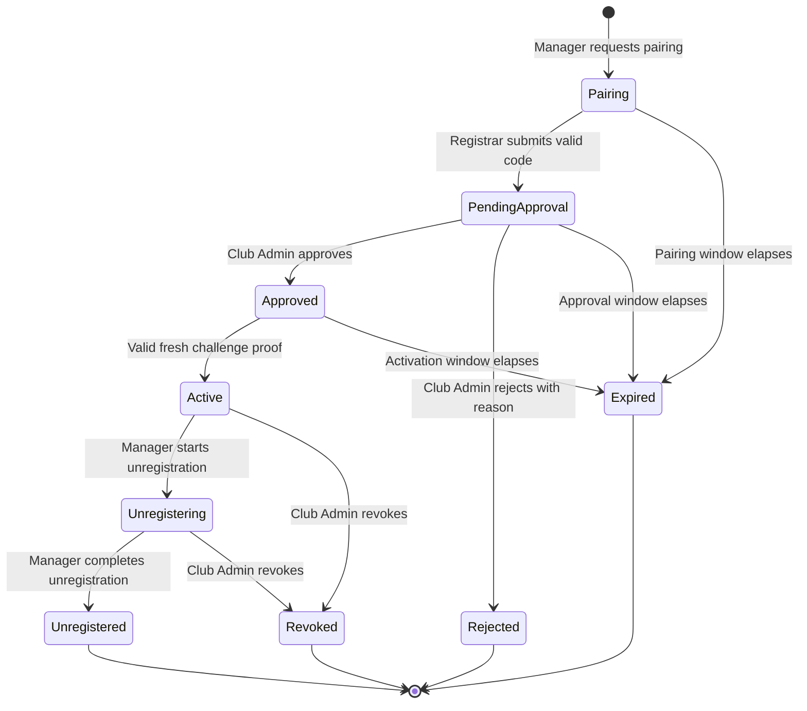

# Data Model: Analyst Manager Registration

**Feature**: [spec.md](spec.md) | **Plan**: [plan.md](plan.md) | **Research**: [research.md](research.md)

The model has two owners. The platform (`src/platform`, Registry functional
area) owns the authoritative registration and every credential decision. The
Analyst Manager (`src/analysts/manager`) owns only protected local state and
its local operating state. Contract field names are in
[openapi.yaml](contracts/openapi.yaml) and
[local-control.schema.json](contracts/local-control.schema.json).

## Platform entities (schema `socalytics`)

All tables are created by one forward-only migration described as
**"registry analyst manager registrations"** (sequence number assigned at
implementation time per the shared persistence conventions). The same
migration extends the Club and Identity `security_audit_event` value checks
(see [Audit events](#audit-events-security_audit_event)). No table or column is
named `club_id`; the stamp is the club.

### `AnalystManagerRegistration` → table `analyst_manager_registration`

Aggregate root covering the whole lifecycle from pairing to a terminal state.
Versioned (`version bigint not null default 1`) with the shared
`socalytics.advance_version()` BEFORE UPDATE trigger. It has no declared child
tables: access tokens and replay entries are independent operational rows that
must not advance the registration version.

| Column | Type | Rules |
| --- | --- | --- |
| `id` | `uuid` PK | Registration (request) identifier, `Guid.CreateVersion7()`, assigned at pairing; used by human endpoints |
| `manager_id` | `uuid` null, unique | Stable Manager identity and OAuth `client_id`; assigned only by successful activation (FR-011); never changes |
| `stamp_id` | `text` not null | Must equal configured `Stamp:Id` at creation; compared on every token request and Manager call |
| `state` | `text` not null | Check constraint over the states below |
| `public_jwk` | `jsonb` not null | EC P-256 public JWK (`kty`, `crv`, `x`, `y` only); no private members accepted |
| `key_thumbprint` | `text` not null | RFC 7638 SHA-256 JWK thumbprint, base64url; partial unique index where state is non-terminal |
| `pairing_nonce` | `text` not null | Manager-supplied fresh nonce (16–128 chars), echoed in the pairing record |
| `device_metadata` | `jsonb` not null | Minimized: `os` (`windows`/`linux`/`macos`), `osVersion` ≤ 64, `architecture` (`x64`/`arm64`), `managerVersion` ≤ 32, optional operator `hostLabel` ≤ 64; nothing else stored |
| `pairing_code_hash` | `bytea` null, unique | SHA-256 of normalized code; cleared on consumption or expiry |
| `polling_handle_hash` | `bytea` not null, unique | SHA-256 of handle; usable until activation or terminal state |
| `challenge_hash` | `bytea` null | SHA-256 of the current activation challenge; cleared on any activation attempt |
| `challenge_expires_at` | `timestamptz` null | Challenge lifetime end |
| `pairing_expires_at` | `timestamptz` not null | Created + pairing window |
| `approval_expires_at` | `timestamptz` null | Submission + approval window |
| `activation_expires_at` | `timestamptz` null | Approval + activation window |
| `submitted_by` | `uuid` null, FK `member_account(id)` | Member who submitted the code |
| `submitted_at` | `timestamptz` null | |
| `decided_by` | `uuid` null, FK `member_account(id)` | Club Admin who approved or rejected |
| `decided_at` | `timestamptz` null | |
| `decision_reason` | `text` null | Required (1–500 chars) for rejection |
| `activated_at` | `timestamptz` null | |
| `unregistration_started_at` | `timestamptz` null | |
| `ended_at` | `timestamptz` null | Time of entering any terminal state |
| `revoked_by` | `uuid` null, FK `member_account(id)` | Club Admin who revoked |
| `end_reason` | `text` null | Revocation reason (1–500 chars) or system reason (`pairing-window-elapsed`, …) |
| `correlation_id` | `text` not null | Generated at pairing; recorded as `details.registrationCorrelationId` by every audit event of this registration |
| `created_at` | `timestamptz` not null | |
| `version` | `bigint` not null default 1 | Strong ETag on reads; transitions advance it via trigger |

Validation rules:

- A pairing is accepted only for a P-256 public JWK whose thumbprint is not held
  by another non-terminal registration, a `stampId` equal to `Stamp:Id`, a nonce,
  and metadata within the limits above (FR-003).
- `manager_id`, `stamp_id`, `public_jwk`, and `key_thumbprint` are immutable
  after insert; no endpoint edits a registration (FR-012). Rebinding always
  creates a new row.
- All expiry decisions use the platform `TimeProvider` (edge case "clock
  differences").

### Registration state machine (platform, authoritative)

| Transition | Command (Application, `Registry`) | Actor and authorization | Guard | Audit event |
| --- | --- | --- | --- | --- |
| → `Pairing` | `StartPairing` | Anonymous Manager, rate-limited | Stamp matches, key valid and unused | `analyst-manager.pairing-issued` |
| `Pairing → PendingApproval` | `SubmitPairingCode` | `IAccessAuthorizer.AuthorizeClubAsync(ClubPermission.Register)` | Code hash matches, state `Pairing`, now < `pairing_expires_at` | `analyst-manager.pending-request-created` |
| `PendingApproval → Approved` | `ApproveRegistration` | `ClubPermission.Administer` at decision time | State, now < `approval_expires_at` | `analyst-manager.approved` |
| `PendingApproval → Rejected` | `RejectRegistration` | `ClubPermission.Administer` at decision time | State, window, reason present | `analyst-manager.rejected` |
| `Approved → Active` | `ActivateRegistration` | Manager holding polling handle | Proof signature by stored key, challenge hash matches and unexpired, `jti` unused, now < `activation_expires_at` | `analyst-manager.activated` (refusals: `analyst-manager.activation-refused`) |
| `* → Expired` | `ExpireDueRegistrations` and inline checks | System | Window elapsed in `Pairing`/`PendingApproval`/`Approved` | `analyst-manager.expired` |
| `Active → Unregistering` | `BeginUnregistration` | Manager (DPoP) | State `Active` (idempotent in `Unregistering`) | `analyst-manager.unregistration-started` |
| `Unregistering → Unregistered` | `CompleteUnregistration` | Manager (DPoP) | State `Unregistering` | `analyst-manager.unregistered` |
| `Active/Unregistering → Revoked` | `RevokeRegistration` | `ClubPermission.Administer` at decision time | State, reason present | `analyst-manager.revoked` |

Non-transition decisions are also audited: authorization denials for
submission, decision, revocation, list, and read are recorded once by
`IAccessAuthorizer` as `authorization.denied` (Registry does not add a second
event), and token endpoint outcomes for an identifiable registration as
`analyst-manager.credential-issued` or `analyst-manager.credential-refused`.
Every transition and its audit event commit in the same unit of work through
`IAuditTrail.RecordAsync` (FR-033, SC-008); refusals that change nothing use
`IAuditTrail.RecordIndependentAsync`. Revocation and unregistration completion
delete outstanding access tokens in the same unit of work. Handlers return the
shared `OperationResult<T>`.

### Audit events (`security_audit_event`)

Registry writes the Club and Identity `AuditEvent` shape:

| Field | Registry values |
| --- | --- |
| `event_type` | `analyst-manager.*` types above, plus `authorization.denied` from `IAccessAuthorizer` |
| `action` | `pair`, `submit`, `approve`, `reject`, `activate`, `expire`, `issue-credential`, `begin-unregister`, `unregister`, `revoke` |
| `outcome` | `succeeded`, `refused`, `denied` |
| `actor_kind` | `member` (human operations, `actor_account_id` from `IRequestContext`), `analyst-manager` (new value; Manager calls), `anonymous` (pairing and activation before a Manager identity exists), `system` (expiry) |
| `resource_type` | `analyst-manager-registration` (new value), `resource_id` = registration id |
| `data_class` | `DAT-001` |
| `reason_code` | `club-admin-rejection`, `club-admin-revocation`, `pairing-window-elapsed`, `approval-window-elapsed`, `activation-window-elapsed`, `proof-invalid`, `proof-replayed`, `registration-inactive`, `stamp-mismatch` |
| `details` (allow-list) | `managerId`, `stampId`, `keyThumbprint`, `fromState`, `toState`, `windowExpiresAt`, `os`, `osVersion`, `architecture`, `managerVersion`, `registrationCorrelationId` |
| `correlation_id` | W3C trace id from `IRequestContext` |

Free-text reasons and the operator `hostLabel` stay on the registration row
(`decision_reason`, `end_reason`, `device_metadata`); the audit event references
them through `resource_id` because `details` accepts no free text. The migration
adds `analyst-manager` to the `actor_kind` check and `analyst-manager-registration`
to the `resource_type` values if Club and Identity constrains them.

Operations allowed per state:

| State | Pairing status poll | Activation | Token issuance | Manager API calls | Human view |
| --- | --- | --- | --- | --- | --- |
| `Pairing` | `awaiting_submission` | No | No | No | Club Admin list |
| `PendingApproval` | `pending_approval` | No | No | No | Yes |
| `Approved` | `approved` + fresh challenge | Yes | No | No | Yes |
| `Active` | handle consumed (invalid) | No | Yes | Yes | Yes |
| `Unregistering` | invalid | No | Yes | Status and completion only | Yes |
| `Rejected` | `rejected` until the approval-window end, then invalid | No | No (inactive signal) | No | Yes |
| `Expired`, `Revoked`, `Unregistered` | invalid | No | No (inactive signal for `Revoked`/`Unregistered`) | No (inactive signal) | Yes |

### `ManagerAccessToken` → table `analyst_manager_access_token`

| Column | Type | Rules |
| --- | --- | --- |
| `token_hash` | `bytea` PK | SHA-256 of the opaque token |
| `registration_id` | `uuid` FK | → `analyst_manager_registration(id)` |
| `jkt` | `text` not null | Equals the registration `key_thumbprint` |
| `scope` | `text` not null | `analyst-manager` only |
| `issued_at`, `expires_at` | `timestamptz` not null | Lifetime from configuration (non-production default 5 min) |

Not versioned and not a declared child of the registration. Rows are deleted on
revocation or unregistration completion and purged after expiry.

### `ProofReplayEntry` → table `analyst_manager_proof_replay`

| Column | Type | Rules |
| --- | --- | --- |
| `kind` | `text` | `client_assertion`, `dpop`, or `activation` |
| `jti_hash` | `bytea` | SHA-256 of the proof `jti`; PK `(kind, jti_hash)` |
| `expires_at` | `timestamptz` not null | End of the proof acceptance window; purged afterwards |

### Domain types (`SocAlytics.Platform.Domain.Registry`)

- `AnalystManagerRegistration`: state, windows, and transition methods returning
  a result or a rule violation; no persistence concerns.
- `RegistrationState` enum: `Pairing`, `PendingApproval`, `Approved`, `Active`,
  `Unregistering`, `Unregistered`, `Rejected`, `Expired`, `Revoked`.
- `DeviceKeyThumbprint`, `DeviceMetadata`, `RegistrationWindows` value objects.
- Non-entity secrets (`PairingCode`, `PollingHandle`, `ActivationChallenge`,
  access token) exist only in transient memory and as hashes.

### Configuration (`Registry` options, non-production defaults)

| Key | Default | Notes |
| --- | --- | --- |
| `Stamp:Id` | none (required) | AppHost sets `local-dev-stamp` |
| `Stamp:PublicBaseUri` | none (required, `https`) | AppHost sets from the API HTTPS endpoint |
| `Registry:Pairing:Window` | 10 min | Architecture value |
| `Registry:Pairing:ApprovalWindow` | 24 h | Architecture value |
| `Registry:Pairing:ActivationWindow` | 10 min | |
| `Registry:Pairing:ChallengeLifetime` | 60 s | |
| `Registry:Pairing:PollingInterval` | 5 s | Returned to the Manager |
| `Registry:Pairing:VerificationPath` | `/analyst-managers/pair` | Joined to `Stamp:PublicBaseUri`; UI deferred |
| `Registry:Tokens:Lifetime` | 5 min | |
| `Registry:Tokens:MaxAssertionLifetime` | 60 s | |
| `Registry:Tokens:ProofClockSkew` | 60 s | DPoP and activation `iat` window |
| `Registry:RateLimits:*` | see research R6 | Per instance |
| `Registry:ExpiryWorker:Interval` | 30 s | |

## Analyst Manager local model

### `ProtectedRegistrationState` (file `registration.state`, protected store)

| Field | Type | Rules |
| --- | --- | --- |
| `schemaVersion` | integer | `1`; unknown versions fail closed |
| `managerId` | string | From activation |
| `stampId` | string | From discovery and activation; must match platform |
| `platformEndpoint` | `https` URI | Non-`https` refused |
| `deviceKeyReference` | string | CNG key name (Windows) or test-store key id |
| `deviceKeyThumbprint` | string | Must equal the opened key's thumbprint at restore |
| `operatingIntent` | `Running` or `Paused` | Last deliberate intent (FR-026) |
| `pendingUnregister` | boolean | Part of operating intent; resumes unregister after restart |
| `writtenAt` | RFC 3339 UTC | Diagnostics only |

Never stored (FR-017, FR-034): human credentials, access tokens, client
assertions, DPoP or activation proofs, pairing codes, polling handles,
challenges, broker credentials, private key material.

### Device identity

`IDeviceKeyStore` creates, opens, and deletes ECDSA P-256 keys and returns an
`IDeviceKey` exposing only the public JWK, thumbprint, and `Sign(data)`. No
member exposes private key bytes. A new key is created for each pairing attempt
and deleted when the attempt is abandoned, rejected, or expired, and on
revocation or unregistration.

### Registration state (Manager-local view)

```mermaid
stateDiagram-v2
  state "Restore failed" as RestoreFailed
  [*] --> Restoring: Start with protected state
  [*] --> Unregistered: Start without protected state
  Restoring --> Active: Key proof and platform confirm Active
  Restoring --> RestoreFailed: State or key missing, unreadable, tampered, or mismatched
  Restoring --> Restoring: Platform unreachable; retry with backoff
  Restoring --> Revoked: Platform reports inactive
  Unregistered --> Pairing: Operator registers; supported key store present
  Pairing --> Active: Activation succeeds
  Pairing --> Unregistered: Rejected, expired, abandoned, or restarted
  Active --> Unregistering: Operator unregisters
  Unregistering --> Unregistered: Platform confirms completion
  Active --> Revoked: Inactive signal observed
  Unregistering --> Revoked: Inactive signal observed
  Revoked --> Unregistered: Local stamp state cleared
  RestoreFailed --> Unregistered: Operator discards local state
```

`Pairing` has the sub-phases `awaiting_submission`, `pending_approval`, and
`activating`; the pairing code is shown only in the `register` command output.
`RestoreFailed` admits no work, requests no credentials, and reports a bounded
diagnostic code (`state-missing`, `state-unreadable`, `state-integrity`,
`key-missing`, `key-inaccessible`, `key-mismatch`, `stamp-mismatch`). It never
recreates or rebinds the identity; `unregister --discard-local` deletes the
remnants and returns to `Unregistered`, reporting that a Club Admin must revoke
the old registration.

### Operating state (beneath `Active` only, FR-023)

```mermaid
stateDiagram-v2
  state "Runtime unavailable" as RuntimeUnavailable
  [*] --> RuntimeUnavailable: Active confirmed; preflight pending
  RuntimeUnavailable --> Running: Preflight passes; intent Running
  RuntimeUnavailable --> Paused: Preflight passes; intent Paused
  Running --> RuntimeUnavailable: Runtime lost or outside list
  Paused --> RuntimeUnavailable: Runtime lost or outside list
  Running --> Paused: Pause
  Paused --> Running: Resume; last preflight passed
  Running --> Draining: Safe exit or unregister
  Paused --> Draining: Safe exit or unregister
  RuntimeUnavailable --> Draining: Safe exit or unregister
  Draining --> Running: Timeout policy CancelRequest; prior Running
  Draining --> Paused: Timeout policy CancelRequest; prior Paused
  Draining --> [*]: Exit or unregister proceeds
```

Rules:

- Work admission (`AdmissionGate.TryAdmit`) succeeds only in `Running` with the
  registration confirmed `Active` in the current process lifetime (FR-001,
  FR-018, SC-009).
- `pause` in `RuntimeUnavailable` records intent `Paused` and stays
  `RuntimeUnavailable` until preflight passes (US5-6).
- Revocation (`Revoked`) supersedes every operating state (FR-020).
- `Draining` carries `purpose` (`safe-exit`/`unregister`), `prior` state, and
  `deadline`; it never outlives drain timeout plus cleanup bound (FR-027).
- Safe exit keeps protected state and intent; unregister clears them after the
  platform confirms.

### `PreflightResult`

| Field | Rules |
| --- | --- |
| `ranAt` | RFC 3339 UTC |
| `profile`, `runtimeProduct`, `runtimeVersion`, `backend` | From the probe; null when unavailable |
| `passed` | True only if every check passed |
| `checks[]` | `id`, `passed`, `detail`, `remediation` for each of: `runtime-integration-configured`, `endpoint-reachable`, `endpoint-local`, `endpoint-authorized`, `runtime-version-supported`, `profile-version-supported`, `backend-available`, `registry-authentication`, `image-platform-compatible`, `resource-limits-feasible`, `accelerator-probe:{id}` |
| `validatedCapabilities[]` | Empty unless `passed`; accelerators only when their own probe passed (FR-030) |

### `RuntimeCompatibilityList` (embedded resource `runtime-compatibility.json`)

Versioned array of supported entries: `profile`, `runtimeProduct`,
`runtimeVersionRange`, `backend`, `os`, `osVersionRange`, `architecture`,
`accelerators[]`, `managerVersionRange`. Shipped empty in this slice; not
user-editable. Tests supply their own list through the test host.

### Manager configuration (non-production defaults)

| Key | Default |
| --- | --- |
| `Manager:StateDirectory` | `%LOCALAPPDATA%\SocAlytics\AnalystManager` (Windows); `$XDG_STATE_HOME/socalytics-analyst-manager` elsewhere |
| `Platform:StatusCheckInterval` | 60 s |
| `Platform:RetryBackoff:Initial` / `Max` | 2 s / 60 s |
| `Operating:DrainTimeout` | 5 min |
| `Operating:DrainTimeoutPolicy` | `CancelRequest` |
| `Operating:CleanupBound` | 30 s |
| `Runtime:Profile` | none (no built-in adapter in this slice) |
| `Runtime:PreflightInterval` | 60 s |
| `Runtime:ProbeImage` | none (digest-pinned reference when a profile exists) |
